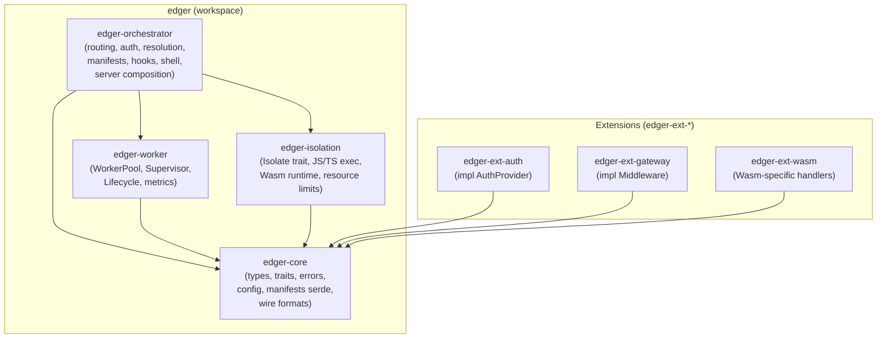
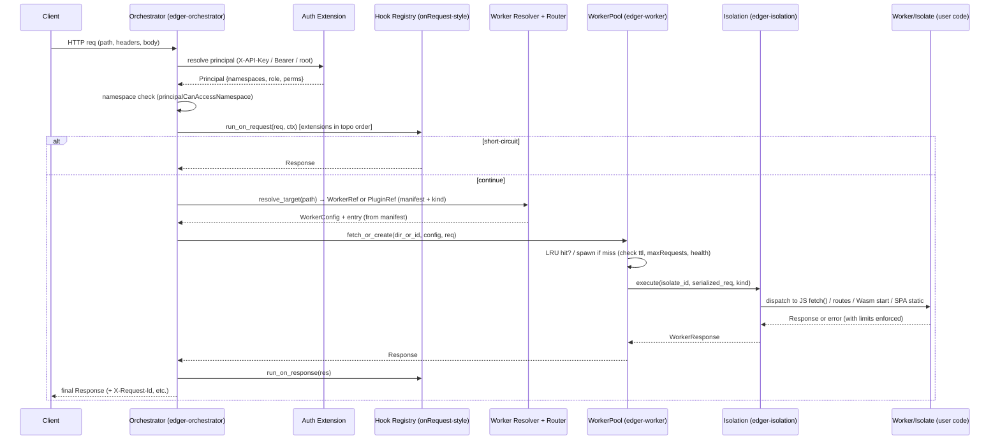
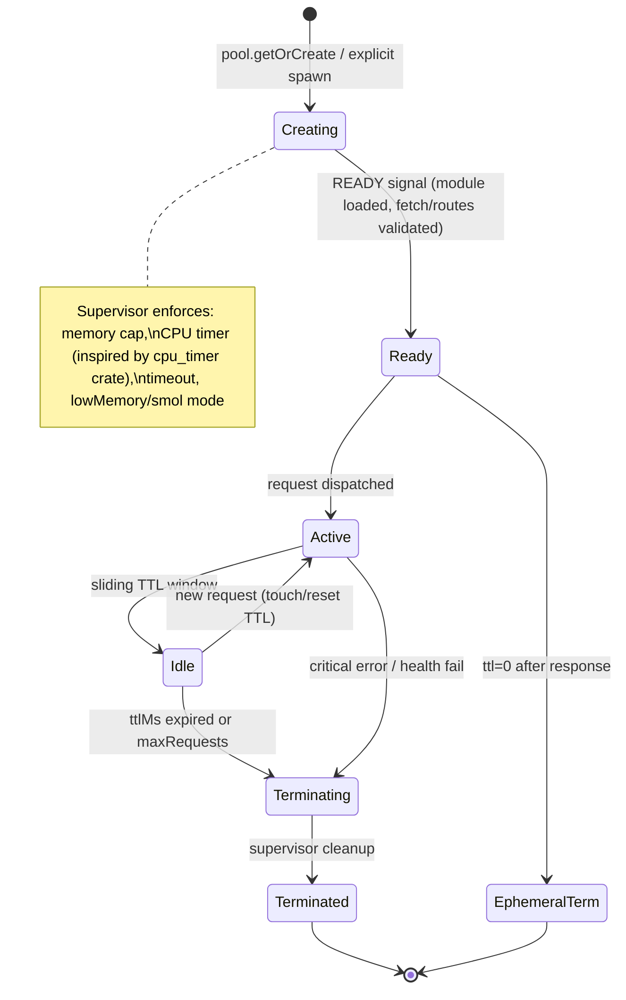
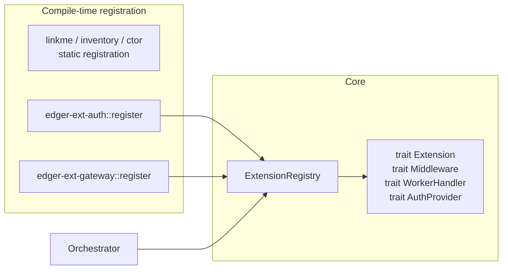

# Edger: Modern Edge Runtime Design Document

**Author:** edger team  
**Date:** 2026-06-28  
**Status:** Foundation-locked (planning complete)
**Project Location:** `/Users/djalmajr/Developer/djalmajr/edger`  
**Version:** 0.1 (Foundation Architecture)

---

## Overview

Edger is a Rust-native edge runtime designed to serve as a reliable, customizable platform for deploying and executing JavaScript, TypeScript, Node.js-compatible, serverless, backend, frontend (SPA), full-stack, SSR, and WebAssembly applications. 

The core innovation is a deeply integrated Rust orchestrator that eliminates the separate "main-service" Deno/TypeScript layer found in current Supabase Edge Runtime deployments. Drawing structural inspiration from the supabase/edge-runtime crate layout (edger-core, edger-worker, edger-isolation, edger-orchestrator, edger-ext-*) and extensibility patterns (ext_* crates), edger reimplements high-level orchestration primitives directly in Rust while leveraging isolate/supervisor/resource-management strengths. 

It fully incorporates the product vision from the Buntime project (the Bun/TS runtime being evolved or migrated from): workers as first-class deployable units, rich multi-tenant orchestration (routing, Buntime-style namespace/role/permission auth with API keys, manifests, onRequest-style hooks, shell/micro-frontend support), and true Open/Closed Principle extensibility via Rust crates rather than dynamic TS plugins. The result is superior control over memory, CPU, isolation, policies, and cold-start characteristics without the limitations of Bun Web Workers for heavy frameworks/SSR workloads.

---

## Background & Motivation

### Current State (Buntime Limitations)
Buntime (see `apps/runtime/`) is a production Bun + TypeScript runtime:
- Orchestration lives in userland: Hono `app.ts` + `api.ts` + `routes/{worker,plugins,...}.ts`, `PluginRegistry`/`PluginLoader`, `WorkerPool` (Bun `Worker` threads + `wrapper.ts` IPC + entrypoint inference).
- Workers are isolated Bun threads executing `fetch` handlers, route tables, or static SPAs (with `<base href>` injection).
- Plugins provide separation of concerns via `manifest.yaml` + `plugin.ts` (persistent, main-process) / `index.ts` (serverless, pool) with hooks: `onRequest`, `onResponse`, `onInit`, `onWorkerSpawn`, etc. Persistent vs serverless mode is a strict choice.
- Auth: API keys with roles/permissions + namespace scoping (`@scope/app`); root key bypass; publicRoutes bypass for hooks.
- Manifests drive config: `entrypoint`, `ttl` (sliding, 0=ephemeral), `timeout`, `maxRequests`, `cron`, `publicRoutes`, env filtering (sensitive patterns blocked), visibility.
- WorkerPool: LRU + sliding TTL + health + ephemeral concurrency limits. Supports namespaced workers, semver versions, collision detection.
- Shell/micro-frontends via `<z-frame>` + MessageChannel for plugin UIs (iframe isolation).
- Multi-tenant via workerDirs (PATH `:`), namespaces.
- Pain points: Bun Workers limit heavy SSR/full-stack (Next.js, TanStack, frameworks) due to thread/compat overhead; orchestration in TS limits deep resource/CPU/memory/policy control and reliability; dynamic plugin loading (topological sort via Kahn) is powerful but couples to JS runtime; cold starts and isolation granularity constrained by Bun.

### Edge Runtime Approach and Inspiration
Supabase Edge Runtime (https://github.com/supabase/edge-runtime) is a Rust + Deno server for JS/TS/Wasm:
- Clean multi-crate structure: `crates/base`, `base_rt`, `deno_facade`, `http_utils`, `cpu_timer`, `fs`, plus `ext/` for pluggable extensions and `deno/` subtree.
- Two-tier: Main Worker (orchestration proxy, full env, no limits) delegates to User Workers (isolated V8 isolates with memory/timeout/resource limits via `EdgeRuntime` global + supervisor).
- Strengths: strong worker lifecycle/supervision, isolate isolation, resource accounting, eszip bundling, Wasm support.
- Limitation to avoid: heavy reliance on a flexible but separate "main-service" (TS/ Deno) layer for high-level orchestration (auth, routing, hooks). This reintroduces the problems Buntime already has.

### Why Edger Now
- Need for **Rust-core orchestration** for deterministic control, lower overhead, better multi-tenancy policies, and future-proofing (e.g., direct integration with wasmtime, hyper, tokio).
- Evolve Buntime vision without its execution limits: support the same worker contracts (manifest-driven fetch/routes/SPA) + Wasm + broader app types while enabling true SSR/full-stack via better isolates.
- Extensibility: TS plugins were a workaround for "don't break the core." Rust crates deliver real OCP (core closed for modification; extensions open for addition) with type-safe traits, compile-time registration, and no runtime JS plugin loader complexity.
- Platform goals: marketplace of extensions, customizable runtimes, reliable edge for mixed workloads (serverless + long-lived services).

---

## Goals & Non-Goals

### Goals
- Rust orchestrator as single source of truth for routing, worker/plugin resolution, auth (namespaces/roles/permissions), resource limits, and lifecycle hooks (Rust equivalents of onRequest/onResponse).
- Worker-first: deployable units supporting JS/TS (Node compat where practical via extensions), serverless (fetch-style), backend services, SPAs (static + base injection), full-stack/SSR, and Wasm.
- Crate modularity mirroring Edge Runtime: `edger-{core,worker,isolation,orchestrator,ext-*}`.
- Extension mechanism via Rust crates (traits + registration) for pluggability without forking core.
- Carry forward Buntime contracts where possible: `manifest.yaml` (or equivalent), worker addressing (`/name`, `/@scope/name@ver`), sliding TTL/ephemeral, public routes, cron, shell support.
- Multi-tenancy, isolation (V8 isolates or equivalent + supervisors), observability.
- Foundation for reliable platform runtime with quantifiable limits (memory, CPU time, concurrency, body sizes).
- Migration path from Buntime (compatible fetch contracts, manifest subset).

### Non-Goals (Explicit Boundaries)
- 100% drop-in compatibility with all Node.js frameworks or heavy SSR without adapters (target "broad execution support" + documented compatibility tiers).
- No separate main-service TS/Deno layer (orchestration stays in Rust).
- Not a full reimplementation of every Buntime plugin (gateway, keyval, etc.) on day one — these become `edger-ext-*` examples.
- No Kubernetes/Helm/deploy infra, cpanel, or full marketplace initially (focus on runtime foundation).
- Not a fork of edge-runtime or direct continuation of buntime source (new independent project).
- Full dynamic Rust crate loading at runtime (initially compile-time/static registration; dynamic via future plugin loading mechanism if needed).
- Complete Node compat or eszip bundling in v1 foundation.

Quantified targets (aspirational for foundation):
- Worker spawn < 50ms for cached/ephemeral cases.
- Strict per-worker memory/CPU caps enforceable in supervisor.
- Support for 100s of concurrent workers per process (isolate efficiency).

---

## Proposed Design

### High-Level Architecture

Edger is a Cargo workspace with focused crates. The binary (or library entry) lives in a thin `edger` or `edger-server` (added later) that wires the orchestrator.

**Crate Layout (Initial + Evolution)**

The project **starts from an existing minimal Cargo workspace skeleton** (see current checkout at project root):
- Workspace members: `edger-core`, `edger-worker`, `edger-isolation`, `edger-orchestrator`.
- Basic `workspace.package` and shared `workspace.dependencies` (tokio, anyhow, serde, tracing) already declared.
- Individual crates currently contain only `Cargo.toml` (no `src/` yet).
- Current (incorrect) skeleton has `edger-core` depending on `edger-worker` (inverted) and `edger-orchestrator` depending on the three siblings.
- README currently in Portuguese with slightly different crate role descriptions.

The **intended architecture** corrects the dependency graph so that `edger-core` is a pure leaf (no sibling dependencies). All higher crates depend on it. This enforces "core closed".



**Correct dependency direction (to be enforced in first alignment PR)**:
- `edger-core`: leaf. Owns pure data models, traits (Extension, Middleware, Isolate, ...), errors, serialization helpers, common constants. No runtime crates.
- `edger-isolation`: depends on core. Implements execution backends.
- `edger-worker`: depends on core (and later isolation). Owns pool/supervisor.
- `edger-orchestrator`: depends on core + worker + isolation. Owns server wiring, routing, registry, pipeline.
- Extensions: depend on `edger-core` only (traits defined in core); registered into orchestrator at compose time.

#### Crate Ownership Table
| Crate             | Owns                                      | Depends On                  | Forbidden (to prevent cycles) |
|-------------------|-------------------------------------------|-----------------------------|-------------------------------|
| edger-core        | Manifests, Configs, Principals, Traits (Extension etc.), Errors, Serialized* types, ExecutionKind | (none on siblings)         | worker, isolation, orchestrator |
| edger-isolation   | Isolate impls, embedding glue, resource limits | core                       | orchestrator, worker (for types) |
| edger-worker      | WorkerPool, Supervisor, WorkerInstance, metrics, lifecycle | core                       | orchestrator |
| edger-orchestrator| Pipeline, Router, ExtensionRegistry, Auth gate, main composition, shell logic | core, worker, isolation    | (none) |
| edger-ext-*       | Concrete impls of traits                  | core only (registered at compose time in orchestrator bin) | orchestrator, worker, isolation |

The first PR will fix the skeleton `Cargo.toml`s and add stub `src/lib.rs` + module structure. All later PRs assume the corrected graph.

### Request Flow (High-Level)



Key differences from Edge Runtime: orchestrator logic (resolution, auth, hooks, shell decision) is native Rust, not delegated to a Main Worker JS context.

### Worker Lifecycle & Supervisor



States mirror Buntime but enforced in Rust (edger-worker) + isolation primitives. IPC becomes in-process (for embedded isolates) or minimal FFI.

### Extension Registration & Pluggability



- Extensions implement traits defined in `edger-core` only (orchestrator consumes via registry, no crate dep on orchestrator).
- Registration: initially static (via `inventory` or `linkme` crate, or explicit `register_extensions!` macro in the server binary). Later: dynamic loading if required (careful with Rust ABI).
- Order: topological or declared priority (replace Buntime Kahn sort with Rust equivalent).
- No duplication of API: an extension crate provides either persistent middleware or worker handlers (mirrors "choose ONE API mode").
- Example: `edger-ext-auth` implements `AuthExtension` + provides principals; `edger-ext-shell` handles micro-frontend iframe routing + base injection.

### Execution Isolation Layer

`edger-isolation` owns the execution surface. Full trait definition (see Data Model section for supporting types):

```rust
/// Core trait implemented by concrete isolate backends.
/// Lifetime of the isolate is managed by the WorkerPool/Supervisor.
pub trait Isolate: Send + Sync {
    /// Execute a fetch-style handler (most common serverless path).
    async fn execute_fetch(
        &mut self,
        req: SerializedRequest,
        config: &WorkerConfig,
    ) -> Result<SerializedResponse, IsolationError>;

    /// Execute a routes-table handler (Hono-like object converted at load time or dynamically).
    async fn execute_routes(
        &mut self,
        req: SerializedRequest,
        config: &WorkerConfig,
    ) -> Result<SerializedResponse, IsolationError>;

    /// Serve static SPA content with optional <base href> injection (no JS execution).
    async fn serve_static_spa(
        &mut self,
        path: &str,
        base_href: Option<&str>,
        config: &WorkerConfig,
    ) -> Result<SerializedResponse, IsolationError>;

    /// Execute Wasm module (entrypoint determined by manifest or convention).
    async fn execute_wasm(
        &mut self,
        req: SerializedRequest,
        config: &WorkerConfig,
    ) -> Result<SerializedResponse, IsolationError>;

    /// Optional: drain for onIdle / onTerminate hooks inside the isolate.
    async fn notify_idle(&mut self) -> Result<(), IsolationError>;
    async fn terminate(&mut self) -> Result<(), IsolationError>;
}

/// How the orchestrator / pool tells the isolate what to run.
#[derive(Clone, Debug, serde::Serialize, serde::Deserialize)]
pub enum ExecutionKind {
    FetchHandler,
    RoutesTable,
    StaticSpa { inject_base: bool },
    WasmModule { entry: Option<String> },
    /// Fullstack/SSR: adapter-specific (e.g. "next" or custom export "handleSsr").
    /// The isolate backend may delegate to a bundled handler.
    Fullstack { adapter: String },
}
```

See "Embedding spike recommendation" and the new Risks section.

Supervisor (in `edger-worker`) owns isolate instances, applies resource limits (memory, cpu via port of cpu_timer patterns), and retires them. Per user decision, multi-process support from early PRs (PR 4/5); use the same `Serialized*` wire types + transport (e.g. tokio::io or uds) for clustering. In-process remains supported for dev.

### Embedding Spike Recommendation
The recommended first implementation activity (PR 2 below) is a **time-boxed spike** inside `edger-isolation` (or a temporary `edger-isolation/examples/`) that:
1. Adds `deno_core` + minimal supporting crates as optional dependency.
2. Boots a V8 isolate, loads a trivial `fetch` JS module (string or file), runs a request roundtrip, measures baseline spawn + exec time.
3. Instruments basic memory accounting and a timeout guard.
4. Compares briefly against a pure `rusty_v8` + `wasmtime` path for pure Wasm.
5. Documents sharp edges (V8 platform singleton, op registration, snapshotting, permissions model, async op dispatch) and produces a go/no-go + recommended crate split (e.g. `edger-isolation/deno` facade module modeled on Edge Runtime's `deno_facade`).

Do **not** commit to a full production embedding in PR 10 without the spike results. This prevents under-estimation of glue and maintenance cost.

Per user final decision (post-review):
- JS/TS: deno_core + facade (primary; Edge Runtime precedent).
- Wasm: standalone wasmtime + WASI (separate from JS isolate).
Resource limits will reuse or port patterns from `cpu_timer` and base_mem_check in the Edge Runtime repo. Bundling (eszip_trait style + precomp) addressed in spike follow-through.

### Multi-Tenancy, Routing, Auth, Shell

- **Routing/Resolution**: Port of Buntime logic (parse app path for `@scope`, semver resolution, plugin base precedence, reserved paths `/api /health /.well-known`, homepage fallback) into Rust. Uses manifests for discovery.
- **Auth**: `ApiKeyPrincipal` (namespaces: `["*"]` or `["@acme"]`, role, permissions). Root bypass. Enforced early in orchestrator before worker dispatch. Public routes (relative or absolute) bypass hooks.
- **Manifests**: `manifest.yaml` (or `.yml`, with `package.json` fallback) parsed via `serde_yaml` into `WorkerManifest` / `PluginManifest` (evolve to support `kind: serverless | backend | spa | ssr | wasm`).
- **Shell / Micro-frontends**: Dedicated extension or core routing that serves worker HTML with base injection. Protocol evolves to more efficient options (e.g. WebTransport per user decision) while preserving Buntime compat; initial support may leverage modern alternatives to MessageChannel + z-frame. Workers flagged for UI. (See Resolved Decisions.)
- **Hooks**: Rust trait methods executed in defined order. Short-circuit possible.
- **Namespaces**: First-class in resolver and auth checks. Workers addressed as before.

### App / Worker Types

Inferred or declared (see mapping table and ExecutionKind above):
- Serverless: `ttl: 0`, pure `fetch` export → FetchHandler.
- Persistent backend: `ttl > 0`, long-lived state / DB connections.
- SPA: `.html` entrypoint + `injectBase` → StaticSpa.
- SSR/Fullstack: special exports or explicit `kind` + adapters.
- Wasm: `.wasm` entry + exported handlers (or dedicated Wasm handler).

The orchestrator resolves the kind once (from manifest + inference) and passes it down; the isolate backend is responsible for dispatch. This preserves Buntime's auto-discovery while adding an explicit escape hatch for future app types.

---

## API / Interface Changes

All core traits live in `edger-core` (or re-exported) so that extensions and other crates depend only on the leaf. Full signatures (abbreviated bodies for brevity; implementors add the logic).

```rust
// === Extension system (in edger-core) ===

pub trait Extension: Send + Sync + 'static {
    fn name(&self) -> &'static str;
    fn priority(&self) -> i32 { 0 } // lower runs earlier for on_request chain
    fn on_init(&self, ctx: &mut ExtensionContext) -> anyhow::Result<()>;
    fn on_shutdown(&self) -> anyhow::Result<()>;
    fn on_server_start(&self, server: &ServerHandle) {} // e.g. for WS upgrades
}

pub trait Middleware: Extension {
    /// Return Some(Response) to short-circuit (like Buntime onRequest).
    /// Return None to continue (possibly after mutating req).
    fn on_request(
        &self,
        req: &mut SerializedRequest,
        ctx: &RequestContext,
    ) -> anyhow::Result<Option<SerializedResponse>>;

    fn on_response(
        &self,
        res: &mut SerializedResponse,
        ctx: &RequestContext,
    );
}

/// For serverless worker execution dispatched by the pool.
pub trait WorkerHandler: Send + Sync {
    async fn handle(
        &self,
        req: SerializedRequest,
        worker: &WorkerRef,
    ) -> anyhow::Result<SerializedResponse>;
}

// === Auth (core) ===
pub trait AuthProvider: Extension {
    fn authenticate(&self, headers: &HeaderMap) -> anyhow::Result<Option<ApiKeyPrincipal>>;
    fn can_access_namespace(&self, principal: &ApiKeyPrincipal, namespace: &str) -> bool;
}

// === Pool (edger-worker, but signature in core for use by orchestrator) ===
pub struct WorkerPool { /* internal LRU, supervisor, isolates */ }

impl WorkerPool {
    pub fn new(
        max_size: usize,
        ephemeral_concurrency: usize,
        ephemeral_queue_limit: usize,
    ) -> Self { ... }

    /// Primary entry used by orchestrator.
    pub async fn fetch(
        &self,
        worker_dir: &std::path::Path,
        config: &WorkerConfig,
        req: SerializedRequest,
        kind_hint: Option<ExecutionKind>,
    ) -> anyhow::Result<SerializedResponse>;

    pub fn shutdown(&self);
    pub fn get_metrics(&self) -> PoolMetrics;
}

// Worker creation helper (used during resolution)
pub fn create_worker_ref(dir: PathBuf, manifest: WorkerManifest) -> anyhow::Result<WorkerRef> { ... }
```

The HTTP layer (hyper + tower or axum) lives in orchestrator. No Hono; routing + middleware composition in Rust.

Manifest parsing/validation lives in `edger-core` (serde + custom validators).

## Main Binary & Composition

A thin executable (initially can be added as a `[[bin]]` target inside `edger-orchestrator` or a new `edger` workspace member with `src/main.rs`) performs the wiring. Skeleton sketch (foundation version; real code will live behind feature flags / env):

```rust
// crates/edger-orchestrator/src/bin/edger.rs  (or edger/src/main.rs)
use edger_core::{WorkerManifest, WorkerConfig, ApiKeyPrincipal /* ... */};
use edger_worker::WorkerPool;
use edger_isolation::/* concrete backend once chosen */;
use edger_orchestrator::{ExtensionRegistry, build_pipeline, load_manifests_from_dirs};
use anyhow::Result;
use std::{net::SocketAddr, path::PathBuf};
use tokio::signal;
use tracing_subscriber;

#[tokio::main]
async fn main() -> Result<()> {
    tracing_subscriber::fmt::init();

    let worker_dirs: Vec<PathBuf> = std::env::var("RUNTIME_WORKER_DIRS")?
        .split(':').map(PathBuf::from).collect();
    let plugin_dirs = /* similar */;

    // 1. Static / compile-time extension registration (inventory or explicit list)
    let mut registry = ExtensionRegistry::new();
    registry.register(edger_ext_auth::AuthExtension::new()?);
    registry.register(edger_ext_gateway::GatewayExtension::new()?);
    // ... more

    // 2. Core services
    let pool = WorkerPool::new( /* from env or config */ );
    let manifests = load_manifests_from_dirs(&worker_dirs)?; // returns map<name, WorkerRef>

    // 3. Build the service (router + middleware stack + hook runner)
    let service = build_pipeline(registry, pool.clone(), manifests);

    // 4. Server (hyper or axum)
    let addr: SocketAddr = /* from PORT or default */;
    let server = hyper::Server::bind(&addr).serve(tower::ServiceBuilder::new()
        .layer(/* tracing, body limit layers */)
        .service(service));

    // 5. Graceful shutdown (port of Buntime SIGINT + pool.shutdown + registry hooks)
    tokio::select! {
        _ = server => {},
        _ = signal::ctrl_c() => {
            registry.run_on_shutdown()?;
            pool.shutdown();
        }
    }
    Ok(())
}
```

`build_pipeline` (in orchestrator) wires:
- Early auth principal resolution + namespace gate (using registered AuthProvider).
- on_request hook chain (topo or priority order from registry).
- Path resolution + WorkerRef lookup (namespaced + semver + plugin base precedence).
- Dispatch to pool.fetch (passing ExecutionKind inferred or from manifest).
- on_response hooks.
- Special paths (health, reserved, shell decision for micro-frontends).

This makes the Rust orchestrator the single source of truth, with no separate main-service JS layer. 

The composition will also honor Buntime env vars for compatibility during migration (RUNTIME_WORKER_DIRS using `:`, RUNTIME_API_PREFIX, etc.).

---

## Data Model & Wire Formats

This section provides implementation-level specificity (structs with derives, full fields, serde notes, wire format, and Buntime mapping). All live in `edger-core`.

### Serialized Request / Response (Wire Format for Isolate Boundary)
These are the only types that cross the isolate boundary. Designed for zero-copy where possible in-process and easy (de)serialization for future multi-proc.

```rust
use http::{Method, HeaderMap, HeaderName, HeaderValue, StatusCode};
use bytes::Bytes;

#[derive(Clone, Debug, serde::Serialize, serde::Deserialize)]
pub struct SerializedRequest {
    pub method: String,                 // "GET", "POST"...
    pub uri: String,                    // full path + query (e.g. "/api/users?x=1")
    pub headers: Vec<(String, String)>, // lower-cased names; values as-is (binary safe via base64 if needed later)
    pub body: Option<Bytes>,            // owned for transfer; for very large bodies stream in future
    pub request_id: String,
    /// Injected by orchestrator before dispatch (Buntime X-Base equivalent)
    pub base_href: Option<String>,
}

#[derive(Clone, Debug, serde::Serialize, serde::Deserialize)]
pub struct SerializedResponse {
    pub status: u16,
    pub headers: Vec<(String, String)>,
    pub body: Option<Bytes>,
}
```

**Notes**:
- Headers are collected with limits (port of Buntime HeaderLimits: 100 headers, 64KiB total, 8KiB per value).
- Body is `Bytes` (from `bytes` crate) for cheap clones in-process.
- For future out-of-process: postcard or bincode + length-prefixed framing over UDS or pipe.
- `SerializedRequest` is produced by the orchestrator pipeline from the raw hyper request (after hook mutation).

### Full WorkerManifest + Normalized WorkerConfig (in edger-core)
```rust
// Human-editable form (from manifest.yaml / package.json fallback)
#[derive(Debug, Clone, serde::Serialize, serde::Deserialize, Default)]
pub struct WorkerManifest {
    pub name: String,
    pub version: Option<String>,        // defaults to "latest"
    pub enabled: Option<bool>,
    pub entrypoint: Option<String>,
    pub env: Option<std::collections::HashMap<String, String>>,
    #[serde(default)]
    pub env_prefix: Vec<String>,
    pub ttl: Option<String>,            // duration string or number seconds
    pub timeout: Option<String>,
    pub idle_timeout: Option<String>,
    pub max_requests: Option<u32>,
    pub max_body_size: Option<String>,  // "10mb" or bytes
    pub low_memory: Option<bool>,
    pub auto_install: Option<bool>,
    pub inject_base: Option<bool>,
    pub visibility: Option<String>,     // "public" | "protected" | "internal"
    pub public_routes: Option<PublicRoutesConfig>,
    pub cron: Option<Vec<CronJob>>,
    pub kind: Option<String>,           // "serverless" | "spa" | "wasm" | ...
    // plugin-style fields when used for extensions
    pub base: Option<String>,
    pub dependencies: Option<Vec<String>>,
}

#[derive(Debug, Clone, serde::Serialize, serde::Deserialize)]
pub struct WorkerConfig {
    pub enabled: bool,
    pub entrypoint: Option<String>,
    pub env: std::collections::HashMap<String, String>,
    pub env_prefix: Vec<String>,
    pub ttl_ms: u64,
    pub timeout_ms: u64,
    pub idle_timeout_ms: u64,
    pub max_requests: u32,
    pub max_body_size_bytes: Option<u64>,
    pub low_memory: bool,
    pub auto_install: bool,
    pub inject_base: bool,
    pub visibility: String,
    pub public_routes: Option<PublicRoutesConfig>,
    pub cron: Vec<CronJob>,
    pub kind: Option<ExecutionKind>,    // normalized
}

pub fn parse_worker_config(m: &WorkerManifest) -> WorkerConfig { /* duration/size parsing + defaults */ ... }
```

**Buntime Manifest Field Mapping Table** (for migration compatibility):

| Buntime (TS) field     | edger Rust field(s)                  | Notes / Normalization |
|------------------------|--------------------------------------|-----------------------|
| entrypoint             | entrypoint                           | same |
| ttl (0 or duration)    | ttl_ms (0 = ephemeral)               | parseDurationToMs |
| timeout                | timeout_ms                           | " |
| idleTimeout            | idle_timeout_ms                      | notification only |
| maxRequests            | max_requests                         | safety cap |
| maxBodySize            | max_body_size_bytes                  | parseSizeToBytes + global caps |
| lowMemory              | low_memory                           | --smol equivalent |
| autoInstall            | auto_install                         | frozen-lockfile --ignore-scripts |
| injectBase             | inject_base                          | <base href> for SPA |
| env                    | env (after sensitive filter)         | same blocklist patterns |
| publicRoutes           | public_routes                        | relative or absolute |
| cron[]                 | cron                                 | runtime fires internal reqs |
| enabled                | enabled                              | toggle without restart |
| name / version (from pkg or manifest) | name, version in WorkerRef | namespaced support identical |
| visibility             | visibility                           | UI hint |
| (inferred from .html)  | kind = StaticSpa                     | or explicit kind |

Inference rules (port of Buntime `getEntrypoint` + wrapper):
1. If `kind` present in manifest, use it.
2. Else if entrypoint ends with `.html` → StaticSpa.
3. Else if module exports `fetch` → FetchHandler.
4. Else if module exports `routes` → RoutesTable.
5. Else Wasm if `.wasm`.
6. Default: FetchHandler.

### WorkerRef
```rust
#[derive(Clone, Debug)]
pub struct WorkerRef {
    pub id: uuid::Uuid,
    pub name: String,                 // "my-app" or "@acme/checkout"
    pub version: String,
    pub dir: PathBuf,
    pub namespace: Option<String>,    // "@acme" or None for unscoped
    pub kind: ExecutionKind,
    pub config: WorkerConfig,
}
```

### Auth Principal (direct faithful port)
```rust
#[derive(Clone, Debug, serde::Serialize, serde::Deserialize)]
pub struct ApiKeyPrincipal {
    pub id: u64,
    pub name: String,
    pub key_prefix: String,
    pub role: String,                 // "admin" | "editor" | ...
    pub permissions: Vec<String>,
    pub namespaces: Vec<String>,      // "*" or ["@acme", "@staging"]
    pub is_root: bool,
    pub expires_at: Option<u64>,
}
```

PublicRoutesConfig, CronJob, Permission, KeyRole etc. are direct ports (see Buntime packages/shared and wiki for exact shapes).

### Extension & Request Contexts (edger-core)
```rust
pub struct ExtensionContext<'a> {
    pub config: serde_json::Value,    // from manifest for the ext
    pub global_config: GlobalConfig,
    pub logger: /* tracing or simple scoped logger */,
    pub register_service: /* fn for inter-ext sharing */,
    // ...
}

pub struct RequestContext {
    pub request_id: String,
    pub principal: Option<ApiKeyPrincipal>,
    pub worker: Option<WorkerRef>,
    pub start: std::time::Instant,
}
```

Storage for keys initially in-memory + optional file (later dedicated ext or Turso-like). Collision detection and semver resolution logic are in orchestrator but use core types.

All types implement the necessary Serialize/Deserialize + Clone where appropriate for the pool and hooks.

---

## Alternatives Considered

### 1. Keep / Evolve "Main Service" Layer (Status Quo + Deno/TS)
- Description: Retain Buntime-style or Edge Runtime Main Worker for high-level orchestration (routing, auth, hooks) while using Rust only for low-level isolates/supervision.
- Trade-offs:
  - **Pros**: Faster to iterate on business logic in TS; reuse existing Buntime Hono/plugins code; easier debugging for JS devs.
  - **Cons**: Loses the stated goal of Rust-native orchestrator; retains limits on deep resource control, policy enforcement, reliability (userland TS can crash main path); higher context-switch/ serialization cost; contradicts "no separate main-service" requirement. Buntime pain points remain.
- Verdict: Rejected for foundation.

### 2. Pure Bun Evolution (No Rust Rewrite)
- Description: Improve Buntime in-place (better worker wrappers, native addons, more isolation via --smol or experimental Bun features).
- Trade-offs:
  - **Pros**: No language switch; immediate compatibility; leverages existing worker pool/manifests/plugins.
  - **Cons**: Bun Web Workers fundamentally limited for heavy frameworks/SSR (memory model, GC pressure, lack of true isolates + supervisor like V8/deno); hard to achieve fine-grained CPU/memory accounting or Wasm-first paths; extensibility still tied to JS dynamic loading rather than compile-time crates. Does not deliver "Rust core for better control".
- Verdict: Rejected; edger is the migration target.

### 3. Adopt workerd (Cloudflare) or Full Deno + thin Rust proxy
- Description: Use Cloudflare's workerd (V8-based, excellent isolation) or stock Deno deploy + minimal Rust gateway for orchestration.
- Trade-offs:
  - **Pros**: Battle-tested isolates, fast cold starts, Wasm + JS; workerd has strong resource limits. (workerd is Apache-2.0 licensed.)
  - **Cons**: Less control/customization of high-level orchestration (routing/auth/hooks would still need external layer or forking); not aligned with "edger-{core,worker,...} + Rust extensions"; harder to embed Buntime concepts (namespaces, manifests, shell) deeply; deviates from "Rust-native orchestrator" and Edge Runtime structural inspiration. workerd is more "function" oriented than full app types + multi-tenant platform.
  - Effort to integrate Buntime contracts: High (would require substantial adapter layer to preserve manifest inference, namespace auth principals, sliding TTL behavior, publicRoutes, shell base injection, and hook ordering exactly).
  - Extensibility fit: Poor (hard to achieve compile-time Rust crate OCP model when the high-level logic lives outside).
- Verdict: Strong technical candidate for the *isolation* backend only (could be evaluated in the embedding spike as one alternative path). Rejected as the overall orchestrator foundation for control, vision fit, and crate-based extensibility goals. Note: could be considered later as pluggable `edger-isolation` backend.

Other Rust JS runtimes (quickjs, boa) or direct Bun FFI were briefly considered in the embedding spike scope but deprioritized because they lack the mature TS/Wasm/Node-subset + op ecosystem of deno_core that matches the Edge Runtime inspiration and Buntime feature needs. Maintenance cost of any chosen embedding is explicitly called out in the Risks section.

### 4. (Bonus) Full static compilation of user apps into Rust (extreme)
Rejected early: loses dynamic JS/TS/Wasm developer experience.

---

## Security & Privacy Considerations

- **Isolation**: Per-worker V8 isolates (or equivalent) with independent heaps, module caches, and env. No shared mutable state across tenants. Path traversal prevention on entrypoints (port of Buntime `resolve` check). Resource caps prevent DoS (memory, CPU via timers, timeouts).
- **Auth Model**: Early principal resolution + namespace gating (`principalCanAccessNamespace`). Root key synthetic principal for bootstrap only. Permissions are explicit (port of `ALL_PERMISSIONS`). Keys never returned after creation (hash stored).
- **Namespace Scoping**: Workers/plugins live under `@scope`; keys restricted accordingly. Unscoped requires `*`. Enforced at resolver and API surfaces.
- **Hook Bypass**: Public routes + internal credentials (analog of `X-Buntime-Internal`) + root bypass documented and minimized.
- **Sensitive Data**: Env var filtering (same regex patterns as Buntime: DB_*, *_KEY, *_SECRET, AWS_*, etc.) before passing to workers. Never pass runtime secrets to user isolates.
- **CSRF / Transport**: Retain origin/host validation for mutating ops (or use Rust middleware equivalent). Enforce HTTPS at ingress; recommend HSTS/CSP in docs.
- **Manifest / Upload**: Strict archive validation (tgz/zip only, strip package/, no scripts on autoInstall). Collision detection prevents hijacking.
- **Reserved Paths**: Hard-coded enforcement (`/api`, `/health`, `/.well-known`).
- **Wasm**: Capability-based if using wasi; strict module validation.
- **Observability Leakage**: Request IDs propagated but no secrets in logs (structured logging with redaction).
- Privacy: Tenants cannot observe each other's workers/metrics without explicit cross-namespace grants (future).

Risk: Rust memory safety helps, but embedding (deno_core) must be kept up-to-date against V8/JS engine vulns.

---

## Risks & Mitigations

Structured risk register (owner in parentheses is suggested for foundation phase).

| Risk | Severity | Likelihood | Mitigation | Owner / When |
|------|----------|------------|------------|--------------|
| Embedding maintenance burden (V8/deno_core version skew, security vulns, op surface) | High | High | Time-boxed spike (PR 2); pin versions; isolate behind feature flag + abstraction; follow Edge Runtime deno_facade patterns closely; budget ongoing maintenance. | Isolation team, immediately |
| Cold starts & bundling complexity (no eszip yet) | High | Medium | Spike + later port of eszip_trait ideas; support both file and in-memory module loading in isolate; measure in spike; document "pre-warm" recommendations. | Isolation + orchestrator, spike + PR 10 |
| Cron / background tasks driven from Rust core | Medium | Medium | Native Rust scheduler (tokio-cron or similar per user decision) in core (not just internal requests). Implemented in PR 11. | Orchestrator, rollout phase |
| Multi-process / clustering & state | Medium | Medium (per user decision to start early) | Multi-process support from early PRs (PR 4/5 supervisor/isolation per user decision). Shared state via extensions; document clearly. | PR 4/5 + later |
| "Choose one API mode" for Rust crates (compile-time only) | Low | Medium | Clarify in docs: an ext crate either registers Middleware hooks or provides WorkerHandler impls. Use Cargo features or separate crates for variants. No runtime duplication inside one crate. | Docs + ext examples in PR 8 |
| No dynamic Rust extension loading (dlopen pain) | Medium | Low | Explicitly compile-time / static registration (inventory) for foundation. Future dynamic loader is out of scope; note in Open Questions. | Design (already) |
| Operability (debugging isolates, live reload of bad worker, metrics exposure) | Medium | High | Rich tracing spans per isolate + request_id; pool metrics exposed on /metrics; worker enable/disable via manifests (port Buntime); add "restart worker" later. | Observability PR 12 |
| Publishing / release rules for Rust crates | Low | Medium | Adapt Buntime AGENTS.md rule: **never** publish to crates.io manually. Use CI OIDC equivalent. No `cargo publish` in dev. Add to repo CONTRIBUTING. | All, from day 1 |
| Buntime contract fidelity drift during migration | Medium | Medium | Explicit mapping table (in this doc) + compat tests in PR 11; preserve fetch/routes/SPA semantics + namespace addressing + principal model exactly. | All PRs |

All high-severity items must have mitigations landed before end of foundation (PR 12).

## Observability

- **Logging**: `tracing` crate (structured, levels). Port Buntime request ID (`X-Request-Id`) correlation. Subsystem spans (orchestrator, pool, isolate). Use `tracing::info_span!("worker", name = %worker.name, id = %worker.id)`.
- **Metrics**: Built-in counters/histograms (active workers, hit rate, spawn latency, request duration p50/p95/p99, error rates, ephemeral queue depth, memory per isolate). Export Prometheus text + OTEL. Per-worker stats via `pool.get_worker_stats()`.
- **Tracing**: OpenTelemetry integration via `tracing-opentelemetry` + `opentelemetry` crate. Distributed traces across request → hook → worker dispatch → response. Sampling configurable via env.
- **Health/Readiness**: Endpoints `/health`, `/ready`, `/live` (as in Buntime). Expose pool/isolate status + basic version.
- **Worker-specific**: Lifecycle events (`on_spawn`, `on_terminate`, `on_idle`) surfaced to extensions + metrics. Critical errors mark workers unhealthy and retire them.
- **Dashboards**: Recommend integration patterns similar to existing Buntime `plugin-metrics` (as an `edger-ext-metrics` example crate).

All events include `request_id` and `worker_id` for correlation. Add concrete span examples in the implementation PRs.

## Development Discipline (aligned to project AGENTS.md)

- **Always run** `cargo test --workspace && cargo clippy --workspace -- -D warnings && cargo fmt -- --check` before any commit or PR.
- Tests live alongside source (`*.rs` next to the module or `mod tests`).
- Strict Rust (no warnings allowed to accumulate even in untouched files).
- Use `anyhow` for internal errors in foundation; introduce domain-specific error types in `edger-core::errors` (following the spirit of Buntime `@buntime/shared/errors`) for client-visible ones.
- No emojis in code, comments, or commit messages.
- Follow the "never publish manually" rule for any future crates.io publishing.

## Rollout Plan

**Note on starting state**: The project already has a workspace + 4 crate `Cargo.toml` stubs (see "Crate Layout"). PR 1 is therefore an alignment step, not a from-scratch init.

1. **Foundation (align skeleton + spike)**: Fix inter-crate deps (core becomes leaf), add `src/lib.rs` skeletons + module structure per ownership table, sync README to English + accurate responsibilities. Add initial CI (test + clippy + fmt). Multi-process support started early (per user decision). Run the embedding spike inside isolation (minimal deno_core + facade for JS/TS; wasmtime prep for Wasm). `cargo test --workspace && cargo clippy ...` must pass. Update this design if spike findings change direction.
2. **Manifest + Worker Model (core)**: Serde parsing for WorkerManifest + WorkerConfig (full fields + parse functions + tests), WorkerRef, ExecutionKind, Buntime mapping validation. Collision + namespace helpers in core. Unit tests.
3. **WorkerPool + Supervisor (edger-worker)**: LRU + states + health + ephemeral controls (using types from core). Mock isolate. Comprehensive unit + property tests.
4. **Isolation trait + wire formats (edger-isolation)**: Complete Isolate trait + Serialized* types + basic in-process mock impl. Tests exercising all ExecutionKind variants (using the mock).
5. **Orchestrator basic pipeline + server wiring**: Hyper/axum server, routing (namespaced + semver + reserved paths + plugin base precedence), main composition sketch implemented, health endpoints, simple end-to-end using mocks. Integration tests (tower test client). 
6. **Auth principal + namespace gating**: Full ApiKeyPrincipal, AuthProvider trait, early gate, root synthetic principal, public route bypass. In-memory store. Tests covering all Buntime auth scenarios.
7. **Extension traits + registry + static registration**: Full traits in core, ExtensionRegistry + hook execution order in orchestrator. Compile-time registration example. on_request short-circuit behavior. 
8. **First real extension crate (edger-ext-auth)**: Concrete AuthProvider impl + wiring. Demonstrates the "one mode per crate" rule for Rust extensions. Tests.
9. **Initial JS execution (post-spike)**: Real (but minimal) isolate backend in isolation using results of spike (likely deno_core path). Support fetch + routes + simple static SPA. Worker pool integration. Temp-dir worker fixtures + tests. **Depends on successful spike**.
10. **Full manifests, worker kinds, shell, end-to-end + cron stub**: Orchestrator resolution + dispatch for all kinds, base href injection, shell routing decision, cron scheduler stub (internal request firing), complete Buntime contract tests.
11. **Observability, limits, hardening, discipline**: tracing/OTEL/metrics, body/header limits, error types, security cases, full discipline enforcement. Update perf measurement plan. Documentation.
12. **(Stretch) Wasm + additional exts**: Wasm path + example ext crate.

**Measurement**: Per user decision, define performance targets & baselines + port harness in PR 12 (not earlier). Track spawn time, p95 request time, pool hit rate, memory per isolate. Compare against Buntime baselines where possible. Multi-process metrics included.

**Migration notes** (Buntime contracts that must be preserved for compatibility):
- Worker addressing and namespace syntax (`/name`, `/@scope/name@ver` or `latest`).
- Manifest fields + inference (see mapping table).
- `fetch(req) -> Response` or `routes` export contract + HTML SPA with base injection.
- API key principals + namespaces + permissions model + root bypass + publicRoutes.
- Sliding TTL / ephemeral (ttl=0) + maxRequests + idle notification.
- onRequest-style hooks (order, short-circuit, public bypass).
- Shell / micro-frontend base injection + reserved paths.
- Env filtering and auto-install flags.
- Collision detection, enabled toggles (no restart), semver resolution.

All PRs must keep the tree green with the exact cargo test + clippy command. 

(Updated rollout reflects skeleton reality and spike requirement.)

---


---

## Resolved Decisions from User Input

All Open Questions from the initial design have been resolved by explicit final user decisions (post-review). These choices are now binding for implementation. A short note on provenance: these were provided directly by the user after the design review cycles.

- **JS/TS embedding strategy**: `deno_core` + facade (following Edge Runtime precedent). Impact: PR 2 spike focuses on `deno_core` + facade patterns for JS/TS (with minimal wasmtime comparison only for Wasm path). PR 9/10 implementation uses this. Avoids other runtimes for v1.
- **Wasm execution model**: Standalone wasmtime + WASI (not co-located in JS isolate). Impact: Isolation layer (PR 5) prepares dual backends; PR 10 (or adjusted) integrates standalone wasmtime for Wasm modules with WASI capabilities. Simplifies interop but requires separate scheduling.
- **Extensions**: Static/compile-time for v1 (using inventory or equivalent), defer dynamic loading. Impact: Reinforces Key Decision #7; PR 8/9 use static registration only. Dynamic deferred to future (post-foundation).
- **Node.js compatibility depth**: Partial (document gaps explicitly). Impact: Use deno_core Node compat subset where available; document incompatibilities (e.g., for heavy SSR frameworks) in manifests, docs, and tests. No full Node polyfill in core for v1.
- **Bundling / cold starts**: Port eszip_trait style + precompilation. Impact: Add to isolation (PR 5) and execution (PR 9/10); update Risks and Rollout measurement. Supports fast spawn for JS/Wasm bundles.
- **Auth persistence**: Immediate Turso/SQLite (no in-memory-only foundation phase). Impact: PR 7 auth implementation and PR 11 use Turso/SQLite from the start (port from Buntime shared). Update store in core/auth crates; affects early testing (no temp in-mem fallback as primary).
- **Shell/micro-frontend protocol**: Evolve to more efficient (e.g. WebTransport or equivalent, beyond MessageChannel + z-frame). Impact: Note evolution in PR 11 shell support; base injection preserved for compat, but protocol can use modern primitives. Update micro-frontend section references.
- **Cron / background**: Native Rust scheduler (tokio-cron or similar). Impact: PR 11 implements native scheduler (not worker-driven internal requests only); replaces Buntime model with core-driven. Affects WorkerPool and orchestrator.
- **Performance targets & measurement**: Define in PR 12 with ported harness. Impact: PR 12 includes baseline definition, ported harness from Buntime, and metrics (no earlier measurement requirement).
- **Multi-process / clustering**: Multi-process from early PRs (not single-process first). Impact: Update PR 4/5 (WorkerPool/Isolation) and Rollout step 1/3 to include multi-process support (e.g. supervisor for separate processes) from foundation. Affects resource limits and wire formats early.

These decisions have been propagated to Key Decisions, PR Plan descriptions, Risks, Rollout Plan, Isolation/Embedding sections, and related text. (See "Note on user-provided decisions" below.)

## Note on User-Provided Decisions
The architecture and implementation plans incorporate final user decisions on all Open Questions listed above. These were provided explicitly after design review to lock in direction for the foundation phase. They override prior open questions and have been used to update PR dependencies, descriptions, and technical choices for consistency. No further user input is required on these topics. All other design elements (Buntime fidelity, data models, diagrams, etc.) remain unchanged.

---

## References

- Intake: `/Users/djalmajr/Developer/djalmajr/edger/planning/edger/intake.md`
- Buntime (claims verified via direct source reads + ai-memory wiki recall with explicit scopes + Buntime MCP tools):
  - `wiki/apps/runtime.md` (request pipeline, manifests, design principles)
  - `wiki/apps/plugin-system.md` (hooks, modes, topological sort, manifests)
  - `wiki/apps/worker-pool.md` (lifecycle, TTL, isolation, namespaces, metrics)
  - `wiki/apps/micro-frontend.md` (shell, base injection, z-frame)
  - `wiki/ops/security.md` (auth principals, CSRF, env filtering, namespaces)
  - `wiki/apps/runtime-api-reference.md`
  - `packages/shared/src/utils/worker-config.ts`, `api-keys.ts`
  - AGENTS.md / CLAUDE.md (test discipline, code style, plugin rules)
- Edge Runtime:
  - https://github.com/supabase/edge-runtime (crates: base, deno_facade, http_utils, cpu_timer; main vs user workers; isolates; supervisor)
  - Blog: "Supabase Edge Runtime: Self-hosted Deno Functions"
  - Architecture notes on Main/User runtime split (to be internalized in Rust)
- Related patterns: Deno core / rusty_v8; wasmtime; hyper/tokio; inventory/linkme for static registries; Buntime use of semver + quick-lru equivalents in Rust (e.g., lru crate).

---

## Key Decisions

1. **Rust-native orchestrator as the core (no separate main-service TS layer)**: Rationale — provides deep control over memory/CPU/isolation/policies requested in the vision; eliminates userland orchestration fragility seen in both Buntime (Hono) and Edge Runtime (Main Worker); aligns with "orchestrator deeply integrated in Rust".
2. **Crate structure `edger-{core,worker,isolation,orchestrator,ext-*}` modeled on Edge Runtime**: Rationale — proven separation of concerns (core types vs. worker mgmt vs. execution vs. high-level logic); enables focused testing, incremental builds, and clear extension boundaries. Avoids monolith.
3. **Extensions as Rust crates implementing traits (not dynamic TS plugins)**: Rationale — delivers genuine Open/Closed Principle and separation of responsibilities; compile-time safety, no JS plugin loader complexity or hot-reload fragility for core logic; maps Buntime hooks to Rust traits while allowing marketplace of native extensions.
4. **Carry Buntime worker/manifest/auth contracts as much as possible**: Rationale — preserves product vision and eases migration; workers remain first-class units with `fetch`/routes/SPA/Wasm support, namespace auth, sliding TTL, public routes, manifests. Avoids breaking existing deployables.
5. **Leverage Edge Runtime strengths (isolates, supervisors, resource limits) but implement high-level orchestration in Rust**: Rationale — avoids the "main-service delegation" limitation; reuses proven low-level patterns (supervision, limits) while making routing/auth/resolution/hook execution native and customizable.
6. **Support broad app types (serverless, backend, SPA, full-stack/SSR, Wasm) via WorkerKind + manifest inference**: Rationale — fulfills Buntime vision without requiring 100% framework compat; different execution paths in isolation layer with shared pool/orchestrator.
7. **Static/compile-time extension registration initially (inventory-style)**: Rationale — simple, safe, no ABI pain for foundation; dynamic loading deferred. Matches "primarily compile-time" open question direction.
8. **Manifests + normalized WorkerConfig as first-class data model**: Rationale — direct port of battle-tested Buntime config (durations, sizes, cron, env, enabled toggle) enables compatibility and rich behavior without reinvention.
9. **Observability via tracing + OTEL from day one**: Rationale — production requirement; correlates with Buntime X-Request-Id and metrics model while using Rust-native tools.
10. **Incremental PR plan with independent reviewable slices + strict `cargo test --workspace && cargo clippy --workspace -- -D warnings && cargo fmt -- --check` discipline**: Rationale — follows project agent rules (adapted) for safe, reviewable progress; the tree must be left cleaner (no warnings) than found; foundation must be solid before features. References Buntime AGENTS.md discipline.

11. **JS/TS embedding via `deno_core` + facade (Edge Runtime precedent); standalone wasmtime + WASI for Wasm**: Rationale — locks in production path per user decision. Spike (PR 2) and impl (PR 9/10) target deno_core for JS/TS compatibility and wasmtime for Wasm isolation. Avoids co-location and other runtimes for v1 predictability and maintenance.

12. **Multi-process support from early PRs; native Rust scheduler for cron; immediate Turso/SQLite auth persistence**: Rationale — user decisions prioritize early multi-process (affects PR 4/5 supervisor/isolation), native tokio-cron style scheduler in core (PR 11), and Turso/SQLite for keys from start (PR 7/11). Deviates from pure single-process in-mem first to match platform needs and Buntime auth model.

13. **Static extensions + partial Node compat + eszip-style bundling + evolved shell protocol for v1**: Rationale — user input defers dynamic crates (Key Decision #7 reinforced), accepts documented partial Node support, adopts eszip_trait + precomp for cold starts (PR 5/9/10), and evolves shell beyond z-frame (PR 11, e.g. toward WebTransport) while preserving Buntime contracts.

These decisions prioritize control, modularity, vision fidelity, and migration ease over short-term reuse of TS code. All Open Question resolutions were provided as final user input after review cycles.

---

## PR Plan

**Realistic incremental strategy**: The project begins with the pre-existing workspace skeleton (4 crates, basic workspace Cargo.toml, no src/ yet, plus inverted deps and Portuguese README). Each PR is independently reviewable and mergeable. Every PR must keep the tree green with:

`cargo test --workspace && cargo clippy --workspace -- -D warnings && cargo fmt -- --check`

No release/publish commands. Total 12 PRs for foundation (extra early PRs for skeleton reality + embedding spike).

1. **PR Title**: `chore: align existing skeleton, correct inter-crate deps, and sync README`  
   **Files/components affected**: Root `Cargo.toml` (minor), all 4 `edger-*/Cargo.toml` (remove bad `edger-core -> edger-worker` dep; ensure core has no sibling deps, worker/isolation depend only on core, orchestrator on the three), add `edger-*/src/lib.rs` + `mod.rs` skeletons with ownership comments, root `README.md` (English + accurate crate roles per ownership table), `.gitignore`, basic `rustfmt.toml` / `clippy.toml` if needed.  
   **Dependencies on other PRs**: None (this is the new starting PR).  
   **Description**: Reconcile the design with the checked-out skeleton. Enforce "core is leaf" dep graph. Add stub source layout. Make README match proposed responsibilities. `cargo build` + full lint suite passes cleanly. All later PRs assume this state. Explicitly references current edger checkout state.

2. **PR Title**: `spike(isolation): evaluate JS/TS/Wasm embedding options (deno_core + facade primary; wasmtime for Wasm)`  
   **Files/components affected**: `edger-isolation/` (new `examples/embedding-spike.rs` or temp module, `Cargo.toml` additions under [dev-dependencies] or optional), spike results document (in planning/ or spike.md).  
   **Dependencies on other PRs**: PR 1.  
   **Description**: Time-boxed spike per user decision: focus on `deno_core` + facade (Edge Runtime precedent) for JS/TS hello-world + basic limits; brief comparison or prep for standalone wasmtime + WASI for Wasm path only. Produces go/no-go + facade module recommendation for PR 9/10. No production embedding code yet. Critical risk mitigation (see Risks section). Wasm execution will use standalone wasmtime (not co-located).

3. **PR Title**: `feat(core): define core types, errors, manifests, wire formats, and traits`  
   **Files/components affected**: `edger-core/src/{lib.rs, types.rs, error.rs, manifest.rs, config.rs, wire.rs, extension.rs, auth.rs}` — full `WorkerManifest`, `WorkerConfig` + parser, `WorkerRef`, `SerializedRequest`/`SerializedResponse`, `ExecutionKind`, `ApiKeyPrincipal`, all traits (Extension/Middleware/WorkerHandler/AuthProvider/Isolate signatures + docs), Buntime mapping table tests.  
   **Dependencies on other PRs**: PR 1.  
   **Description**: Implementation-ready data models and interfaces (see "Data Model & Wire Formats" section). Ports all required Buntime fields. Unit tests for parsing, validation, serialization roundtrips, namespace helpers.

4. **PR Title**: `feat(worker): implement WorkerPool skeleton, lifecycle, supervisor, and metrics`  
   **Files/components affected**: `edger-worker/src/{lib.rs, pool.rs, instance.rs, supervisor.rs, metrics.rs, types.rs}` (LRU, states, health timers, get_or_create, collision, ephemeral controls, PoolMetrics). Uses core types. Mocks isolation.  
   **Dependencies on other PRs**: PR 1, PR 3.  
   **Description**: Core pool logic (no real exec yet). Sliding TTL, retirement, metrics. Comprehensive unit + state tests. Public `fetch` signature matches final.

5. **PR Title**: `feat(isolation): complete Isolate trait + in-process mock + wire handling (prep for deno_core facade + standalone wasmtime)`  
   **Files/components affected**: `edger-isolation/src/{lib.rs, isolate.rs, kinds.rs, mock.rs, limits.rs, error.rs, wire.rs}`. Full trait impls for all ExecutionKind (mock). Resource limit stubs. Prep dual-backend (JS via deno_core facade; Wasm via standalone wasmtime + WASI). Tests using Serialized* types.  
   **Dependencies on other PRs**: PR 1, PR 3.  
   **Description**: Defines and mocks the execution contract (multi-process support early per user decision). Foundation for supervisor + pool. Prepares for real backend (depends on spike results from PR 2). Bundling/eszip precomp hooks added here.

6. **PR Title**: `feat(orchestrator): basic HTTP server, routing, request pipeline + main composition**`  
   **Files/components affected**: `edger-orchestrator/src/{lib.rs, server.rs, router.rs, pipeline.rs, main.rs or bin/}` (hyper/axum or tower service, full path resolution logic, build_pipeline wiring sketch, health, simple end-to-end using mocks + core types).  
   **Dependencies on other PRs**: PR 1, PR 3, PR 4.  
   **Description**: Minimal listening server. Buntime routing precedence, URL rewrite, worker resolution. Implements the "Main Binary & Composition" sketch. Integration tests via test client. Health endpoints live.

7. **PR Title**: `feat(auth): implement principal resolution, namespace gating, root key, and public route bypass (immediate Turso/SQLite persistence)`  
   **Files/components affected**: `edger-orchestrator/src/auth.rs` + pipeline integration, `edger-core/src/auth.rs` (full principal + helpers), store (Turso/SQLite from day one per user decision; no primary in-mem). Tests for all cases (root, namespaced, publicRoutes, bypass).  
   **Dependencies on other PRs**: PR 3, PR 6.  
   **Description**: Faithful port of Buntime auth model with immediate Turso/SQLite persistence (user decision). Early gate before worker dispatch. Matches security.md behavior. (Persistence wiring completed/verified in PR 11 if needed.)

8. **PR Title**: `feat(core + orchestrator): extension traits, registry, static registration + hook execution`  
   **Files/components affected**: Core traits (if not complete in PR 3), `edger-orchestrator/src/registry.rs` (ExtensionRegistry, hook runners with priority/topo, registration). Example in bin or tests.  
   **Dependencies on other PRs**: PR 1, PR 3, PR 6.  
   **Description**: Registry + execution of on_request (short-circuit) / on_response / on_init etc. Static registration. No real extensions yet.

9. **PR Title**: `feat: add edger-ext-auth as first extension (demonstrates pattern)`  
   **Files/components affected**: New `edger-ext-auth/` crate (Cargo.toml + src/lib.rs implementing AuthProvider + registration), wiring in orchestrator example, tests.  
   **Dependencies on other PRs**: PR 8.  
   **Description**: First real extension crate. Shows compile-time registration + "one responsibility per crate" (auth provider, no routes). Updates registry examples. Follows OCP.

10. **PR Title**: `feat(isolation): initial real JS/TS execution (deno_core + facade per user decision) + standalone wasmtime for Wasm`  
    **Files/components affected**: `edger-isolation/src/deno.rs` (facade per PR 2 + user decision for JS/TS), wasmtime integration for standalone Wasm + WASI, integration into worker/instance, support for fetch + routes + StaticSpa + Wasm. Temp worker dir tests with real JS/Wasm fixtures. eszip-style bundling/precomp support.  
    **Dependencies on other PRs**: PR 2 (spike), PR 4, PR 5, PR 6.  
    **Description**: First production-path execution: JS/TS via deno_core + facade (user decision); Wasm via standalone wasmtime + WASI (not co-located, per user decision). Resource limits, bundling, and multi-process prep enabled. Handles Buntime-compatible entrypoints + Wasm. **Blocked until spike lands.**

11. **PR Title**: `feat(orchestrator): full manifests, kinds, shell (evolved protocol), end-to-end + native Rust cron scheduler`  
    **Files/components affected**: Router/pipeline for all ExecutionKind + base injection, shell routing (evolve protocol per user decision e.g. toward WebTransport while preserving Buntime compat), full manifest loading, native Rust scheduler (tokio-cron or similar per user decision; core-driven not just internal reqs), auth Turso completion if needed. Integration tests exercising auth + hooks + real workers + SPA + Wasm. Multi-process notes.  
    **Dependencies on other PRs**: PR 6, PR 10, PR 3.  
    **Description**: Complete request flows. Multi-type support. Shell evolution noted (user decision). Cron uses native Rust scheduler (user decision). Preserves all Buntime contracts listed in rollout. (Turso auth persistence verified here if split from PR 7.)

12. **PR Title**: `chore: observability, hardening, discipline, docs, and measurement (define targets + ported harness per user decision)`  
    **Files/components affected**: Tracing + OTEL + metrics across crates, body/header limits + sanitization, error types, security/namespace tests, full discipline CI, README + architecture docs (diagrams), example workers, basic perf harness (ported from Buntime) + measurement notes. Define performance targets & baselines here per user decision. Update Risks if needed.  
    **Dependencies on other PRs**: All prior.  
    **Description**: Production readiness for foundation phase. Tree perfectly clean under strict lint. Ports key Buntime behaviors. Per user decision: performance targets & measurement defined in this PR with ported harness (no earlier requirement). Documents resolved decisions and open items (if any remain). Multi-process and other user choices validated.

(Note: Wasm via standalone wasmtime is integrated in PR 10 per user decision; no separate stretch needed for core Wasm path.)

Each PR description must reference this design document + intake.md. PRs must be small and focused. After PR 6+ verify full pipeline with mocks then real execution. The PR Plan was revised to start from the actual skeleton state.

**PR cross-references throughout the document (Risks table, Rollout Plan measurement, Embedding Spike Recommendation, and PR Plan descriptions) have been audited and aligned to the final PR Plan numbering (1=align skeleton, 2=spike, 3=core types, 4=worker pool, 5=isolation trait+mock, 6=orchestrator basic server, 7=auth, 8=extensions+registry, 9=edger-ext-auth, 10=real JS execution, 11=full manifests+shell+cron, 12=observability+hardening).**

---

*End of design document.*
