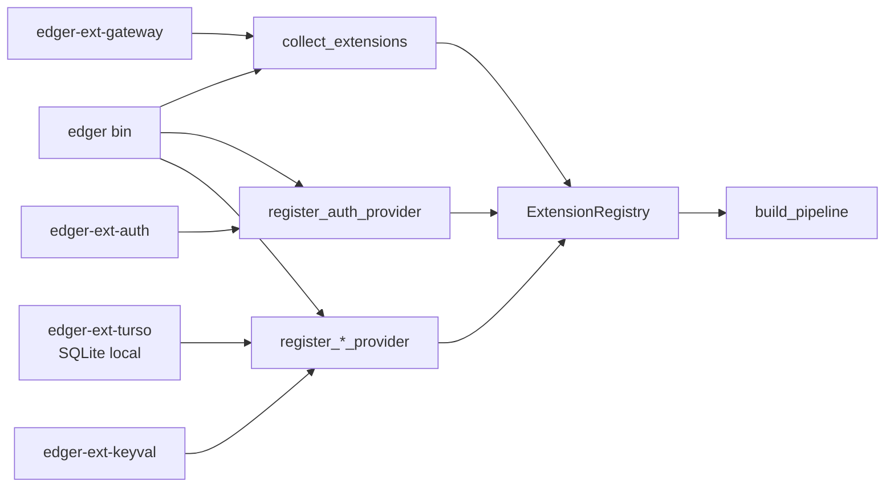

# Extensões edger (edger-ext-*)

> OBSOLETO desde o Epic 17: o sistema de extensões/registry/hooks, `edger-ext-*`,
> providers e auth plugável foram removidos do runtime. Este arquivo fica como
> registro histórico da arquitetura pré-Epic 17. Ver
> `planning/edger/epics/17-edger-minimalista/`.

**Status:** histórico/obsoleto (removido pelo Epic 17)
**Origin:** `planning/edger/epics/06-extensibilidade/00-overview.md`

## Princípio choose ONE

Cada crate `edger-ext-*` escolhe **um** modo por crate:

- **Middleware** (hooks `on_request` / `on_response`), ou
- **AuthProvider** / provider especializado (ex: auth, SQL, KV, queue), ou
- **WorkerHandler** (dispatch serverless dedicado)

**Anti-padrão (proibido):** `edger-ext-foo` que implementa `AuthProvider` **e** `Middleware` de gateway na mesma crate sem features mutuamente exclusivas no `Cargo.toml`.

## Padrão de registro (story 06.01 — decisão)

| Opção | Status |
|---|---|
| `inventory` | adiado — manutenção incerta |
| `linkme` | adiado — quirks de toolchain |
| **Lista explícita no bin** | **escolhido para v1** |

### Wiring



1. Crate `edger-ext-*` depende **apenas** de `edger-core` (traits).
2. Middleware exporta `pub fn middleware() -> Arc<dyn Middleware>`.
3. Auth exporta `AuthExtension` e é registrado por `register_auth_provider`.
4. Service provider exporta um tipo que implementa `Extension` + o trait de provider (`DurableSqlProvider`, `KeyValueProvider`, `QueueProvider`).
5. Bin `edger` chama `collect_extensions(vec![...])`, `register_auth_provider` e `register_*_provider`.
6. `ExtensionRegistry` ordena middleware por `priority()` (menor = mais cedo em `on_request`) e valida providers antes do dispatch.

Migrar para `inventory`/`linkme` quando houver 3+ extensões estáveis (story futura).

## Capabilities, dependencies e providers (Story 08.06)

`crates/edger-core/src/extension.rs` define o vocabulário puro:

- `ExtensionCapability`: middleware, request/response hook, auth provider, worker handler, service provider, menu contribution e lifecycle hook.
- `ExtensionDependency`: capability requerida antes do registro.
- `ExtensionHook`: hooks de lifecycle (`onInit`, `onServerStart`, `onShutdown`).

Cada extensão declara `capabilities()` e, se necessário, `dependencies()` no trait
`Extension`. O default é seguro e mínimo; extensões com valor operacional devem
declarar explicitamente o que oferecem.

Exemplos atuais:

| Crate | Modo | Capabilities | Dependências |
|---|---|---|---|
| `edger-ext-auth` | `AuthProvider` | `authProvider`, `apiKeys` | nenhuma |
| `edger-ext-gateway` | `Middleware` | `middleware`, `onRequest`, `onResponse` | nenhuma |
| `edger-ext-turso` | `DurableSqlProvider` local SQLite (`LocalSqliteProvider`) | `provider:durableSql` | nenhuma |
| `edger-ext-turso-remote` | `DurableSqlProvider` remoto/sync via libSQL/Turso (`RemoteTursoProvider`) | `provider:durableSql` | nenhuma |
| `edger-ext-keyval` | `KeyValueProvider` + `QueueProvider` | `provider:keyValue`, `provider:queue` | `provider:durableSql` |

O registry v1 não copia o loader topológico do Buntime. Ele entrega o mesmo
valor observável de forma estática: registro explícito, falha cedo para
dependência ausente e conflito claro quando dois providers tentam ocupar a mesma
capability incompatível.

O provider SQL remoto/sync, incluindo Turso/libSQL remoto, é evolução do Epic 09.
`edger-ext-turso-remote` implementa a fronteira como crate separado e pode ser
selecionado no binário por `EDGER_DURABLE_SQL_PROVIDER=turso-remote` ou
`turso-sync`. Ele permanece registrado no composition root, sem dependência
direta do pipeline em SDKs ou variáveis específicas de Turso.

Story 09.05 prova consumidores reais contra esse provider externo sem mudar as
dependências entre crates: workers recebem os mesmos binding descriptors,
`edger-ext-keyval` mantém KV/queue sobre `DurableSqlProvider`, e
`edger-ext-gateway` persiste `gateway_decisions` por `with_history_store`
mantendo o gateway como middleware e dono do próprio schema.

O crate local ainda se chama `edger-ext-turso` e o inventário operacional ainda
expõe o nome `turso` por compatibilidade. O tipo canônico para uso novo é
`LocalSqliteProvider`; `LocalTursoProvider` permanece apenas como alias legado.

Regras:

- `register_durable_sql_provider`, `register_key_value_provider` e
  `register_queue_provider` aceitam apenas extensões que declaram a capability
  correspondente.
- Um provider duplicado para o mesmo `BindingKind` falha com `COLLISION`.
- Uma dependência ausente falha com `MISSING_DEPENDENCY` durante o registro.
- `resolve_service_bindings` só injeta `x-edger-bindings` se o registry tiver
  provider registrado para cada `BindingKind` declarado no manifesto.
- `MenuContribution` é capability tipada para catálogo/shell, mas a UI final e
  marketplace seguem fora do v1.

## Controle runtime (Story 08.13, Story 08.26)

`ExtensionRegistry` mantém a lista registrada como fonte de verdade e aplica um
overlay para status operacional:

- `GET /api/admin/extensions` retorna `status: "enabled" | "disabled"`.
- `POST /api/admin/extensions/{name}/disable` remove a extensão ativa do
  pipeline sem apagar o registro.
- `POST /api/admin/extensions/{name}/enable` recoloca a extensão ativa.
- Middlewares desabilitados não executam hooks.
- Service providers desabilitados deixam de satisfazer `resolve_service_bindings`.
- Quando `EDGER_EXTENSION_STATUS_FILE` está configurado, o status é persistido
  em JSON e recarregado quando o registry é reconstruído.
- Quando `EDGER_EXTENSION_STATUS_FILE` está ausente mas `EDGER_STATE_DIR` existe,
  o binário usa `$EDGER_STATE_DIR/extension-status.json`.

Esse controle não edita manifestos, não faz rescan de diretórios, não reordena
dependências em runtime e não substitui um futuro loader/reload persistente. O
registro explícito no binário continua sendo a fonte de verdade para quais
extensões existem no v1.

## Checklist nova extensão

- [ ] Crate `edger-ext-<nome>` depende apenas de `edger-core`
- [ ] Implementa **um** trait documentado (choose ONE)
- [ ] Declara `capabilities()` e, quando aplicável, `dependencies()`
- [ ] Registro explícito no bin `edger` via `collect_extensions` / `register_auth_provider`
- [ ] `cargo test -p edger-ext-<nome>` verde
- [ ] Sem dependência de `edger-orchestrator`
- [ ] Não publicar em crates.io manualmente (workspace interno)

## Walkthrough edger-ext-auth (story 06.02)

**Crate:** `edger-ext-auth/` — modo `AuthProvider` only.

| Componente | Papel |
|---|---|
| `AuthExtension` | Implementa `Extension` + `AuthProvider` |
| `SqliteApiKeyStore` | Persistência SQLite (`ApiKeyStore` trait em `edger-core`) |
| `from_env()` | Lê `EDGER_AUTH_DB`, `ROOT_API_KEY` |

**Wiring no bin:**

```rust
let auth_ext = AuthExtension::from_env()?.into_arc();
let mut registry = collect_extensions(vec![GatewayExtension::middleware()])?;
registry.register_auth_provider(auth_ext.clone())?;
let sql_provider = local_sql_provider_from_env()?;
let keyval_provider = Arc::new(SqlKeyValueProvider::new(sql_provider.clone()));
registry.register_durable_sql_provider(sql_provider)?;
registry.register_key_value_provider(keyval_provider.clone())?;
registry.register_queue_provider(keyval_provider)?;
let auth = AuthGate::new(AuthGateConfig::default(), auth_ext);
```

**Orchestrator:** `AuthGate` delega `authenticate` ao `Arc<dyn AuthProvider>` — sem lógica duplicada.

**Testes:** `edger-ext-auth/tests/auth_provider.rs` (unit) + `crates/edger-orchestrator/tests/auth_gate.rs` (integração, paridade 05.04).

### Pendências (06.02)

| Item | Destino |
|---|---|
| Turso/libsql remoto/sync | Epic 09 como provider externo substituível |
| SHA-256 → argon2 para key hash | Story 07.07 hardening |
| OAuth / CSRF | Fase 7 stories auth-adjacentes |

## Template edger-ext-gateway (story 06.03)

**Crate:** `edger-ext-gateway/` — modo `Middleware` only (copiar para novas extensões).

| Componente | Papel |
|---|---|
| `GatewayExtension` | CORS, redirect, proxy loopback, cache durável opcional, rate limit local/persistente, diagnostics e histórico persistente opcional |
| `middleware()` | Factory para registro no bin |
| `priority()` | `0` (auth usa `-100`) |
| `README.md` | Passo-a-passo copy-paste |

**Teste de invocação:** header `X-Gateway-Test` incrementa contador interno + trace log.

Ver `edger-ext-gateway/README.md` para criar `edger-ext-<nome>` em < 30 min.
