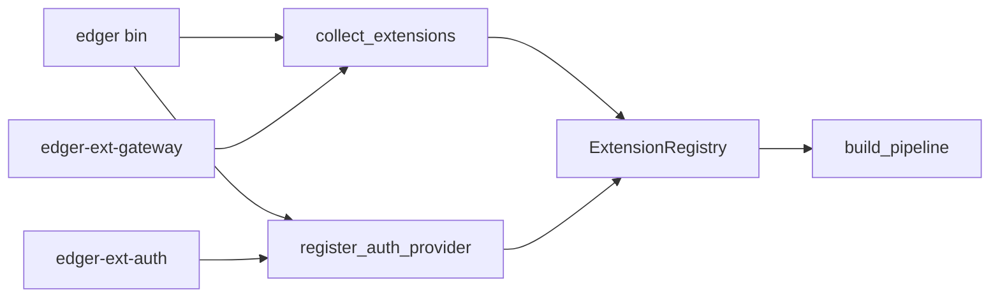

# Extensões edger (edger-ext-*)

**Status:** ativo (Epic 06 — delivered)  
**Origin:** `planning/edger/epics/06-extensibilidade/00-overview.md`

## Princípio choose ONE

Cada crate `edger-ext-*` escolhe **um** modo por crate:

- **Middleware** (hooks `on_request` / `on_response`), ou
- **AuthProvider** / provider especializado (ex: auth), ou
- **WorkerHandler** (dispatch serverless dedicado)

**Anti-padrão (proibido):** `edger-ext-foo` que implementa `AuthProvider` **e** `Middleware` de gateway na mesma crate sem features mutuamente exclusivas no `Cargo.toml`.

## Padrão de registro (story 06.01 — decisão)

| Opção | Status |
|---|---|
| `inventory` | adiado — manutenção incerta |
| `linkme` | adiado — quirks de toolchain |
| **Lista explícita no bin** | **escolhido para v1** |

### Wiring



1. Crate `edger-ext-*` depende **apenas** de `edger-core` (traits).
2. Middleware exporta `pub fn middleware() -> Arc<dyn Middleware>`.
3. Auth exporta `AuthExtension` + `register_auth_provider` no bin.
4. Bin `edger` chama `collect_extensions(vec![...])` e `register_auth_provider`.
5. `ExtensionRegistry` ordena middleware por `priority()` (menor = mais cedo em `on_request`).

Migrar para `inventory`/`linkme` quando houver 3+ extensões estáveis (story futura).

## Checklist nova extensão

- [ ] Crate `edger-ext-<nome>` depende apenas de `edger-core`
- [ ] Implementa **um** trait documentado (choose ONE)
- [ ] Registro explícito no bin `edger` via `collect_extensions` / `register_auth_provider`
- [ ] `cargo test -p edger-ext-<nome>` verde
- [ ] Sem dependência de `edger-orchestrator`
- [ ] Não publicar em crates.io manualmente (workspace interno)

## Walkthrough edger-ext-auth (story 06.02)

**Crate:** `edger-ext-auth/` — modo `AuthProvider` only.

| Componente | Papel |
|---|---|
| `AuthExtension` | Implementa `Extension` + `AuthProvider` |
| `SqliteApiKeyStore` | Persistência SQLite (`ApiKeyStore` trait em `edger-core`) |
| `from_env()` | Lê `EDGER_AUTH_DB`, `ROOT_API_KEY` |

**Wiring no bin:**

```rust
let auth_ext = AuthExtension::from_env()?.into_arc();
let mut registry = collect_extensions(vec![GatewayExtension::middleware()])?;
registry.register_auth_provider(auth_ext.clone())?;
let auth = AuthGate::new(AuthGateConfig::default(), auth_ext);
```

**Orchestrator:** `AuthGate` delega `authenticate` ao `Arc<dyn AuthProvider>` — sem lógica duplicada.

**Testes:** `edger-ext-auth/tests/auth_provider.rs` (unit) + `edger-orchestrator/tests/auth_gate.rs` (integração, paridade 05.04).

### Pendências (06.02)

| Item | Destino |
|---|---|
| Turso/libsql backend | Story 07.07 ou ext dedicada |
| SHA-256 → argon2 para key hash | Story 07.07 hardening |
| OAuth / CSRF | Fase 7 stories auth-adjacentes |

## Template edger-ext-gateway (story 06.03)

**Crate:** `edger-ext-gateway/` — modo `Middleware` only (copiar para novas extensões).

| Componente | Papel |
|---|---|
| `GatewayExtension` | Pass-through `on_request` → `None` |
| `middleware()` | Factory para registro no bin |
| `priority()` | `0` (auth usa `-100`) |
| `README.md` | Passo-a-passo copy-paste |

**Teste de invocação:** header `X-Gateway-Test` incrementa contador interno + trace log.

Ver `edger-ext-gateway/README.md` para criar `edger-ext-<nome>` em < 30 min.