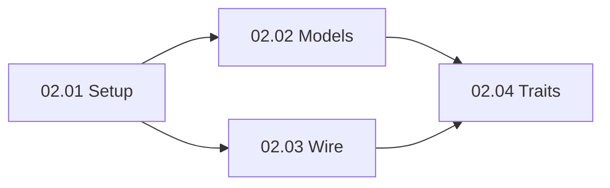

# Epic 02: edger-core (Vocabulário Puro + Tipos)

**Origin:** `planning/edger/roadmap.md` (Fase 2)

## Traceability
- **Source docs:** `planning/edger/design.md` (Data Model, PR 3), `planning/edger/analysis-synthesis.md` (core purity)
- **Roadmap phase:** Fase 2
- **Depends on epic:** `planning/edger/epics/01-fundacao/00-overview.md` (completed)

## Context

### Macro problem
After Fase 1 (Bun loader functional), the Rust workspace has minimal stubs. Higher crates cannot share types without cycles or I/O leakage.

### Initiative objective
Establish `edger-core` as pure leaf crate: manifests, configs, wire formats, traits, errors — no I/O, no sibling deps.

### Expected outcome
`cargo test -p edger-core` green with Buntime mapping tests; public API documented; Bun adapter unchanged.

### Constraints
- Pure vocabulary only (no tokio/fs/network in core)
- Small incremental PRs aligned to design.md PR 3
- Preserve Bun `bun test` pass throughout

### AS-IS
- `edger-core/src/lib.rs` has minimal `ExecutionKind`, `CoreError`, subset `WorkerManifest`
- Other crates are empty stubs
- No module split, no full traits

### TO-BE
- Full data models + parsers per design.md mapping table
- `SerializedRequest`/`SerializedResponse` wire types
- Traits: `Extension`, `Middleware`, `WorkerHandler`, `AuthProvider`, `Isolate` signatures
- Unit tests for serde roundtrips and Buntime field mapping

### Out of scope
- WorkerPool, HTTP server, embedding, Turso store (later epics)
- Dynamic extension loading

## Story backlog

| Story | File | Size | Status | Depends on |
|---|---|---|---|---|
| 02.01 Setup crate | `01-setup-core-crate.md` | small | in-progress | Epic 01 |
| 02.02 Core models | `02-core-models.md` | large | not started | 02.01 |
| 02.03 Errors + wire | `03-errors-wire.md` | medium | not started | 02.01 |
| 02.04 Core traits | `04-core-traits.md` | large | not started | 02.02, 02.03 |

## Epic roadmap

## Epic acceptance criteria
- [ ] `edger-core/Cargo.toml` has no sibling crate deps; only serde/bytes/etc.
- [ ] `src/` modules: manifest, config, wire, error, extension, auth, execution
- [ ] `cargo test -p edger-core` passes with mapping + roundtrip tests
- [ ] `cargo clippy -p edger-core -- -D warnings` clean
- [ ] `bun test` still passes (unchanged)
- [ ] planning/edger/ cross-refs valid; refinement clean

## Risks

| Risk | Mitigation |
|---|---|
| Over-defining traits early | Minimal viable from design; evolve in Fase 3+ |
| Buntime contract drift | Mapping table tests in 02.02 |
| Serde version skew | Pin in workspace.dependencies |

## Recommended next step
`/agile-story` on `01-setup-core-crate.md` to finish crate module layout, then 02.02.

## Status
ready-for-development (planning complete; implementation not started)