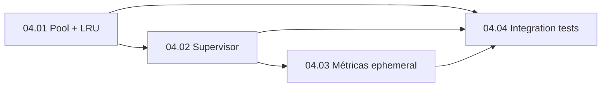

# Epic 04: Worker Management (Pool + Supervisor)

**Origin:** `planning/edger/roadmap.md` (Fase 4), `planning/edger/design.md` (PR 4, Worker Lifecycle & Supervisor)

## Traceability
- **Source docs:** `planning/edger/design.md` (WorkerPool, Supervisor state diagram, Pool API, Buntime worker-pool wiki mapping), `planning/edger/roadmap.md` (Fase 4), `planning/edger/analysis-synthesis.md`
- **Roadmap phase:** Fase 4 — Worker Management (Pool + Supervisor)
- **Depends on epic:** `planning/edger/epics/02-edger-core/00-overview.md` (tipos WorkerConfig, WorkerRef, traits); `planning/edger/epics/03-isolacao-execucao/00-overview.md` (parcial: trait Isolate + mock — stories 03.02+)

## Context

### Problema macro
O orquestrador precisa reutilizar workers com LRU, TTL deslizante, limites ephemeral, health e lifecycle supervisionado — espelhando Buntime `WorkerPool` mas em Rust, sem execução real ainda (mock isolate).

### Objetivo da iniciativa
Implementar `edger-worker` com `WorkerPool` skeleton, LRU `get_or_create`, supervisor com estados Creating/Ready/Active/Idle/Terminating, métricas `PoolMetrics`, controles ephemeral/maxRequests, e suite de testes de integração com mock isolate + fixtures tempfile.

### Resultado esperado
- API pública `WorkerPool::fetch` compatível com assinatura do design
- Supervisor gerencia transições de estado e cleanup
- Métricas expostas via `get_metrics()`
- Testes de integração em `edger-worker/tests/` verdes
- `edger-worker` depende apenas de `edger-core` (+ trait isolate via injeção/mock, não dep direta em `edger-isolation` crate se evitar ciclo — usar trait object de core ou dev-dep)

### Restrições
- Sem HTTP/orquestrador neste epic
- Execução via mock `Isolate` (injeta factory ou trait de core)
- `edger-worker` **não** depende de `edger-orchestrator`
- Dependência em `edger-isolation`: apenas como `dev-dependency` para testes ou via trait definido em core (preferir injeção)
- Multi-processo: pool prepara IDs e wire dispatch mas não spawn processo filho ainda
- Disciplina cargo gate completa

### AS-IS
- `edger-worker/` stub sem pool/supervisor
- Sem LRU, sem lifecycle states, sem métricas

### TO-BE
- Módulos: `pool.rs`, `supervisor.rs`, `instance.rs`, `metrics.rs`, `lru.rs`, `types.rs`
- Estados: Creating → Ready → Active → Idle → Terminating → Terminated (+ EphemeralTerm para ttl=0)
- LRU com `get_or_create`, sliding TTL, maxRequests retirement
- PoolMetrics: active, idle, hits, misses, spawn_latency, ephemeral_queue_depth

### Fora de escopo
- Execução deno_core/wasmtime real
- Auth, routing, hooks
- Cron scheduler
- Clustering multi-processo completo

## Story backlog

| Story | Arquivo | Tamanho | Status | Depende de |
|---|---|---|---|---|
| 04.01 WorkerPool + LRU | `01-worker-pool-lru.md` | large | not started | Epic 02 |
| 04.02 Supervisor lifecycle | `02-supervisor-lifecycle.md` | large | not started | 04.01, Epic 03.02 (parcial) |
| 04.03 Métricas + ephemeral | `03-metrics-ephemeral.md` | medium | not started | 04.01, 04.02 |
| 04.04 Testes integração | `04-pool-integration-tests.md` | large | not started | 04.01, 04.02, 04.03, Epic 03.02 |

## Epic roadmap

## Epic acceptance criteria
- [ ] `WorkerPool::new` + `fetch` + `shutdown` + `get_metrics` implementados
- [ ] LRU eviction e `get_or_create` com collision detection básica (mesmo dir+name)
- [ ] Supervisor implementa diagrama de estados do design
- [ ] ttl=0 ephemeral: terminate após response; concurrency limit + queue
- [ ] maxRequests força Terminating após N dispatches
- [ ] `edger-worker/tests/` com mock isolate + tempfile worker dirs
- [ ] `cargo test -p edger-worker` verde; gate workspace verde; `bun test` passa

## Risks

| Risco | Severidade | Mitigação |
|---|---|---|
| Acoplamento worker↔isolation crate | Média | Injetar `Box<dyn Isolate>` via factory trait em worker; core define contrato |
| Race conditions async pool | Alta | `tokio::sync::Mutex`/`RwLock` + testes de concorrência |
| Divergência TTL Buntime | Média | Testes table-driven com casos sliding TTL do wiki worker-pool |
| Epic 03 atrasado bloqueia testes | Média | Mock local mínimo em worker até 03.02; substituir por edger-isolation dev-dep |

## Próximo passo recomendado
`/agile-story` em `01-worker-pool-lru.md` quando Epic 02.02 (WorkerConfig, WorkerRef) estiver completo.

## Status
ready-for-development (planning complete; implementação bloqueada por Epics 02-03)