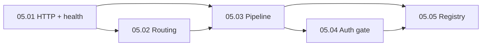

# Epic 05: Orquestrador Principal (Fase 5)

**Origin:** `planning/edger/roadmap.md` (Fase 5), `planning/edger/design.md` (PR 6–8)

## Traceability
- **Source docs:** `planning/edger/design.md` (Multi-Tenancy/Routing/Auth/Shell, Main Binary & Composition, PR 6–8), `planning/edger/intake.md` (contratos Buntime)
- **Roadmap phase:** Fase 5 — Orquestrador Principal (Routing, Auth, Hooks, Servidor)
- **Depends on epics:**
  - `planning/edger/epics/02-edger-core/00-overview.md` (tipos, wire, traits)
  - `planning/edger/epics/03-isolacao-execucao/00-overview.md` (mock Isolate + Serialized*)
  - `planning/edger/epics/04-worker-management/00-overview.md` (WorkerPool + fetch mock)

## Context

### Problema macro
Após as fases 2–4, o workspace tem vocabulário puro, pool de workers e isolamento mockados, mas nenhum servidor HTTP nem pipeline de requisições que una roteamento, auth e hooks — o valor visível do runtime ainda não existe.

### Objetivo da iniciativa
Entregar `edger-orchestrator` funcional: servidor axum/hyper, resolução de rotas Buntime, pipeline `build_pipeline`, gate de auth com namespaces, registry de extensões com short-circuit em `on_request`.

### Resultado esperado
Servidor escuta em `PORT`, responde `/health` e `/ready`, resolve workers namespaced com semver, aplica auth antes do dispatch, executa cadeia de hooks via registry; testes de integração com pool/isolate mock passam.

### Restrições
- Preservar contratos Buntime (endereçamento, publicRoutes, root bypass, reserved paths)
- Turso/SQLite para chaves API desde o início (sem store in-mem como primário)
- Hyper/axum + tower no orchestrator; sem Hono/TS
- `cargo test --workspace && cargo clippy --workspace -- -D warnings` verde após cada story
- Execução real JS/Wasm fica fora deste epic (Fase 3/7); usar mocks do pool

### AS-IS
- `edger-orchestrator/src/lib.rs` é stub (`orchestrator_stub()`)
- `Cargo.toml` declara deps em core/worker/isolation mas sem módulos
- Sem servidor, router, pipeline, auth nem registry

### TO-BE
- Módulos: `server.rs`, `router.rs`, `pipeline.rs`, `auth.rs`, `registry.rs`, `bin/edger.rs` (ou `main.rs`)
- Endpoints `/health`, `/ready` (e stub `/live` se aplicável)
- Resolução completa de path (namespaces, semver, reserved, plugin base precedence)
- `SerializedRequest` construído a partir de hyper/axum
- `ApiKeyPrincipal` + gate early + bypass de rotas públicas
- `ExtensionRegistry` com registro estático e execução ordenada de hooks

### Fora de escopo
- Primeira crate `edger-ext-auth` (Epic 06)
- Padrão inventory/linkme documentado em profundidade (Epic 06)
- Execução real deno_core/wasmtime (PR 10 / Epic 03 avançado)
- Shell completo, cron nativo, observabilidade OTEL (Fase 7)
- Dynamic loading de extensões em runtime

## Story backlog

| Story | Arquivo | Tamanho | Status | Depende de |
|---|---|---|---|---|
| 05.01 Servidor HTTP + health | `01-http-server-health.md` | medium | not started | Epic 02 (parcial), Epic 04 (mock pool) |
| 05.02 Resolução de rotas | `02-routing-resolution.md` | large | not started | 05.01 |
| 05.03 Pipeline de requisições | `03-request-pipeline.md` | large | not started | 05.01, 05.02 |
| 05.04 Auth + namespace gate | `04-auth-namespace-gate.md` | large | not started | 05.03, Epic 02 (auth types) |
| 05.05 Extension registry | `05-extension-registry.md` | medium | not started | 05.03, Epic 02 (traits) |

## Epic roadmap

## Epic acceptance criteria
- [ ] Servidor axum/hyper sobe e responde `/health` (200) e `/ready` (200 quando pool/manifests ok)
- [ ] Resolução de rotas cobre `@scope`, semver (`@1.2.3` / `latest`), paths reservados (`/api`, `/health`, `/.well-known`), precedência plugin base
- [ ] `build_pipeline` integra registry + pool + manifests; `SerializedRequest` roundtrip testado
- [ ] Auth gate: root synthetic principal, namespace gating, `publicRoutes` bypass antes de hooks
- [ ] Store Turso/SQLite para API keys (com fallback de teste documentado se necessário)
- [ ] `ExtensionRegistry` executa `on_request` em ordem de prioridade; short-circuit retorna resposta sem dispatch
- [ ] Testes de integração (tower/axum test client) cobrem fluxo mock end-to-end
- [ ] `cargo test --workspace && cargo clippy --workspace -- -D warnings` verde
- [ ] `bun test` inalterado (adapter Bun)
- [ ] Cross-refs em `planning/edger/` válidos

## Risks

| Risco | Mitigação |
|---|---|
| Drift de semântica Buntime no router | Tabela de casos + testes portados de worker-config/security wiki |
| Turso indisponível em CI | SQLite file in-memory ou temp dir; Turso como target primário em prod |
| Acoplamento pipeline ↔ pool | Injetar `WorkerPool` via trait ou struct; mocks em testes |
| Ordem de hooks incorreta | Priority + testes de short-circuit explícitos na story 05.05 |
| axum vs hyper puro | Escolher um (axum recomendado) e documentar em AGENTS |

## Próximo passo recomendado
`/agile-story` em `01-http-server-health.md` após Epic 02–04 atingirem critérios mínimos (core types + pool mock + isolate mock).

## Status
ready-for-development (planning complete; implementação bloqueada por Epics 02–04)