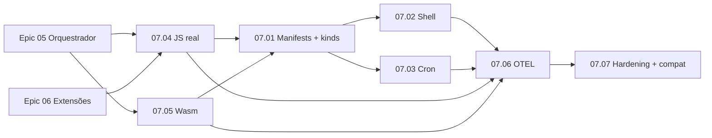

# Epic 07: Features Avançadas, Observabilidade e Preparação (Fase 7)

**Origin:** `planning/edger/roadmap.md` (Fase 7), `planning/edger/design.md` (PR 10–12)

## Traceability
- **Source docs:** `planning/edger/design.md` (PR Plan 10–12, Observability, Rollout, Buntime mapping), `planning/edger/roadmap.md` (Fase 7), `planning/edger/analysis-synthesis.md` (disciplina, testes de integração)
- **Roadmap phase:** Fase 7 — Features Avançadas, Observabilidade e Preparação
- **Depends on epics:**
  - `planning/edger/epics/05-orquestrador/00-overview.md` (Fase 5: pipeline HTTP, routing, auth, hooks, servidor básico)
  - `planning/edger/epics/06-extensibilidade/00-overview.md` (Fase 6: registry estático, primeiras `edger-ext-*`)
- **Design PRs covered:** PR 10 (execução real JS/Wasm), PR 11 (manifests completos, shell, cron nativo), PR 12 (observabilidade, hardening, medição)

## Context

### Macro problem
Após Fases 5–6, o edger tem orquestrador funcional com mocks ou execução mínima, mas ainda não entrega o contrato Buntime completo: todos os `ExecutionKind`, manifests descobertos em diretórios, shell/micro-frontends, cron nativo, backends reais de isolamento (deno_core + wasmtime), observabilidade de produção e matriz de compatibilidade verificável.

### Initiative objective
Consolidar o runtime para uso real e migração Buntime: execução production-path, dispatch completo por kind, shell evoluído, scheduler Rust, OTEL/métricas, limites de segurança e harness de performance com baselines documentadas.

### Expected business/technical outcome
- Servidor edger atende workers JS/TS (fetch, routes, SPA), Wasm e kinds inferidos/explícitos a partir de `manifest.yaml` em `RUNTIME_WORKER_DIRS`.
- Cron dispara requisições internas via scheduler nativo (tokio-cron), não apenas stub.
- Shell serve micro-frontends com injeção de `<base href>` e notas de protocolo evoluído.
- `/metrics`, tracing estruturado e correlação `request_id` em todo o pipeline.
- Matriz de compatibilidade Buntime com testes automatizados + harness de perf (PR 12).

### Constraints, assumptions, and references
- JS/TS: `deno_core` + facade (decisão do usuário; spike Fase 3 obrigatório).
- Wasm: `wasmtime` + WASI standalone (não co-localizado no isolate JS).
- Extensões: registro estático (inventory/linkme); sem dlopen em v1.
- Auth Turso/SQLite já wired nos épicos 05–06; verificar persistência aqui se gaps.
- Multi-process iniciado cedo (Fases 4–5); wire formats `Serialized*` já definidos em `edger-core`.
- Disciplina: `cargo test --workspace && cargo clippy --workspace -- -D warnings && cargo fmt -- --check` antes de qualquer PR deste épico.
- `bun test` deve continuar passando (loader funcional Fase 1 inalterado).

### AS-IS
- Orquestrador básico (épico 05) resolve paths e despacha para pool com mock ou execução parcial.
- Isolamento (Fase 3) tem spike e trait `Isolate` com mock cobrindo `ExecutionKind`.
- Manifests parciais em `edger-core`; carregamento multi-dir e inferência completa de kind ainda incompletos.
- Sem cron nativo, shell routing dedicado, OTEL, `/metrics` ou matriz de compat formal.
- PR 10–12 do design ainda não implementados.

### TO-BE
- `load_manifests_from_dirs` indexa workers por nome/namespace/semver com detecção de colisão.
- Pipeline despacha todos os variants de `ExecutionKind` para backends reais ou mock documentado.
- `edger-isolation/src/deno.rs` (facade) cobre fetch/routes/SPA; `wasmtime` cobre `WasmModule`.
- Shell routing com `inject_base` e documentação de evolução de protocolo (WebTransport etc.).
- `CronScheduler` em orchestrator com tokio-cron disparando HTTP interno autenticado.
- Tracing + OTEL + endpoint Prometheus; limites body/header; testes de compat Buntime; harness de perf.

### Out of scope
- Deploy K8s/Helm, cpanel, marketplace de extensões.
- 100% compat Node / Next.js nativo sem adapters.
- Dynamic loading de crates Rust em runtime.
- Implementação completa de todos os plugins Buntime atuais (ficam como `edger-ext-*` futuros).
- Clustering multi-proc completo (apenas validação/notas; full rollout pós-fundação).

## Story backlog

| Story | File | Size | Status | Depends on |
|---|---|---|---|---|
| 07.01 Manifests + kinds completos | `01-full-manifests-kinds.md` | large | not started | 07.04, 07.05, Epic 05 |
| 07.02 Shell routing | `02-shell-routing.md` | medium | not started | 07.01 |
| 07.03 Cron nativo | `03-native-cron.md` | medium | not started | 07.01, Epic 05 |
| 07.04 Execução JS real | `04-real-js-execution.md` | large | not started | Epic 03 (spike), Epic 04, Epic 05 |
| 07.05 Execução Wasm | `05-wasm-execution.md` | large | not started | Epic 03 (spike), Epic 04, Epic 05 |
| 07.06 Observabilidade OTEL | `06-observability-otel.md` | medium | not started | 07.01, 07.04, 07.05 |
| 07.07 Hardening + matriz compat | `07-hardening-compat-matrix.md` | large | not started | 07.02, 07.03, 07.06 |

**Nota de sequência (caminho crítico):** PR 10 (stories 07.04 + 07.05 em paralelo) desbloqueia PR 11 (07.01 → 07.02/07.03). PR 12 fecha com 07.06 → 07.07.

## Epic roadmap

### Fases sugeridas

| Fase | Stories | Validação intermediária |
|---|---|---|
| A — Execução real (PR 10) | 07.04, 07.05 (paralelo) | Integration test: fetch JS + módulo Wasm respondem via pool |
| B — Contratos completos (PR 11) | 07.01 → 07.02 + 07.03 | E2E: manifest multi-dir, SPA base injection, cron tick |
| C — Produção foundation (PR 12) | 07.06 → 07.07 | `/metrics` scrape, matriz compat verde, baselines no harness |

## Epic acceptance criteria
- [ ] `load_manifests_from_dirs` carrega workers de `RUNTIME_WORKER_DIRS` (`:`) com inferência de `ExecutionKind` e colisão detectada.
- [ ] Todos os variants de `ExecutionKind` despacham para backend correto (JS via deno_core facade; Wasm via wasmtime; StaticSpa com `inject_base`).
- [ ] Shell routing serve HTML com `<base href>` quando `inject_base: true`; notas de protocolo evoluído documentadas.
- [ ] Cron nativo (tokio-cron) dispara requisições internas conforme `manifest.cron[]`; testes cobrem schedule + auth interna.
- [ ] Tracing estruturado com `request_id` em orchestrator → pool → isolate; OTEL export configurável; `/metrics` Prometheus.
- [ ] Limites body/header (port Buntime HeaderLimits) enforced no pipeline.
- [ ] Matriz de compatibilidade Buntime com testes automatizados passando (`tests/compat/` ou equivalente).
- [ ] Harness de performance (portado de Buntime) define baselines documentadas em PR 12.
- [ ] `cargo test --workspace && cargo clippy --workspace -- -D warnings && cargo fmt -- --check` verde.
- [ ] `bun test` inalterado e passando.

## Risks

| Risk | Severity | Mitigation |
|---|---|---|
| Spike deno_core revela custo de manutenção alto | High | Time-box; feature flags; facade module isolado; pin de versões |
| Wasm WASI capabilities mal configuradas | Medium | Testes com fixtures mínimos; deny-by-default; validação de módulo |
| Drift de contratos Buntime durante dispatch multi-kind | Medium | Matriz explícita na story 07.07; testes por campo do mapping table |
| Cron + auth interna expõe superfície de ataque | Medium | Credencial interna `X-Buntime-Internal` equivalente; rotas cron não públicas |
| OTEL overhead em hot path | Low | Sampling configurável; spans leves no pool hit |
| Story 07.01 antes de backends reais gera falsa sensação de done | Medium | Gate: 07.01 só “done” com 07.04+07.05 verdes em integração |

## Recommended next step
- Após conclusão dos épicos 05 e 06: `/agile-story` em `04-real-js-execution.md` (desbloqueia caminho crítico PR 10).
- Paralelamente possível: `/agile-story` em `05-wasm-execution.md`.
- Ao fechar o épico: `/agile-refinement` + atualizar `planning/edger/roadmap.md` (Fase 7 → done).

## Status
ready-for-planning (aguarda épicos 05 e 06)