# Epic 08: Paridade de Valor Buntime sem Cópia 1:1

**Origin:** `planning/edger/roadmap.md` (Fase 8), `planning/edger/runtime-functional-plan.md`, `planning/edger/docs/compat-matrix.md`

## Traceability
- **Source docs edger:** `planning/edger/runtime-functional-plan.md`, `planning/edger/docs/compat-matrix.md`, `planning/edger/docs/pendencies-epic-07.md`, `planning/edger/epics/07-avancado/00-overview.md`
- **Source docs Buntime:** `/Users/djalmajr/Developer/djalmajr/buntime/apps/site/src/content/docs/concepts/runtime.md`, `/Users/djalmajr/Developer/djalmajr/buntime/apps/site/src/content/docs/concepts/worker-pool.md`, `/Users/djalmajr/Developer/djalmajr/buntime/apps/site/src/content/docs/concepts/plugin-system.mdx`, `/Users/djalmajr/Developer/djalmajr/buntime/apps/site/src/content/docs/concepts/storage.md`, `/Users/djalmajr/Developer/djalmajr/buntime/apps/site/src/content/docs/ops/security.md`
- **Prototype refs:** none required for this epic; admin/shell UI prototypes become inputs only after the service contracts are stable.
- **Business rules:** Buntime compatibility is treated as observable product value, not source-level parity. The hard rule remains: no Bun adapter fallback in edger.
- **Depends on epics:** `planning/edger/epics/07-avancado/00-overview.md` for runtime execution foundation.

## Context

### Macro problem
O edger já está caminhando para um runtime Rust funcional, mas Buntime entrega mais do que execução de workers: ele entrega operação, controle de ciclo de vida, segurança, serviços de estado, gateway/shell, plugins e evidência de produção. Copiar Buntime como está aumentaria acoplamento e traria decisões próprias do ecossistema Bun. O objetivo desta fase é extrair os aprendizados e entregar no edger, de forma nativa em Rust, pelo menos o mesmo valor observável.

### Initiative objective
Definir e executar uma trilha de paridade de valor: cada fluxo relevante do Buntime deve ter um contrato edger correspondente, uma evidência de uso e um status explícito em matriz. A Epic 08 não substitui a Epic 07; ela organiza os próximos passos depois da fundação técnica para provar que o produto resultante serve os mesmos casos reais.

### Decisão de fechamento modular

Em 2026-06-29, a Epic 08 foi fechada como consolidação de paridade observável e matriz de valor. As próximas capacidades não devem ser acumuladas aqui nem empurradas para o core. Cada fronteira com ciclo de vida próprio agora tem epic dono:

- Epic 09 para providers duráveis externos, incluindo Turso remoto/sync opt-in.
- Epic 10 para operação de extensões, plugins, manifesto operacional e reload/reconcile.
- Epic 11 para gateway avançado, proxy externo, cache, vhosts, rate limit persistente e histórico/SSE.
- Epic 12 para frontends modulares, cPanel/admin UI, shell e catálogo de módulos.
- Epic 13 para MCP e authoring AI-native local funcional.

Essa decisão preserva a regra de que `edger-core` continua sendo vocabulário puro, sem I/O, e que capacidades de produto entram por módulos, providers, extensões ou apps dedicados.

### Expected business/technical outcome
- Operadores conseguem gerenciar workers, extensões, chaves e estado por API estável.
- Aplicações migram por comportamento e contrato, não por cópia de código.
- Segurança operacional cobre chamadas internas, CSRF, request IDs, limites e escopo por namespace.
- Serviços equivalentes a Turso/KV/queue/gateway/shell/plugins têm contratos Rust-native, com providers remotos/sync tratados como dependências substituíveis.
- A matriz de valor mostra quais capacidades estão testadas, parciais ou ainda são gap.

### AS-IS
- Epic 07 cobre execução JS/TS, Wasm, manifests, shell, cron, observabilidade e hardening como fundação técnica.
- `planning/edger/docs/compat-matrix.md` registra compatibilidade Buntime técnica, ainda centrada no runtime.
- Buntime já possui pool de workers com TTL, APIs administrativas, plugins, serviços de estado, shell/gateway, docs operacionais e rotas de segurança.
- edger ainda não tem uma definição consolidada de “mesmo valor” além da compatibilidade de execução.

### TO-BE
- `planning/edger/docs/value-parity-matrix.md` passa a ser o artefato canônico para valor Buntime versus edger.
- Cada próxima entrega referencia uma linha de valor, um fluxo de usuário/operador e uma evidência automatizada ou manual.
- API operacional, segurança, serviços de estado, shell/gateway, extensão e observabilidade evoluem como fatias verticais.
- A conclusão do épico depende de provas de migração representativas, não de equivalência interna de implementação.

### Out of scope
- Clonar a implementação Buntime, seus nomes internos ou seus detalhes de Bun.
- Reintroduzir adapter Bun como caminho de execução.
- CPanel completo, marketplace completo ou UI administrativa final antes dos contratos.
- Deploy Kubernetes/Helm completo quando a história em foco só exige contrato local.
- Compatibilidade irrestrita de Node/Next.js sem tiers explícitos.
- Implementação interna obrigatória de Turso remoto/sync; essa evolução pertence ao Epic 09 como provider externo sobre `DurableSqlProvider`.

## Story backlog

| Story | Arquivo | Objetivo | Tamanho | Status | Depende de |
|---|---|---|---|---|---|
| 08.01 Valor e contratos | `01-define-valor-e-contratos.md` | Definir matriz de valor e critérios de paridade observável | medium | completed | Epic 07 baseline |
| 08.02 API operacional | `02-api-operacional-workers-e-plugins.md` | Expor gestão de workers, extensões e chaves por API Rust-native | large | completed | 08.01, Epic 07.01 |
| 08.03 Segurança operacional | `03-seguranca-e-identidade-operacional.md` | Fechar fronteiras de chamadas internas, namespaces, CSRF e limites | large | completed | 08.01, 08.02 |
| 08.04 Serviços de estado | `04-servicos-de-estado-turso-kv-queue.md` | Entregar contratos de SQL durável, KV e queue equivalentes em valor | large | completed | 08.01, 08.03 |
| 08.05 Shell e gateway | `05-shell-gateway-e-experiencia-de-apps.md` | Provar composição de apps, shell, proxy e experiência de navegação | large | completed | 08.01, Epic 07.02 |
| 08.06 Extensões e bindings | `06-modelo-de-extensoes-e-bindings.md` | Evoluir registry para providers, hooks, menus e bindings de serviço | medium | completed | 08.02, 08.04 |
| 08.07 Operação e observabilidade | `07-observabilidade-operacao-e-deploy.md` | Tornar logs, métricas, saúde, backup e deploy operáveis | medium | completed | Epic 07.06, 08.03 |
| 08.08 Provas de migração | `08-provas-de-migracao-e-matriz-de-valor.md` | Validar fluxos representativos e fechar matriz de valor | large | completed | 08.02-08.07 |
| 08.09 API keys operacionais | `09-api-keys-operacionais.md` | Fechar criação e revogação de chaves operacionais pela Admin API | medium | completed | 08.02, 08.03 |
| 08.10 Env filtering Deno | `10-env-filtering-deno.md` | Injetar env seguro em workers JS/TS sem herdar segredos do host | medium | completed | 08.03, Epic 07.04 |
| 08.11 Enable/disable runtime | `11-worker-enable-disable-runtime.md` | Permitir retirar/recolocar worker em tráfego por Admin API sem persistência em disco | medium | completed | 08.02, 08.03 |
| 08.12 Stats por worker | `12-worker-metrics-stats.md` | Expor snapshot JSON de pool + workers para operação sem UI/SSE | medium | completed | 08.07, Epic 04 |
| 08.13 Enable/disable extensões | `13-extension-enable-disable-runtime.md` | Permitir retirar/recolocar capacidades de extensão em runtime sem reload persistente | medium | completed | 08.02, 08.06 |
| 08.14 Autodiscovery `index.html` | `14-manifestless-index-html-autodiscovery.md` | Descobrir SPA estática sem manifesto, priorizando HTML antes de JS | small | completed | Epic 07.01, 08.08 |
| 08.15 Gateway redirect rules | `15-gateway-redirect-rules.md` | Redirecionar prefixos de gateway com suffix/query preservados sem proxy externo | small | completed | 08.05, 08.08 |
| 08.16 Gateway rate limit | `16-gateway-rate-limit.md` | Bloquear bursts por cliente no gateway com token bucket local em memória | small | completed | 08.05, 08.15 |
| 08.17 Diagnóstico gateway | `17-gateway-operational-diagnostics.md` | Expor contadores e decisões recentes do gateway no inventário operacional de extensões | small | completed | 08.07, 08.16 |
| 08.18 API admin gateway read-only | `18-gateway-admin-readonly-api.md` | Expor stats, logs filtráveis e config segura do gateway por Admin API dedicada | small | completed | 08.17 |
| 08.19 Stats de logs do gateway | `19-gateway-log-stats-api.md` | Expor agregados dos logs recentes do gateway por Admin API dedicada | small | completed | 08.18 |
| 08.20 Duração logs gateway | `20-gateway-log-duration.md` | Registrar duração real em logs recentes do gateway e calcular média em stats | small | completed | 08.19 |
| 08.21 Métricas rate limit gateway | `21-gateway-rate-limit-metrics-api.md` | Expor métricas agregadas de rate limit local do gateway por Admin API dedicada | small | completed | 08.18, 08.20 |
| 08.22 Semver range routing | `22-worker-semver-range-routing.md` | Resolver ranges semver em rotas de workers sem quebrar versão exata | small | completed | 08.08 |
| 08.23 API key bootstrap store | `23-api-key-bootstrap-store.md` | Provar autenticação bootstrap file-backed sem depender de provider SQL durável | small | completed | 08.09 |
| 08.24 CSRF e chamadas internas | `24-csrf-internal-calls-contract.md` | Fechar contrato de mutações admin browser/internal sem elevar keys não-root | small | completed | 08.03 |
| 08.25 Fronteira de orquestração runtime | `25-runtime-orchestration-boundary.md` | Provar que o processo principal orquestra e o pool/isolate executa app code | small | completed | Epic 07 |
| 08.26 Persistência status extensões | `26-extension-status-persistence.md` | Persistir enable/disable operacional de extensões sem loader dinâmico | small | completed | 08.13 |
| 08.27 Layout local verificável | `27-deploy-layout-check.md` | Validar layout local de operação/deploy por gate mecânico | small | completed | 08.07, 08.26 |
| 08.28 Hooks lifecycle worker | `28-worker-lifecycle-hooks.md` | Provar hooks de lifecycle envolvendo dispatch real de worker | small | completed | 08.06, 08.13 |
| 08.29 Logs operacionais acionáveis | `29-operational-error-logs.md` | Provar logs estruturados de erro sem vazamento de segredos | small | completed | 08.03, 08.07 |

## Roadmap

```mermaid
flowchart LR
    E07["Epic 07: fundação técnica"] --> S01["08.01 valor e contratos"]
    S01 --> S02["08.02 API operacional"]
    S01 --> S03["08.03 segurança operacional"]
    S01 --> S04["08.04 serviços de estado"]
    S01 --> S05["08.05 shell e gateway"]
    S02 --> S06["08.06 extensões e bindings"]
    S04 --> S06
    S03 --> S07["08.07 operação e observabilidade"]
    S06 --> S08["08.08 provas de migração"]
    S05 --> S08
    S07 --> S08
    S08 --> S09["08.09 API keys operacionais"]
    S09 --> S10["08.10 env filtering Deno"]
    S10 --> S11["08.11 enable/disable runtime"]
    S11 --> S12["08.12 stats por worker"]
    S12 --> S13["08.13 enable/disable extensões"]
    S13 --> S14["08.14 autodiscovery index.html"]
    S14 --> S15["08.15 gateway redirect rules"]
    S15 --> S16["08.16 gateway rate limit"]
    S16 --> S17["08.17 diagnóstico gateway"]
    S17 --> S18["08.18 API admin gateway read-only"]
    S18 --> S19["08.19 stats logs gateway"]
    S19 --> S20["08.20 duração logs gateway"]
    S20 --> S21["08.21 métricas rate limit gateway"]
    S08 --> S22["08.22 semver range routing"]
    S09 --> S23["08.23 API key bootstrap store"]
    S03 --> S24["08.24 CSRF e internal calls"]
    S08 --> S25["08.25 runtime orchestration boundary"]
    S13 --> S26["08.26 extension status persistence"]
    S26 --> S27["08.27 deploy layout check"]
    S13 --> S28["08.28 worker lifecycle hooks"]
    S07 --> S29["08.29 operational error logs"]
    S04 --> E09["Epic 09: providers duráveis externos"]
```

### Fases sugeridas

| Fase | Stories | Validação intermediária |
|---|---|---|
| A — Definição de valor | 08.01 | Matriz inicial com cada capacidade Buntime classificada como must/should/later |
| B — Controle e segurança | 08.02, 08.03 | API protegida gerencia recursos sem furar namespace ou limites |
| C — Serviços e composição | 08.04, 08.05, 08.06 | App real usa estado, shell/gateway e provider extension sem contrato Bun-specific |
| D — Operação e prova | 08.07, 08.08 | Evidências de migração fecham must-have workflows na matriz |
| E — Gaps must-have restantes | 08.09+ | Cada linha `must partial` vira uma fatia operacional testável antes de declarar paridade literal |

### Paralelismo
- 08.02 e 08.03 podem avançar em paralelo depois de 08.01, desde que compartilhem os mesmos contratos de auth e namespace.
- 08.04 e 08.05 podem avançar em paralelo porque entregam superfícies diferentes: serviços de estado versus experiência de apps.
- 08.06 deve esperar pelo menos uma versão dos contratos de API e serviços, para não congelar abstrações cedo demais.
- 08.08 consolida evidência executável inicial e não deve começar como implementação isolada.
- 08.09+ reabre a fase apenas para reduzir gaps `must partial` explícitos da matriz, começando por API keys operacionais, env filtering JS/TS, controle runtime de workers e regras de gateway/rate limit.
- Providers duráveis remotos/sync passam para o Epic 09 para evitar acoplar a paridade do Epic 08 a uma implementação específica de storage.

## Epic acceptance criteria for consolidation closure
- [x] `planning/edger/docs/value-parity-matrix.md` lista capacidades Buntime relevantes, valor entregue, status edger, evidência e decisão de escopo.
- [x] Cada capacidade must-have já executável tem teste, runbook ou evidência manual versionada.
- [x] API operacional cobre listagem, inspeção e alteração controlada de workers/extensões/chaves sem depender de UI.
- [x] Segurança operacional cobre namespaces, chamadas internas, CSRF em mutações, request IDs, limites body/header e filtragem de env sensível para as superfícies implementadas.
- [x] Pelo menos um serviço de estado durável local e um serviço KV/queue têm contrato edger e prova de uso por worker; provider remoto/sync fica planejado como dependência substituível no Epic 09.
- [x] Shell/gateway entrega navegação composta, redirects, CORS, rate limit local e APIs read-only locais; proxy externo/cache/vhosts e operação avançada seguem no Epic 11.
- [x] Extensões expõem providers/hooks/bindings suficientes para os serviços priorizados sem misturar modos de crate.
- [x] Operação expõe saúde, métricas, logs correlacionados e documentação de deploy/backup para o escopo local.
- [x] Provas de migração cobrem `todos`, worker protegido, app com estado, app shell-hosted e gateway local; cron nativo continua no Epic 07.03.
- [x] Gate obrigatório permaneceu verde no checkpoint de fechamento do Epic 08.
- [x] Gate de planejamento permanece obrigatório para mudanças futuras: `SCRATCH=planning/edger/status/evidence planning/edger/scripts/run-gates.sh`.

## Risks

| Risk | Severity | Mitigation |
|---|---|---|
| Transformar paridade em clonagem de design | High | Matriz descreve valor e contrato observável, não classes/funções do Buntime |
| Epic 08 competir com Epic 07 em vez de depender dela | Medium | 08.01 define pré-requisitos; stories marcam dependência explícita de fundação técnica |
| Scope creep por tentar portar todos os plugins | High | Priorização must/should/later e prova com fluxos representativos |
| Segurança ficar atrás da API operacional | High | 08.03 é gate para mutações reais e serviços com estado |
| Serviços de estado virarem abstração genérica demais | Medium | Começar por fluxos Buntime existentes e evidência com worker real; mover remoto/sync específico para Epic 09 |
| Matriz virar documento estático | Medium | 08.08 exige evidência por linha must-have antes de fechar o épico |

## Status
completed as consolidation (2026-06-29) - Epic 08 fechou a prova executável inicial de paridade de valor sem copiar Buntime 1:1. A matriz continua preservando gaps `must partial` ou `should partial`, mas esses gaps agora têm owners modulares fora deste epic em vez de prolongar a Epic 08 indefinidamente. 08.01 concluiu a matriz inicial de valor, 08.02 entregou a API operacional v1, 08.03 fechou a segurança operacional v1, 08.04 entregou contratos locais de SQL/KV/queue, 08.05 entregou shell/gateway v1, 08.06 fechou providers/capabilities/binding lookup no registry, 08.07 entregou probes operacionais, `/metrics`, baseline local, Browser check e runbook, 08.08 entregou a suite `value_parity`, validação Browser de `/todos` e o guard contra `base: ""` aprendido do Buntime, 08.09 fechou criação/revogação de API keys pela Admin API, 08.10 fechou env filtering para workers JS/TS no Deno bridge, 08.11 fechou enable/disable runtime de workers pela Admin API com overlay em memória, 08.12 fechou stats JSON de pool + workers em `/metrics/stats`, 08.13 fechou enable/disable runtime de extensões com efeito real em hooks e providers, 08.14 fechou autodiscovery de `index.html` sem manifesto, 08.15 fechou redirect rules de gateway com suffix/query preservados, 08.16 fechou rate limit local em memória por cliente no gateway, 08.17 fechou diagnóstico local do gateway no inventário root de extensões, 08.18 fechou API admin read-only dedicada para stats, logs filtráveis e config segura do gateway, 08.19 fechou stats agregados dos logs recentes do gateway, 08.20 fechou duração real em logs/stats do gateway, 08.21 fechou métricas agregadas de rate limit local do gateway por endpoint dedicado, 08.22 fechou semver range routing para workers namespaced e unscoped, 08.23 fechou o store de API keys bootstrap-safe com prova file-backed independente de provider SQL durável, 08.24 fechou o contrato CSRF/internal de mutações admin atuais sem elevar keys não-root, 08.25 fechou a fronteira de orquestração runtime provando dispatch via WorkerPool/factory/isolate, 08.26 fechou persistência opcional de status enable/disable de extensões via status store JSON, 08.27 fechou o layout local de operação/deploy como contrato verificável no gate, 08.28 fechou hooks de lifecycle de worker ao redor do dispatch real pelo `WorkerPool`, e 08.29 fechou logs operacionais estruturados para erros de Admin API e pipeline sem vazar segredos. Providers duráveis externos, incluindo Turso remoto/sync, foram reclassificados para o Epic 09 como dependência substituível sobre `DurableSqlProvider`. Lacunas futuras permanecem explícitas na matriz e foram redistribuídas: retry/DLQ profundo segue no Epic 09 ou em epic futuro de async; proxy externo, cache, rate limit persistente/distribuído, buckets/reset dinâmicos de gateway, SSE/histórico persistente e vhosts seguem no Epic 11; reload/rescan dinâmico de extensões e persistência de manifesto completo seguem no Epic 10; UI final, cPanel, shell/catálogo e frontends modulares seguem no Epic 12; MCP e authoring AI-native local funcional seguem no Epic 13; cron nativo continua no Epic 07.03; deploy remoto/PVC/K8s fica fora desta fase.
