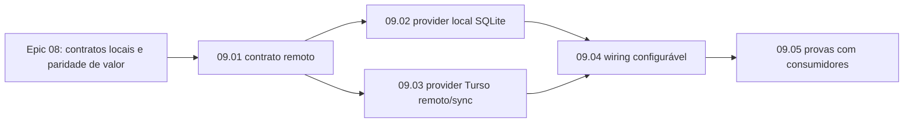

# Epic 09: Providers Duráveis Externos

> OBSOLETO desde o Epic 17.C: providers de estado, `DurableSqlProvider` e
> service bindings foram removidos do runtime. Este epic fica como registro
> histórico da arquitetura pré-Epic 17, não como backlog atual.

**Origin:** `planning/edger/roadmap.md`, `planning/edger/docs/value-parity-matrix.md`, `planning/edger/epics/08-valor-buntime/00-overview.md`

## Context

### Macro problem

O Epic 08 provou contratos locais de estado para SQL/KV/queue, mas registrava "Turso remoto/sync" como lacuna do próprio edger. Essa classificação misturava duas responsabilidades: o runtime deve depender de um contrato de estado durável; o transporte remoto/sync específico deve viver em um provider substituível.

### AS-IS

- `edger-core` já define `DurableSqlProvider` como contrato puro.
- `edger-ext-turso` implementa o contrato usando SQLite local por namespace, em memória ou file-backed.
- `edger-ext-keyval` usa `DurableSqlProvider` como backend para KV/queue.
- O orchestrator registra providers por capability (`provider:durableSql`, `provider:keyValue`, `provider:queue`) sem precisar conhecer transporte.
- A matriz do Epic 08 agora aponta este epic como owner do provider externo remoto/sync.

### TO-BE

- Turso remoto/sync passa a ser dependência/provider externo planejado, não implementação obrigatória dentro do core ou do orchestrator.
- O edger mantém `DurableSqlProvider` como fronteira estável.
- O provider local SQLite é tratado como implementação local/single-node.
- Um provider remoto/sync pode evoluir como crate/repo separado e ser registrado no composition root sem vazar detalhes de Turso para workers, gateway, KV/queue ou auth.

### Out of scope

- Implementar Turso remoto/sync nesta fase de planejamento.
- Renomear crates ou mover arquivos sem uma história de compatibilidade.
- Trocar o provider local usado por testes e demos.
- Acoplar `edger-orchestrator` a SDKs ou variáveis específicas de Turso.

## Traceability

- `planning/edger/epics/08-valor-buntime/04-servicos-de-estado-turso-kv-queue.md`
- `planning/edger/docs/value-parity-matrix.md`
- `planning/edger/docs/durable-provider-contract.md`
- `planning/edger/docs/extensions.md`
- `docs/developers/06-operacao-e-testes.adoc`
- `edger-core/src/bindings.rs`
- `edger-ext-turso/src/lib.rs`
- `edger-ext-keyval/src/lib.rs`

## Story backlog

| Story | Arquivo | Objetivo | Tamanho | Status | Depende de |
|---|---|---|---|---|---|
| 09.01 Contrato de provider remoto | `01-contrato-provider-sql-remoto.md` | Definir requisitos observáveis para providers SQL remotos sem alterar o contrato core | medium | completed | Epic 08.04 |
| 09.02 Provider local SQLite | `02-provider-local-sqlite.md` | Clarificar naming, docs e compatibilidade do provider local atual | medium | completed | 09.01 |
| 09.03 Provider Turso remoto/sync | `03-provider-turso-remoto-sync.md` | Criar implementação remota/sync substituível para `DurableSqlProvider` | large | obsolete/cancelled (2026-07-03) | 09.01 |
| 09.04 Wiring por configuração | `04-wiring-provider-configuravel.md` | Selecionar provider durável no composition root sem acoplar o orchestrator | medium | completed | 09.02, 09.03 |
| 09.05 Provas com consumidores reais | `05-provas-consumidores-duraveis.md` | Provar workers, KV/queue e gateway history usando provider durável externo | large | completed | 09.04 |

## Roadmap

### Fases sugeridas

| Fase | Stories | Validação intermediária |
|---|---|---|
| A - Fronteira | 09.01 | Contrato de provider remoto descrito sem mudar `edger-core` desnecessariamente |
| B - Implementações | 09.02, 09.03 | Provider local continua compatível; provider remoto implementa a mesma fronteira |
| C - Integração | 09.04 | Binário seleciona provider por configuração, sem acoplar pipeline |
| D - Prova | 09.05 | Workers, KV/queue e gateway usam provider externo em fluxo observável |

### Paralelismo

- 09.02 e 09.03 podem avançar em paralelo depois de 09.01.
- 09.04 deve esperar as decisões de contrato e naming para não congelar configuração errada.
- 09.05 só fecha quando houver provider remoto/sync executável e wiring configurável.

## Epic acceptance criteria

- [x] Turso remoto/sync está documentado como provider externo substituível, não como obrigação interna do edger.
- [x] `edger-core` permanece a fronteira de contrato, sem dependência de SDK Turso.
- [x] Provider local SQLite continua disponível para testes, demos e single-node.
- [x] Provider Turso remoto/sync implementa `DurableSqlProvider` sem exigir mudanças em workers consumidores.
- [x] `edger-orchestrator` seleciona provider por composição/configuração, não por lógica espalhada no pipeline.
- [x] Pelo menos um worker, KV/queue e uma feature operacional de gateway usam provider durável externo em evidência versionada.
- [x] Gates obrigatórios seguem verdes: Rust gate e `SCRATCH=planning/edger/status/evidence planning/edger/scripts/run-gates.sh`.

## Risks

| Risk | Severity | Mitigation |
|---|---|---|
| Acoplar o runtime ao SDK Turso | High | Manter `DurableSqlProvider` como fronteira única e registrar implementação no composition root |
| Renomear provider local quebrando testes e docs | Medium | Fazer renome/alias como história própria com compatibilidade explícita |
| Tratar sync remoto como detalhe trivial | High | Exigir história dedicada para credenciais, health, retries, modo local replica e evidência multi-consumidor |
| Duplicar contratos de SQL/KV/queue | Medium | Reusar traits de `edger-core`; não criar API paralela para Turso |
| Fechar Epic 08 com dependência escondida | Medium | Matriz do Epic 08 referencia Epic 09 como dependência planejada quando o valor exigir provider externo |

## Status

obsolete/cancelled (2026-07-03) - Epic 17.C removeu `DurableSqlProvider`, providers de estado e bindings do runtime. A história 09.03 e o restante do Epic 09 ficam como registro histórico da fase pré-Epic 17, não como backlog atual do edger.
