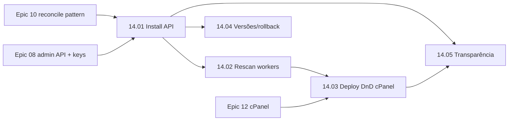

# Epic 14: Deploy de Apps (mini Vercel local)

**Origin:** `planning/edger/roadmap.md`, decisão de produto do operador (2026-07-02): "o EdgeR precisa facilitar deploy de apps da maneira mais fácil e transparente possível — um mini Vercel/Cloudflare onde o desenvolvedor sobe apps sem se preocupar com infraestrutura".

**Depends on epics:** `planning/edger/epics/10-operacao-extensoes-plugins/00-overview.md` (reconcile pattern), `planning/edger/epics/12-frontends-modulares-cpanel/00-overview.md` (cPanel), `planning/edger/epics/08-valor-buntime/00-overview.md` (admin API, keys, enable/disable)

## Context

### Macro problem

Hoje o deploy de um worker no EdgeR é filesystem puro: copiar um diretório para `RUNTIME_WORKER_DIRS` e **reiniciar o binário**. Não há upload, não há rescan em runtime e não há UI. O Buntime resolvia isso com um file manager drag-and-drop no cPanel + `workers:install`. Sem esse caminho, o EdgeR não entrega a promessa central do produto: desenvolvedor sobe um app e ele está no ar, sem tocar em infra.

### AS-IS

- Workers indexados apenas no boot (`load_manifests_from_dirs` em `RUNTIME_WORKER_DIRS`).
- `POST /api/admin/workers/{name}/enable|disable` opera só sobre workers já indexados.
- Reconcile existe apenas para extensões (`POST /api/admin/extensions/reconcile`, Epic 10).
- cPanel (Epic 12, redesign 2026-07-02) é leitura/operação; sem file manager.
- MCP local (Epic 13) escreve arquivos de worker e valida manifests, mas depende do restart para o worker aparecer.
- Ingress body cap de 4 MiB (`MAX_BODY_BYTES`) limita uploads; override por rota é pendência da 07.07.

### TO-BE

- `POST /api/admin/workers/install` recebe um pacote zip, valida manifest/estrutura, escreve atomicamente no worker root e indexa o worker **sem restart**.
- `POST /api/admin/workers/rescan` reconcilia disco ↔ índice (dry-run + apply), cobrindo também workers copiados manualmente ou escritos pelo MCP.
- cPanel ganha view Deploy com drag-and-drop de zip/pasta: preview do manifest inferido → confirmar → app no ar com URL clicável.
- Versões coexistem (`name@semver`); rollback é trocar o enable da versão.
- Pós-deploy transparente: URL do app, kind inferido, visibilidade e primeiros logs/erros de request.

### Out of scope

- Deploy remoto/multi-node, CDN, build pipeline (npm install/bundling no servidor).
- Marketplace/registry público de apps.
- Autoscaling, domínios custom com TLS automático.
- Hot reload de extensões Rust (continua fora, Epic 10).
- Upload acima do body cap global (streaming/chunked upload fica para evolução; v1 documenta o limite de 4 MiB).

## Traceability

- `edger-orchestrator/src/admin_api.rs` (rotas admin, permissões)
- `edger-orchestrator/src/manifest_index_stub.rs` (`ManifestIndex` — `Arc<RwLock>`, insert em runtime)
- `edger-orchestrator/src/manifest_loader.rs` (`load_manifests_from_dirs`, validação de manifest)
- `edger-orchestrator/src/registry.rs` (padrão reconcile de extensões, Epic 10.02)
- `workers/cpanel/` (cPanel shadcn, Epic 12 + redesign 2026-07-02)
- `edger-mcp/` (authoring local, Epic 13)
- Buntime refs: file manager DnD do cPanel, permissão `workers:install` (ai-memory zommehq/buntime)

## Story backlog

| Story | Arquivo | Objetivo | Tamanho | Status | Depende de |
|---|---|---|---|---|---|
| 14.01 Install API | `01-install-api.md` | Upload de pacote zip com validação, escrita atômica e indexação sem restart | large | **completed** | Epic 08.02, Epic 10.02 |
| 14.02 Rescan de workers | `02-rescan-workers.md` | Reconciliar disco ↔ índice em runtime (dry-run + apply) | medium | **completed** | 14.01 (compartilha indexação incremental) |
| 14.03 Deploy DnD no cPanel | `03-deploy-dnd-cpanel.md` | View Deploy com drag-and-drop, preview de manifest e URL do app | large | **completed** | 14.01, 14.02, Epic 12 |
| 14.04 Versões e rollback | `04-versoes-rollback.md` | `name@semver` coexistindo; rollback via enable/disable de versão | medium | **completed** | 14.01 |
| 14.05 Transparência pós-deploy | `05-transparencia-pos-deploy.md` | Resposta de deploy com URL/kind/visibilidade + erros por worker na listagem | small | **completed** | 14.01, 14.03 |

## Roadmap

### Fases sugeridas

| Fase | Stories | Validação intermediária |
|---|---|---|
| A — Fatia vertical (autorizada) | 14.01 → 14.02 | Deploy de worker novo via `curl` zip → responde sem restart; rescan detecta worker copiado manualmente |
| B — Produto | 14.03 | DnD no Browser: drop de zip → preview → app no ar com URL |
| C — Operação madura | 14.04 + 14.05 | Duas versões coexistem, rollback observável; resposta de deploy mostra URL/kind/logs |

### Paralelismo

- 14.04 pode avançar em paralelo com 14.03 depois da 14.01.
- 14.05 fecha por último (depende da resposta de install e da UI).

## Epic acceptance criteria

- [ ] `POST /api/admin/workers/install` (zip) exige permissão `workers:install`, valida manifest/estrutura, rejeita path traversal/zip-slip e tamanho acima do cap, escreve atomicamente e indexa sem restart.
- [ ] Worker instalado responde na sua rota imediatamente após o install (E2E sem restart do processo).
- [ ] `POST /api/admin/workers/rescan` tem dry-run (diff disco↔índice) e apply, sem prometer hot reload de extensões.
- [ ] cPanel Deploy: drop de zip → preview (nome, versão, kind, visibilidade) → confirmar → link para o app; erros de validação legíveis.
- [ ] Duas versões do mesmo worker coexistem; rollback = trocar enable, provado por teste.
- [ ] Resposta de install/deploy inclui URL do app, kind inferido e visibilidade; falhas de primeiro request ficam visíveis (logs operacionais).
- [ ] UI/API não introduzem bypass de auth/CSRF/namespace; install respeita namespaces do principal.
- [ ] Gates verdes: Rust gate + `SCRATCH=planning/edger/status/evidence planning/edger/scripts/run-gates.sh`.

## Risks

| Risk | Severity | Mitigation |
|---|---|---|
| Zip-slip/path traversal no extract | High | Validar cada entry contra o root canônico antes de escrever; testes negativos dedicados |
| Escrita parcial corrompe worker servindo tráfego | High | Extrair para dir temporário + rename atômico; nunca escrever direto no destino final |
| Upload grande estoura body cap global (4 MiB) | Medium | Documentar limite v1; per-route override é follow-up da 07.07; streaming fica para evolução |
| Índice em runtime diverge do disco | Medium | Rescan com dry-run mostra diff; apply re-deriva do disco (fonte de verdade) |
| Install sobrescreve worker existente silenciosamente | Medium | Colisão `name@version` retorna erro tipado; sobrescrever exige flag explícita ou nova versão |
| DnD de pasta (não zip) varia por browser | Low | v1 aceita zip; pasta via webkitdirectory como melhoria progressiva |

## Recommended next step

- Fatia vertical autorizada: executar 14.01 e 14.02 (install API + rescan) com prova E2E local.
- Depois: `/agile-story` em `03-deploy-dnd-cpanel.md`.

## Status

**completed** (2026-07-02) — epic criado a partir da decisão de produto do operador: o EdgeR como "mini Vercel/Cloudflare" local onde o desenvolvedor sobe apps sem se preocupar com infraestrutura (paridade com o file manager DnD do Buntime). Todas as 5 stories entregues e validadas no preview: 14.01 install API (zip, zip-slip, escrita atômica, sem restart), 14.02 rescan disco↔índice (dobrado no Refresh do cPanel), 14.03 deploy drag-and-drop na modal de Workers, 14.04 versões coexistentes + rollback por versão, 14.05 transparência pós-deploy (erros por worker na listagem). Prova live e E2E em `status/evidence/deploy-vertical-slice-2026-07-02.txt`. Gate Rust: 342 testes verdes.
