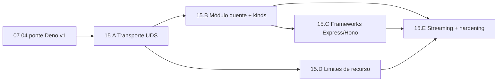

# Epic 15: Runtime JS Durável — workers Deno multi-processo isolados

**Origin:** `planning/edger/docs/js-runtime-durable-design.md`, `planning/edger/status/evidence/js-runtime-perf-2026-07-02.md`, decisão sobre a Story 07.04.

**Depends on epics:** `planning/edger/epics/07-avancado/00-overview.md` (07.04 ponte Deno v1, matriz de compat), `planning/edger/epics/04-worker-management/00-overview.md` (pool, supervisor, lifecycle), `planning/edger/epics/14-deploy-apps/00-overview.md` (install/rescan → hot-reload por deploy)

## Context

### Macro problem

A execução JS/TS hoje usa a ponte Deno CLI v1: um `deno eval` por request, com marcador de stdout, re-import com cache-bust e streaming bounded-first-chunk. Medição (2026-07-02): **~40 ms/request** (spawn ~10 ms + re-import ~30 ms), ~10x mais lento que in-process. É funcional, mas não é a fundação durável. Além disso, o produto exige alta compat com frameworks (Express/Hono/npm) e controle real de recurso por worker — dois requisitos que a ponte v1 não atende e que o embedding de `deno_core` atenderia mal.

### AS-IS

- `DenoCliRunner` faz `deno run` de um script bridge por request; captura por marcador de stdout; re-import por `?edger=<uuid>`.
- `ResourceLimits`/`LimitGuard`/`CpuTimer` existem como vocabulário; enforcement de memória/CPU é **stub** (só wall-clock timeout é real).
- `IsolateTransport`, `InProcessTransport` e `UdsTransport` (stub) + `wire::{encode_frame, decode_frame}` (postcard) + feature `multiproc` já provisionados.

### TO-BE

- Workers como **processos Deno persistentes, pré-aquecidos e sandboxados**, cada um rodando o Deno completo (compat total: TS, `fetch`, `node:`, `npm:`, import maps, remoto/JSR).
- Orquestrador ↔ worker por **protocolo binário postcard/UDS** (`UdsTransport` real), com **streaming real** por frames e módulo importado **uma vez**.
- **Limites de recurso enforçáveis pelo SO** (rlimit/cgroup): memória, CPU, FDs; kill limpo no estouro + reciclagem.
- Frameworks Express/Hono como fixtures `tested` na matriz de compat.
- Embedding `deno_core`/`deno_runtime` fica como **backend futuro** atrás da mesma trait, sem abrir mão da fronteira de processo.

### Out of scope

- Embutir V8/`deno_core` in-process nesta fase (backend futuro, não descartado).
- cgroup/sandbox multi-node/K8s (foco local; contratos prontos para produção).
- Densidade estilo isolates (trade-off consciente por isolamento/compat).

## Traceability

- `planning/edger/docs/js-runtime-durable-design.md` (design canônico)
- `edger-isolation/src/transport.rs` (`IsolateTransport`, `UdsTransport`, `InProcessTransport`)
- `edger-isolation/src/wire.rs` + `edger-core/src/wire.rs` (`SerializedRequest/Response`, framing postcard)
- `edger-isolation/src/deno/cli.rs` (ponte v1; harness/captura a evoluir)
- `edger-isolation/src/limits.rs` (`ResourceLimits`, `LimitGuard`, `CpuTimer` — stub → real)
- `edger-worker/src/{pool,supervisor,ephemeral}.rs` (lifecycle, gate)
- `planning/edger/docs/compat-matrix.md` (Express/Hono como novas linhas)

## Story backlog

| Story | Arquivo | Objetivo | Tamanho | Status | Depende de |
|---|---|---|---|---|---|
| 15.A Transporte UDS mínimo | `01-transporte-uds-minimo.md` | Worker Deno persistente; round-trip por UDS (JSON frames); módulo importado uma vez | large | **completed** | 07.04, Epic 04 |
| 15.B Módulo quente + paridade de kinds | `02-modulo-quente-kinds.md` | Import uma vez; fetch/routes/SPA pelo processo persistente; matriz atual verde via UDS; perf re-medida | large | **completed** | 15.A |
| 15.C Compat de frameworks | `03-compat-frameworks.md` | Express + Hono (npm) rodando via captura de listener; `tested` na compat-matrix | medium | **completed** | 15.B |
| 15.D Limites de recurso reais | `04-limites-recurso-reais.md` | Cap de heap V8 por worker no spawn; kill on breach + reciclagem; RSS/CPU e cgroup adiados | large | **completed** | 15.A |
| 15.E Streaming + hardening | `05-streaming-hardening.md` | Streaming real por frames; sandbox SO; pré-warm/pool sizing; ponte v1 vira legado | medium | not started | 15.B, 15.C, 15.D |

## Roadmap

### Fases sugeridas

| Fase | Stories | Validação intermediária |
|---|---|---|
| A — Transporte | 15.A | E2E: GET a worker JS responde via UDS, sem `deno eval` |
| B — Paridade | 15.B (‖ 15.D) | Compat suite atual verde via UDS; perf ~poucos ms; limites reais |
| C — Produto | 15.C | Express/Hono `tested` |
| D — Fechamento | 15.E | Streaming SSE real; sandbox; ponte v1 legado |

### Paralelismo

- 15.D (limites) pode avançar em paralelo com 15.B depois de 15.A.
- 15.E fecha por último (depende de B, C e D).

## Epic acceptance criteria

- [ ] Worker JS responde por `UdsTransport` (postcard/UDS), processo Deno persistente, sem `deno eval` por request.
- [ ] Módulo do usuário importado uma vez por processo; hot-reload no deploy (install/rescan).
- [ ] Matriz de compat atual (hello-world, read-body, routes, SPA, serve-html, chunked, sse, commonjs) verde via UDS.
- [ ] Express e Hono (via `npm:`) rodam e viram `tested` na compat-matrix.
- [ ] Limites de memória/CPU por worker enforçáveis pelo SO; worker que estoura é morto e reciclado; teto respeitado por teste.
- [ ] Streaming real (SSE/stream) passthrough por frames, não bounded-first-chunk.
- [ ] Perf re-medida: JS/request cai de ~40 ms para a casa de poucos ms.
- [ ] Isolamento: crash/OOM de um worker não derruba o host nem afeta outro worker (teste).
- [ ] Gates verdes: Rust gate + `SCRATCH=planning/edger/status/evidence planning/edger/scripts/run-gates.sh`.

## Risks

| Risk | Severity | Mitigation |
|---|---|---|
| Densidade menor que isolates (memória por processo) | Média | Pré-warm limitado + reciclagem idle/TTL; pool sizing configurável; embedding como backend futuro |
| cgroup v2 varia por SO (Linux vs macOS dev) | Média | rlimit base portável; cgroup reforço em Linux/prod; tiers por plataforma documentados |
| Protocolo UDS/streaming cresce em complexidade | Média | Reusar `wire::encode_frame`/postcard; contrato versionado; round-trip + negativos |
| Captura de `app.listen()` de frameworks Node | Média | Evoluir adapter `node:http` existente; Express/Hono como gate |
| Regressão da matriz durante a migração | Alta | Ponte v1 fica como fallback até 15.B passar a matriz; só então vira legado |

## Status

**in-progress** (2026-07-02) — epic criado a partir do design `js-runtime-durable-design.md`, aprovado após medição de performance. Reorienta a Story 07.04: em vez de embutir `deno_core`, realizar o design multi-processo (UDS + frames JSON) já provisionado no código, satisfazendo compat de frameworks e controle de recurso. **Fase A (15.A) entregue** em 2026-07-02: worker Deno persistente por UDS, round-trip warm p50 67us (~600x vs ponte v1). 15.B entregue: backend de processo no pool por default, paridade fetch/routes/SPA, workers JS persistentes, perf end-to-end p50 1.57ms (~25x). 15.C entregue: Express (`npm:express@5`) e Hono (`npm:hono@4`) rodam pelo processo persistente sem reimplementação (adapter `node:http` + captura `Deno.serve`), `tested` na compat-matrix. 15.D entregue: cap de heap V8 por worker (`--max-old-space-size`) derivado de `ResourceLimits::from_config`, worker que estoura é morto (fatal OOM) e reciclado, com host saudável — decisão medida (heap cap vs `RLIMIT_AS`), provada por `resource_limits.rs`; RSS/CPU e cgroup adiados. Próxima: 15.E (streaming+hardening).
