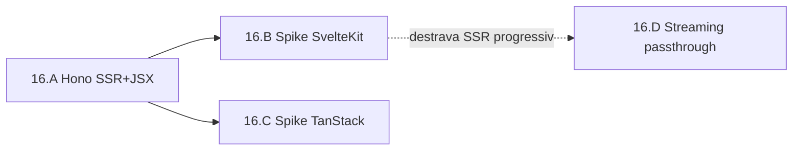

# Epic 16: Fullstack SSR + Streaming real

**Origin:** `planning/edger/epics/15-runtime-js-duravel/00-overview.md` (adiados do 15.E) + decisão do operador (2026-07-02): priorizar frameworks leves (Hono SSR/JSX, SvelteKit, TanStack Start) sobre Next.js.

## Context

- **Problema:** `kind: fullstack` responde `501 adapter-required` — o EdgeR não tem caminho first-class para apps SSR. E o streaming ao cliente é bounded (snapshot), não passthrough: SSE/streaming progressivo não chegam incrementais.
- **AS-IS:** o processo Deno persistente (Epic 15) já captura `Deno.serve`, default fetch e `node:http.createServer().listen()` — Express e Hono rodam. Deno transpila TSX nativamente (`jsxImportSource: hono/jsx` provado em scratchpad: SSR sem build step). Frameworks cujo build gera um desses três contratos já *poderiam* rodar como `kind: fetch`, mas nada é testado/documentado. Body é lido bounded (`EDGER_STREAM_MAX_*`).
- **TO-BE:** (1) Hono SSR+JSX como caminho fullstack **blessed** (fixture + docs + validação live, deploy de fonte `.tsx` sem build); (2) SvelteKit e TanStack Start validados por spike com build real, findings documentados; (3) streaming passthrough real: frames chunk/end no UDS, cliente recebe incremental (SSE de verdade, SSR progressivo).
- **Fora de escopo:** Next.js (complexidade/superfície de compat — tier futuro via captura `node:http` do standalone); HonoX islands; backpressure fino/HTTP2 push; adapter declarativo `kind: fullstack` com roteamento estático-vs-SSR no Rust (fica para depois dos spikes).

## Traceability

- `planning/edger/epics/15-runtime-js-duravel/05-streaming-hardening.md` (adiados: passthrough)
- `planning/edger/docs/compat-matrix.md` (linhas SSE/stream/fullstack)
- `edger-isolation/src/multiproc.rs`, `edger-isolation/src/multiproc_harness.mjs` (protocolo UDS)
- Docs Hono: hono.dev/docs/guides/jsx, hono.dev/docs/middleware/builtin/jsx-renderer

## Story backlog

| Story | Arquivo | Objetivo | Tamanho | Status | Depende de |
|---|---|---|---|---|---|
| 16.A Hono SSR+JSX first-class | `01-hono-ssr-jsx.md` | Fixture `.tsx` sem build via jsxRenderer; E2E + live; docs blessed path | small | not started | 15.C |
| 16.B Spike SvelteKit | `02-spike-sveltekit.md` | Build real (adapter-deno/node) rodando pelo processo persistente; findings | medium | not started | 16.A |
| 16.C Spike TanStack Start | `03-spike-tanstack-start.md` | Build com preset node/deno pela captura; findings honestos (best-effort) | medium | not started | 16.A |
| 16.D Streaming passthrough | `04-streaming-passthrough.md` | Frames chunk/end no UDS; body incremental até o cliente; SSE real; cancel-safe | large | not started | 15.E |

## Roadmap

- 16.A primeiro: menor custo, maior valor imediato (mata o gap fullstack com o runtime atual).
- 16.B e 16.C são spikes independentes entre si (podem paralelizar); dependem só das capturas já existentes.
- 16.D é ortogonal (transporte), fecha por último por ser o de maior blast radius.

## Epic acceptance criteria

- [ ] Worker Hono SSR+JSX (`.tsx`, sem build) responde HTML renderado no servidor via processo persistente; documentado como caminho fullstack recomendado.
- [ ] SvelteKit: build real testado; resultado (funciona/o que falta) registrado na compat-matrix.
- [ ] TanStack Start: idem, best-effort com findings honestos.
- [ ] SSE/stream chegam **incrementais** ao cliente HTTP (passthrough), não snapshot bounded; worker `sse` emite eventos contínuos observáveis com `curl -N`.
- [ ] Cancel-safe: disconnect do cliente mid-stream não wedgeia worker nem vaza processo.
- [ ] Gates verdes (workspace + multiproc + oráculo de planning).

## Risks

| Risk | Severity | Mitigation |
|---|---|---|
| Compat Node dos builds SvelteKit/TanStack sob Deno | Média | Spikes com build real antes de prometer suporte; findings honestos na matriz |
| TanStack Start instável (mudou de fundação recentemente) | Média | Best-effort documentado; não vira compromisso de suporte |
| Streaming muda protocolo UDS (frames) e contrato Isolate | Alta | Frames versionados com tag; fallback buffered como default no trait; testes de round-trip + cancel |
| Streaming × cancelamento (disconnect mid-stream) | Alta | Guard já existente no pool; stream body carrega guard próprio até end/drop |

## Status

**in-progress** (2026-07-02) — criado a partir dos adiados do 15.E + direção do operador (frameworks leves primeiro, Hono SSR+JSX como combinação de interesse).
