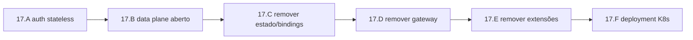

# Epic 17: Edger minimalista (worker soberano)

**Origin:** decisão do operador (2026-07-02) — reposicionar o edger como runtime serverless durável **sem opinião**, num contexto greenfield (nenhum worker em produção; liberdade total de remodelar). Contraparte de adição: `Epic 18 — Escala`.

## Context

- **Problema:** o edger acumulou responsabilidades que decidem *pelo* worker — gate de auth no data plane, service bindings, providers de estado (KV/queue/SQL), gateway operacional (rate limit/cache/redirect), e todo o sistema de extensões/registry/hooks que existe para plugar essas coisas. Isso é complexidade que o operador não quer gerenciar dentro deste projeto, e que ninguém em produção depende ainda.
- **AS-IS:** auth de workers via `edger-ext-auth` (store SQLite de API keys, não persiste bem em K8s); estado via `edger-ext-keyval`/`edger-ext-turso*` sobre `DurableSqlProvider`; ingress via `edger-ext-gateway`; tudo plugado por `ExtensionRegistry` + hooks `onRequest`/`onResponse`/lifecycle. Observabilidade (request-id, métricas, tracing) já é middleware **built-in**, não passa por hook.
- **TO-BE:** **worker soberano.** O edger só: resolve o worker, roda durável (spawn lazy + TTL, streaming, cap de recurso), injeta env/secrets do worker, e sai da frente. Auth só no **control plane** (`/api/admin/*`), stateless e opt-in (OIDC genérico + root-key via Secret-arquivo). Data plane **aberto** — o worker faz sua própria auth (via lib/middleware dele) e escolhe seu backend (libSQL, Deno KV, Postgres+PgBouncer, ou nada). Ingress vira API Gateway externo.
- **Princípio-guia:** qualquer decisão que hoje o edger toma "para facilitar a vida do worker", o **próprio worker** passa a tomar. O que não tem consumidor legítimo após a poda é **deletado** (não desativado) — o git history é a rede de resgate.
- **Fora de escopo:** classe de lifecycle `always-on` (decidido: 100% serverless, workers morrem); escala (Epic 18); construir serviço de estado externo (Deno KV multi-tenant é projeto à parte, opcional, escolhido pelo worker).

## Traceability

- `edger-ext-auth`, `edger-ext-gateway`, `edger-ext-keyval`, `edger-ext-turso`, `edger-ext-turso-remote` (crates a deletar)
- `crates/edger-core/src/extension.rs`, `crates/edger-core/src/bindings.rs`, `crates/edger-core/src/auth.rs`
- `crates/edger-orchestrator/src/registry.rs`, `service_bindings.rs`, `auth.rs`, `admin_api.rs`, `pipeline.rs`
- `planning/edger/docs/compat-matrix.md` (linhas que deixam de valer)

## Story backlog

| Story | Arquivo | Objetivo | Tamanho | Status | Depende de |
|---|---|---|---|---|---|
| 17.A Control-plane auth stateless (OIDC + root-key) | `01-control-plane-auth.md` | Validador OIDC genérico (discovery+JWKS+claims) opt-in + root-key via Secret-arquivo (hot-reload); deletar `edger-ext-auth`; só gateia `/api/admin/*` | large | **completed** (2026-07-03) | — |
| 17.B Data plane aberto | `02-data-plane-aberto.md` | Worker recebe request cru (Authorization intacto); só control plane gateia | small | **completed** (2026-07-02) | — |
| 17.C Remover estado + bindings | `03-remover-estado-bindings.md` | Deletados keyval/turso/turso-remote + service bindings + DurableSqlProvider; env/secrets + egress mantidos | medium | **completed** (2026-07-02) | 17.B |
| 17.D Remover gateway + shell | `04-remover-gateway.md` | Deletar `edger-ext-gateway` **e** o shell routing (`shell_gateway`); ingress/composição → externo | medium | **completed** (2026-07-02) | — |
| 17.E Remover sistema de extensões | `05-remover-extensoes.md` | Deletar `ExtensionRegistry`/hooks/`Extension`/`Middleware`; limpar `visibility`/`namespaces` vestigiais | large | **completed** (2026-07-03) | 17.A–17.D |
| 17.F Deployment K8s de referência | `06-deployment-k8s.md` | Helm chart Rancher-style (questions.yaml modelado no Buntime, stateless) que instala e serve o cPanel; Deployment + HPA + Secret-arquivo | medium | **completed** (2026-07-03) | 17.A–17.E |

## Roadmap

Ordem = da folha para a raiz: primeiro troca a auth (destrava o problema K8s), depois abre o data plane, depois arranca os consumidores do registry (estado, gateway), e só então o registry em si fica sem consumidor e sai. O deployment fecha.

## Epic acceptance criteria

- [x] Control plane protegido por OIDC (opt-in, provider-agnóstico) e/ou root-key via Secret-arquivo; **zero** persistência de auth (sem SQLite, sem PVC); edger stateless (HPA-ready).
- [x] Data plane aberto: worker recebe o request cru (inclusive `Authorization`) e decide sua própria auth.
- [x] Worker conecta direto no backend que escolher (env/secrets injetados + egress); sem bindings/providers no caminho.
- [x] `edger-ext-{auth,gateway,keyval,turso,turso-remote}` deletados; sistema de extensões/registry/hooks deletado; `visibility`/`namespaces` removidos.
- [x] Observabilidade (request-id, métricas, tracing) preservada (já é built-in).
- [x] Manifesto K8s de referência (Deployment stateless + Secret-arquivo) + doc de rotação sem restart.
- [x] Gates verdes (workspace + multiproc + clippy + fmt + oráculo); MVP live no preview segue servindo workers (SSR/SPA/API/streaming).

## Risks

| Risk | Severity | Mitigation |
|---|---|---|
| Deleção grande quebra o pipeline de dispatch | Alta | Ordem folha→raiz; gate + preview live após cada story; commit por story (reversível) |
| Header-trust de auth spoofável | Alta | Preferir validação de JWT (assinatura via JWKS) a header cru; header-trust só sob NetworkPolicy fechada, documentado |
| Perder observabilidade junto com os hooks | Média | Confirmado que request-id/métricas/tracing são middleware built-in, não hooks — não são tocados |
| Reaproveitar algo dos módulos no futuro | Baixa | Git history preserva tudo; decisão explícita de deletar, não desativar |

## Status

**completed** (2026-07-03) — 17.A–17.F concluídas e mergeadas. Evidência curta: ControlAuth built-in com root-key hot-reload e OIDC genérico validado contra Keycloak real; data plane aberto; providers de estado/bindings, gateway/shell e extensão/registry/hooks removidos; chart/Dockerfile stateless validado em cluster K3s real com cPanel, probes admin e rotação de root-key sem restart.
