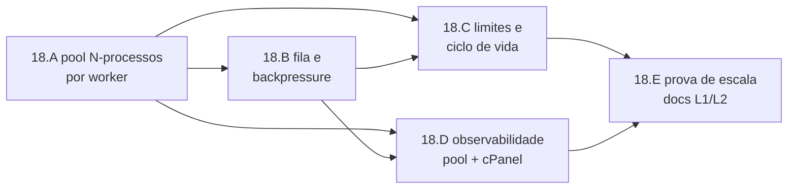

# Epic 18: Escala worker pool (Level 1) + HPA (Level 2)

**Origin:** limitação de concorrência registrada pela arquitetura do Epic 15 e reservada como adição pelo Epic 17. O Epic 15 entregou o processo Deno persistente por worker (`planning/edger/epics/15-runtime-js-duravel/00-overview.md`, `01-transporte-uds-minimo.md`, `02-modulo-quente-kinds.md`) e deixou pré-warm/pool sizing fora da fatia de streaming (`05-streaming-hardening.md`). O Epic 17 reposicionou o edger como runtime stateless/HPA-ready e declarou escala fora de escopo, apontando para o Epic 18 (`planning/edger/epics/17-edger-minimalista/00-overview.md`, `06-deployment-k8s.md`). Decisão de arquitetura (2026-07-03): Level 1 = pool de N processos por worker dentro do edger; Level 2 = réplicas do edger via HPA; Level 3 = Knative/FaaS fora de escopo.

## Context

- **Problema:** o runtime durável do Epic 15 removeu o custo de reimportar módulo a cada request, mas hoje cada worker persistente tem uma única `WorkerInstance` por `WorkerCacheKey`. Essa instância segura um único isolate/processo e serializa concorrência pelo `dispatch_lock`; em streaming, os locks viajam dentro do body até o fim do stream. Resultado: 1 processo persistente = 1 request concorrente por worker por réplica.
- **AS-IS:** `edger-worker/src/pool.rs` cacheia `WorkerInstance` em `WorkerLru`; `edger-worker/src/instance.rs` tem `dispatch_lock` e um `isolate`; `edger-isolation/src/multiproc.rs` tem `DenoProcessIsolate` com `process: Option<DenoWorkerProcess>`; `WorkerManifest` (`edger-core/src/manifest.rs`) expõe `ttl`, `timeout`, `idleTimeout`, `maxRequests`, `lowMemory`, mas não campos de concorrência/pool; fila limitada existe só para `ttl_ms == 0` via `EphemeralGate`.
- **TO-BE:** cada worker persistente pode ter um pool local de processos Deno, configurado por manifesto e normalizado em `WorkerConfig`. O edger escolhe uma instância livre por request (least-busy/round-robin), cria processos sob demanda até `maxProcesses`, aplica TTL/idle/maxRequests por processo, enfileira de forma limitada quando todos estão ocupados e expõe métricas por worker. O chart/HPA existente segue como Level 2 documentado, sem construir Knative/FaaS.
- **Princípio-guia:** escala horizontal interna primeiro, mantendo o edger stateless e o worker soberano. O pool melhora concorrência sem introduzir estado compartilhado, sem reabrir gateway/bindings/extensões, e sem esconder backpressure.
- **Fora de escopo:** Level 3 (Knative/FaaS), balanceamento multi-réplica dentro do edger, estado distribuído, sticky sessions no runtime, filas persistentes, autoscaling por métrica customizada em cluster como implementação obrigatória.

## Traceability

- `edger-worker/src/pool.rs` (`WorkerPool`, `get_or_create`, `fetch_worker_inner`, `fetch_worker_stream_inner`, `shutdown`, métricas)
- `edger-worker/src/instance.rs` (`WorkerInstance`, `dispatch_lock`, `isolate`, `request_count`, TTL handle)
- `edger-worker/src/types.rs` (`PoolConfig`, `WorkerCacheKey`)
- `edger-worker/src/supervisor.rs` (`Supervisor::on_request_start`, `on_request_complete`, `retire_for_max_requests`, TTL)
- `edger-worker/src/ephemeral.rs` (`EphemeralGate`, fila limitada hoje apenas para `ttl_ms == 0`)
- `edger-worker/src/metrics.rs` (`PoolMetrics`, `WorkerStats`, `MetricsCollector`)
- `edger-isolation/src/multiproc.rs` (`DenoWorkerProcess`, `DenoProcessIsolate`, UDS framed stream)
- `edger-isolation/src/limits.rs` (`ResourceLimits::from_config`)
- `edger-core/src/manifest.rs` (`WorkerManifest`)
- `edger-core/src/config.rs` (`WorkerConfig`, `parse_worker_config`)
- `edger-orchestrator/src/metrics.rs`, `edger-orchestrator/src/pipeline.rs`, `edger-orchestrator/src/server.rs` (`/metrics`, `/metrics/stats`, erro HTTP)
- `edger-orchestrator/tests/perf_harness.rs` (baseline warm-hit)
- `charts/edger/templates/hpa.yaml`, `charts/edger/values.yaml`, `planning/edger/docs/deployment-k8s.md` (HPA Level 2 existente)

## Story backlog

| Story | Arquivo | Objetivo | Tamanho | Status | Depende de |
|---|---|---|---|---|---|
| 18.A Pool N-processos por worker | `01-pool-processos-worker.md` | Manifesto/config para `concurrency`, `minProcesses`, `maxProcesses`; fan-out de `WorkerInstance` por worker; roteamento least-busy/round-robin e spawn sob demanda | large | pending | — |
| 18.B Fila e backpressure por worker | `02-fila-backpressure-worker.md` | Fila limitada por worker persistente, timeout de espera, respostas 429/503 tipadas e proteção contra streams longos monopolizando o worker | medium | completed (2026-07-03) | 18.A |
| 18.C Limites e ciclo de vida por processo | `03-limites-ciclo-vida-processo.md` | Aplicar `ResourceLimits`, TTL/idle/maxRequests, recycle e drain gracioso por processo do pool | medium | pending | 18.A, 18.B |
| 18.D Observabilidade do pool + cPanel | `04-observabilidade-pool-cpanel.md` | Métricas Prometheus/JSON por worker: processos ativos/ociosos, fila, espera, rejeições; visibilidade na aba Workers do cPanel como should | medium | pending | 18.A, 18.B |
| 18.E Prova de escala + docs L1/L2 | `05-prova-escala-docs-hpa.md` | Harness comparando 1 vs N processos sob concorrência; docs de escala L1 pool + L2 HPA; limite explícito L3 não construir | medium | pending | 18.A–18.D |

## Roadmap

Ordem = primeiro abrir a unidade de concorrência (processos por worker), depois tornar saturação explícita, então fechar lifecycle/limites e observabilidade. A prova de escala e os docs fecham quando a semântica operacional estiver mensurável.

## Epic acceptance criteria

- [ ] `WorkerManifest`/`WorkerConfig` aceitam configuração de concorrência/pool por worker com defaults seguros: `concurrency`, `minProcesses`, `maxProcesses`, fila e timeout de espera.
- [ ] Worker persistente com `maxProcesses: N` processa até N requests concorrentes na mesma réplica, mantendo isolamento por processo Deno e sem reintroduzir bridge v1.
- [ ] Todos os processos do pool respeitam `ttl`, `idleTimeout`, `timeout`, `maxRequests`, `lowMemory` e reciclagem por erro/OOM.
- [ ] Quando todos os processos estão ocupados, requests entram em fila limitada por worker ou recebem resposta tipada 429/503; streams longos não causam head-of-line blocking além da capacidade configurada.
- [ ] `/metrics` e `/metrics/stats` expõem processos ativos/ociosos, ocupação, fila, latência de espera e rejeições por worker sem labels secret-like.
- [ ] cPanel mostra, no mínimo como should, a visão operacional do pool por worker sem bloquear o runtime headless.
- [ ] `edger-orchestrator/tests/perf_harness.rs` cobre comparação 1 vs N sob concorrência e demonstra melhora verificável em p50/p95/throughput ou queda de wait time.
- [ ] Docs explicam Level 1 (pool interno), Level 2 (HPA via `charts/edger`) e declaram Level 3 Knative/FaaS fora de escopo.
- [ ] Gates esperados: `cargo test --workspace && cargo clippy --workspace -- -D warnings && cargo fmt -- --check`; harness de perf ignorado executável explicitamente; validação live com `cargo run -p edger-orchestrator --bin edger` + `curl` para workers concorrentes e `/metrics`.

## Risks

| Risk | Severity | Mitigation |
|---|---|---|
| Pool por worker virar scheduler complexo demais | Alta | Manter Level 1 local e bounded: sem filas persistentes, sem distribuição, sem sticky global |
| Streams longos ocuparem todos os processos | Alta | Fila/timeout tipados, métricas de wait, docs recomendando `maxProcesses` e HPA para workloads streaming |
| Multiplicar processos estourar memória por worker | Alta | `lowMemory`/heap cap por processo, defaults conservadores e observabilidade de processos ativos |
| Lifecycle ficar inconsistente entre instâncias | Média | `Supervisor` continua sendo a fonte do estado por processo; testes para TTL/maxRequests/drain por instância |
| Labels Prometheus de alta cardinalidade | Média | Labels limitados a worker name/version/namespace; sem path, request id, env ou segredo |
| HPA parecer solução para concorrência de um único worker quente | Média | Docs separam Level 1 (concorrência intra-réplica) de Level 2 (capacidade por réplicas) e mostram limites |

## Status

**pending** (2026-07-03) — épico planejado a partir do AS-IS real do runtime durável: processo Deno persistente por worker já existe, mas o worker persistente ainda serializa requests por instância/processo. Nenhuma implementação iniciada.
