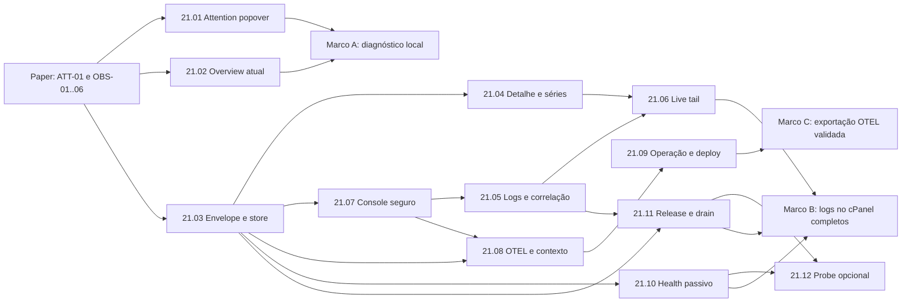

# Epic 21: Observabilidade de Workers no cPanel e integração OTEL

**Origin:** `planning/edger/intake.md`

## Traceability

- **Prototype routes/screens:** `ATT-01 Attention popover`, `OBS-01 Observability overview`, `OBS-02 Worker detail`, `OBS-03 Logs explorer`, `OBS-04 Request trace`, `OBS-05 OTEL settings/status` e `OBS-06 Worker workspace · Logs` no arquivo Paper `01KWZ6Q4CCXHZWB6JP77BMNJCC`.
- **Business rules:** leitura root-only; nenhuma tela, API ou exporter expõe bodies, headers sensíveis, chaves, env ou mensagens sem sanitização; métricas históricas declaram janela, retenção e reset; observabilidade local não depende de backend externo.
- **Source docs:** `planning/edger/design.md`, `planning/edger/docs/compat-matrix.md`, `planning/edger/docs/value-parity-matrix.md`, `planning/edger/epics/08-valor-buntime/07-observabilidade-operacao-e-deploy.md`, `planning/edger/epics/08-valor-buntime/18-gateway-admin-readonly-api.md`, `planning/edger/epics/12-frontends-modulares-cpanel/00-overview.md`, `planning/edger/epics/20-endurecimento-runtime/09-observabilidade-otlp-evento.md`.

## Context

- **Macro problem:** o runtime já produz métricas, erros recentes e eventos estruturados, mas o operador ainda precisa correlacionar APIs, stdout e request IDs manualmente. O cPanel mostra inventário e snapshots, não uma jornada de diagnóstico.
- **Initiative objective:** entregar logs e observabilidade operacional diretamente no cPanel como capacidade essencial do produto, com contratos versionados de eventos/logs/métricas; OTEL entra depois como integração opt-in sem acoplar o runtime a um collector.
- **Expected outcome:** o operador identifica pressão, erros e regressões por worker/versão, acompanha uma execução por request/trace ID e, quando desejar, exporta sinais para uma stack OTEL externa.
- **Constraints:** `edger-core` continua sem I/O; o hot path não recebe armazenamento pesado; cPanel permanece StaticSpa modular; stdout/stderr nunca usa buffer ilimitado; request IDs e paths não viram labels de métricas.

### AS-IS

- `/metrics` expõe Prometheus agregado; `/metrics/stats` expõe snapshot JSON de pool, processos e métricas por worker/versão.
- O cPanel consulta `/metrics/stats` a cada 5 segundos e calcula `req/min` numa janela cliente de 60 segundos; a série desaparece ao recarregar.
- `WorkerErrorLog` mantém no máximo 20 erros por nome de worker, em memória, com `requestId`, status, código, mensagem sanitizada e timestamp; não diferencia versão/namespace na chave.
- `edger.dispatch` emite evento estruturado com worker, versão, namespace, outcome, wall time e status; `edger.operational` registra falhas por superfície, mas esses eventos não são consultáveis pelo cPanel.
- O runtime JS persistente agora drena stdout/stderr continuamente para o store bounded, com redaction, truncamento, rate limit e process ID; live tail ainda não foi implementado.
- O gateway possui stats, logs recentes e SSE próprios; não há envelope operacional compartilhado com dispatch de workers.
- `tracing_init.rs` reconhece `OTEL_EXPORTER_OTLP_ENDPOINT` e sampler, mas o exporter OTLP real não está ligado.

### TO-BE

- `Needs attention` abre popover estruturado com motivos, contagens e ações.
- A navegação `Observability` apresenta saúde, throughput, latência, pressão de fila, erros e freshness com janela declarada.
- O detalhe de worker/versão apresenta processos, séries temporais curtas, recycles, filas, erros, console logs seguros e eventos correlacionados.
- O detalhe de worker/versão funciona como workspace com navegação segmentada e URLs próprias para `Overview`, `Files` e `Logs`; `Settings` e `Deployments` não entram sem contratos operacionais próprios e aprovados.
- A aba `Logs` entrega primeiro os erros recentes já produzidos pelo runtime, identificados por worker/versão/request ID; eventos unificados e console stdout/stderr entram progressivamente sem esconder a fonte ou a retenção disponível.
- O cPanel separa estado de roteamento (`Default`, `Enabled`, `Disabled`), estado momentâneo de processo (`Cold`, `Idle`, `Active`, `Queued`, `Terminating`) e health passivo (`Unobserved`, `Healthy`, `Degraded`, `Failing`); `Serving` deixa de representar health.
- Releases/migrations e drains de processo geram eventos operacionais consultáveis; `release` continua sendo comando de deploy e `beforeunload` + `EdgeRuntime.waitUntil()` continua sendo o contrato de encerramento do worker.
- O explorador oferece filtros por intervalo, worker, versão, processo, nível, outcome, status, request ID e trace ID.
- Cada worker/versão oferece ação `View logs`; a rota de logs e seus filtros ficam no pathname/query do cPanel para sobreviver a refresh e permitir deep link.
- Um store operacional bounded e versionado serve ao cPanel; retenção longa permanece responsabilidade de Prometheus/Loki/Tempo ou outro backend externo.
- OTLP é opt-in por build/configuração, assíncrono e bounded, com traces e logs/eventos primeiro; métricas continuam Prometheus-first e podem ganhar export OTLP sem alterar o contrato local.
- Contexto W3C (`traceparent`/`tracestate`) atravessa ingress, dispatch e processo do worker quando disponível.
- Configuração de deploy expõe endpoint/protocolo/sampling e secret references sem embutir Collector ou credenciais no chart.

### Architecture decisions

1. **Local-first:** cPanel, Admin API, `/metrics` e retenção curta funcionam sem Collector.
2. **OTEL como saída, não storage:** exporter consome o mesmo envelope operacional; não se torna fonte de leitura do cPanel.
3. **Identidade canônica:** `namespace + worker + version`, acrescida de `processId` apenas para eventos/logs; labels Prometheus permanecem de baixa cardinalidade.
4. **Filas limitadas:** store local, captura de console, live tail e batch OTLP têm capacidade, timeout e contadores de dropped/evicted.
5. **Redaction por allowlist:** campos exportáveis são tipados; bodies, tokens, cookies, env, paths de filesystem e headers arbitrários ficam fora do modelo.
6. **Falha externa isolada:** indisponibilidade do Collector nunca bloqueia dispatch; modo padrão é fail-open com health/dropped counters, e configuração inválida falha no startup apenas quando `required=true`.

### Delivery policy

- **Produto essencial:** 21.01 a 21.07. O marco local inclui logs no cPanel, busca/filtros, detalhe, correlação, live tail bounded e funcionamento sem qualquer stack externa.
- **Clareza operacional:** 21.10 e 21.11 separam roteamento de health e tornam releases/drains observáveis sem depender de OTEL.
- **Integração opcional:** 21.08 e 21.09. OTEL/OTLP pode ser habilitado por operadores que precisem de retenção longa, múltiplas instâncias ou integração com ferramentas externas.
- **Probe opcional:** 21.12 adiciona somente checks manuais/on-deploy; polling periódico permanece desligado para não manter workers serverless aquecidos.
- **Independência:** conclusão ou falha da trilha OTEL não pode impedir boot, requests, métricas locais, Admin API ou consulta de logs no cPanel.

### Out of scope

- Embutir Prometheus, Grafana, Loki, Tempo ou OpenTelemetry Collector no binário ou no chart padrão.
- Persistência indefinida, busca full-text irrestrita, profiling contínuo ou ingestão de stdout bruto sem limites.
- Expor request/response bodies, Authorization, cookies, API keys, env ou stack traces não sanitizados.
- Alertas externos, paging/on-call, SLOs distribuídos, tail sampling ou tracing entre múltiplos clusters nesta fase.
- Usar request ID, pathname, process ID ou mensagem como label de métrica.

## Story backlog

| Story | Arquivo | Objetivo | Tamanho | Dependência | Status |
|---|---|---|---|---|---|
| 21.01 Attention popover | `01-attention-popover.md` | Tornar motivos de atenção legíveis e acionáveis | small | -- | completed |
| 21.02 Visão geral | `02-visao-geral-observabilidade.md` | Entregar overview usando sinais existentes | medium | 21.01 | completed |
| 21.03 Eventos unificados | `03-eventos-operacionais-unificados.md` | Criar modelo/API bounded para eventos consultáveis | large | -- | completed |
| 21.04 Detalhe do worker | `04-detalhe-worker-series.md` | Diagnosticar uma versão com métricas e série limitada | large | 21.03 | completed |
| 21.05 Explorador de logs | `05-explorador-logs-correlacao.md` | Filtrar eventos/logs e correlacionar requests/traces | large | 21.03, 21.07 | completed |
| 21.06 Live tail e retenção | `06-live-tail-retencao.md` | Atualização incremental com limites explícitos | medium | 21.04, 21.05, 21.07 | completed |
| 21.07 Captura segura de console | `07-captura-segura-console-worker.md` | Capturar stdout/stderr sem bloquear subprocessos | large | 21.03 | completed |
| 21.08 OTEL opt-in | `08-otel-exporter-contexto.md` | Exportar sinais e propagar contexto distribuído | large | 21.03, 21.07 | completed |
| 21.09 Operação e deploy OTEL | `09-operacao-deploy-otel.md` | Configurar e validar OTLP opt-in em Helm/Rancher | medium | 21.08 | completed |
| 21.10 Health passivo e vocabulário | `10-health-passivo-vocabulario.md` | Separar roteamento, processo e confiabilidade recente | large | 21.03 | completed |
| 21.11 Eventos de release e drain | `11-eventos-release-drain.md` | Tornar migrations e encerramento observáveis no cPanel | medium | 21.03, 21.05 | completed |
| 21.12 Health check opcional | `12-health-check-opcional.md` | Validar uma versão manualmente ou no deploy sem polling | medium | 21.10, 21.11 | completed |
| 21.13 Overview operacional | `13-overview-runtime-operacional.md` | Tornar `/cpanel/` uma visão operacional compreensiva e acionável | medium | 21.02, 21.03, 21.10 | completed |
| 21.14 Ações primárias no topo do conteúdo | `14-acoes-primarias-header.md` | Centralizar ações na faixa superior do conteúdo do cPanel | small | 21.13 | completed |
| 21.15 Preferências e conta no header | `15-preferencias-conta-sidebar.md` | Oferecer idioma, tema e conta compacta no header | small | 21.14 | completed |

## Roadmap

- **Critical path local:** protótipos → aba `Logs` com erros atuais → 21.03 → 21.10 → 21.07 → 21.05 completo → 21.11 → 21.06.
- **Critical path OTEL:** 21.03 → 21.07 → 21.08 → 21.09.
- **Parallelism:** 21.01/21.02 avançam sobre APIs existentes; 21.04 e 21.07 avançam em paralelo após o envelope; 21.08 pode iniciar tracing/context propagation enquanto 21.05 compõe a UI.
- **Ownership:** 21.08 consolida a cauda OTLP ainda pendente de 20.09; 20.09 permanece referência histórica do evento por execução já entregue, não um segundo owner do exporter.

## Epic acceptance criteria

### Produto essencial: observabilidade no cPanel

- [x] Frames `ATT-01` e `OBS-01..06` existem no Paper e orientaram a implementação UI validada com o usuário.
- [x] Motivos de atenção suportam múltiplos itens sem overflow e navegam para a origem.
- [x] Overview e detalhe declaram janela, freshness, reset e fonte de cada métrica.
- [x] Eventos, erros e console logs usam identidade versionada, schema allowlisted, paginação e retenção bounded.
- [x] Operador filtra por worker/versão/processo/outcome/status/request ID/trace ID e abre detalhe sanitizado.
- [x] Captura de stdout/stderr drena continuamente, não bloqueia subprocesso e contabiliza truncamentos/drops.
- [x] Live tail tolera cliente lento, reconnect e cursor expirado sem crescer memória sem limite.
- [x] APIs/UI permanecem root-only e testes negativos provam ausência de segredos.
- [x] Logs do cPanel funcionam com OTEL, OTLP, Prometheus externo e Collector totalmente ausentes.
- [x] A aba `Logs` do workspace mostra erros recentes e diferencia eventos de runtime, console, release e lifecycle.
- [x] A UI nunca usa `Serving` como sinônimo de health; versão default/roteável, processo e confiabilidade recente aparecem como dimensões independentes.
- [x] Health passivo usa tráfego real, janela bounded e identidade por versão; ausência de tráfego resulta em `Unobserved`, não em `Healthy`.
- [x] Falhas de `release` impedem ativação e aparecem como eventos sanitizados; drain registra início, conclusão e timeout sem expor secrets.
- [x] Probe por worker é opt-in manual/on-deploy e não cria polling periódico nem mantém processos aquecidos.
- [x] Deep links de logs e filtros sobrevivem a refresh e ações `View logs` partem do worker/versão correto.
- [x] Gates Rust, cPanel e planejamento do Epic 21 passam; Browser foi validado com tráfego real e evidência.

### Integração opcional: OTEL

- [x] OTLP real exporta traces e logs/eventos quando habilitado e preserva o comportamento atual quando desligado.
- [x] Contexto W3C é propagado entre ingresso e dispatch, e o header válido permanece disponível ao worker sem virar label de métrica.
- [x] Collector indisponível não bloqueia requests nem substitui o store local; falha aparece no flush do exporter.
- [x] `/metrics`, gateway e runtime sem OTEL continuam compatíveis.
- [x] Gates de feature OTEL e Helm/Rancher passam sem virar pré-requisito do produto local.

## Risks

| Risk | Mitigation |
|---|---|
| Transformar tracing em storage acoplado | Store dedicado bounded; tracing/exporters continuam sinks independentes |
| Alta cardinalidade ou consumo de memória | Labels permitidas, orçamento global/por identidade, TTL/cursor e métricas do próprio pipeline |
| Bloqueio do worker por stdout/stderr | Drenagem contínua em tasks dedicadas, linha/taxa/fila limitadas e teste de volume |
| Vazamento de dados | Schema allowlist, redaction central, truncamento e testes com secrets/cookies/tokens |
| Collector indisponível afetar requests | Batch queue bounded, timeout curto, circuit-breaker/backoff e fail-open padrão |
| Séries enganosas após restart | `observedAt`, janela, uptime e marcador explícito de reset/gap |
| Duplicidade entre gateway, eventos e console | Envelope com `source/kind`, event ID e regra de ownership por produtor |
| Dependências OTEL ampliarem build | Feature opt-in, versões fixadas, smoke build com feature on/off |
| UI prometer histórico inexistente | Rótulos `recent/in-memory`, empty states e links para backend externo quando configurado |
| `Serving` ser interpretado como disponibilidade | Renomear para `Default`/`Enabled` e renderizar health em dimensão própria |
| Probe sintético destruir semântica serverless | Default off; somente manual/on-deploy; periodicidade fora do escopo inicial |
| Migration/drain aparecer como sucesso sem prova | Eventos tipados com timestamps, resultado, duração, timeout e identidade versionada |

## Open questions

- Validar por medição a retenção inicial sugerida de 15 minutos, 2.000 eventos globais e 200 por identidade.
- Decidir se o SSE unificado adapta ou substitui apenas na UI o SSE existente do gateway.
- A primeira matriz OTLP foi definida com gRPC e HTTP/protobuf para traces e logs/eventos.
- Métricas OTLP permanecem desligadas; Prometheus continua sendo a fonte de métricas para evitar duplicação nesta fase.
- Confirmar no Paper o comportamento de deep links entre Worker, aba `Logs`, explorador global, Request trace e configuração OTEL.
- Validar os thresholds iniciais de health passivo com tráfego real, incluindo worker que falha propositalmente e worker sem tráfego.
- Decidir em fase posterior se existe caso comprovado para evento `idle`; o contrato atual de cleanup garantido continua sendo `beforeunload` no encerramento.

## Status

completed (2026-07-12) — observabilidade local-first concluída com overview global/scoped, séries reset-aware, logs paginados/live tail, console seguro, health passivo, release/drain e probe manual/on-deploy. OTLP traces/logs é opt-in por feature/config com W3C e chart Helm/Rancher; Collector externo permanece secundário e não é requisito do cPanel.

## Recommended next step

- Evoluções posteriores devem partir de evidência: persistência/cluster para retenção longa, métricas do próprio exporter e health de Collector só entram quando houver contrato local verificável; não criar polling de workers.
