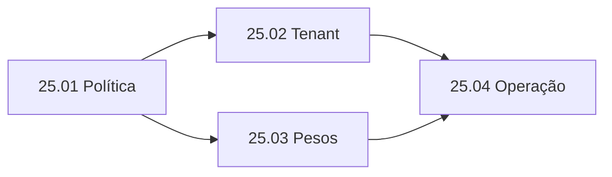

# Epic 25: disponibilidade de apps por tenant e rollout ponderado

**Origem:** pedido do operador em 2026-09-26; `planning/edger/roadmap.md`; contrato do Tenancit em `docs/developers/03-contratos-http.adoc` no repositório irmão. **Estado:** em andamento local na branch `feat/tenant-routing`; sem publicação.
**Origin:** `planning/edger/roadmap.md`, pedido do operador de 2026-09-26.

## Contexto

**AS-IS.** O EdgeR resolve hostname ou caminho para um nome de worker. Sem versão explícita, usa um único `defaultVersion` ou a maior semver habilitada. O data plane público não autentica o visitante, e `Host`/`:authority` é entrada fornecida pelo cliente. Namespaces e API keys atuais protegem o control plane, não restringem requisições públicas aos apps.

**TO-BE.** Uma política por nome de app permite restringir sua disponibilidade a slugs de tenant identificados pelo Tenancit e definir pesos entre versões elegíveis. As capacidades têm flags independentes `EDGER_TENANT_ROUTING_ENABLED` e `EDGER_WEIGHTED_ROUTING_ENABLED`, ambas false por padrão. Com a primeira desligada, nem URL nem token do Tenancit são necessários e a allowlist armazenada não é aplicada. Com a segunda desligada, o split armazenado não altera o `defaultVersion`. Quando habilitado, o EdgeR identifica o tenant pelo endpoint autenticado `/v1/identify?hostname=...`, sem consultar `/v1/resolve` e sem receber secrets de resources. A mesma sessão permanece no mesmo coorte enquanto a política não muda. O bloqueio ocorre antes de invocar o worker, também em URL com versão explícita. Política ausente preserva o comportamento atual.

**Limite de segurança.** A associação hostname → tenant do Tenancit determina o contexto de domínio, não autentica um usuário nem prova que ele pertence ao tenant. A autorização de pessoas e dados continua com a aplicação ou com uma futura credencial verificada. O EdgeR nunca aceitará `x-tenant-id` vindo do cliente como prova; quando injetar esse header, removerá o original. Para app restrito, falha de identificação nega o acesso. O contrato de disponibilidade/cache e o limite de autorização de usuário foram confirmados pelo orquestrador do Tenancit em `../../../../.herdr-agents/wF/from-tenancit-tenant-routing-design-20260926.md`.

**Fora desta entrega:** cadastro de tenants no EdgeR, autorização de usuário, sincronização de recursos/segredos do Tenancit, split entre clusters, deploy remoto, migração de secrets para Bao e escolha ponderada em rotas `@versão` ou workers core.

## Rastreabilidade e regras

| Regra | Contrato observável |
|---|---|
| TR-01 | Política ausente deixa roteamento e acesso público como hoje. |
| TR-02 | App com allowlist só executa se `/v1/identify` confirmar slug permitido; ausência, erro ou tenant diferente não chama o worker. |
| TR-03 | Header de tenant do cliente nunca é identidade; o valor injetado vem somente do Tenancit. |
| TR-04 | Política ponderada exige pesos inteiros positivos somando 100, versões únicas, públicas, habilitadas, não staged e do mesmo nome. |
| TR-05 | Host route só escolhe versão que declara o próprio host; caso contrário, falha fechada sem cair em outro app. |
| TR-06 | Rotas sem versão usam coorte estável por cookie de sessão; `@versão` ignora pesos, mas respeita a restrição de tenant. |
| TR-07 | Alteração/rollback de política é atômica e durável; nenhuma requisição observa configuração parcialmente escrita. |
| TR-08 | Tokens de serviço, cookies e headers de identidade não são gravados em logs, métricas ou respostas administrativas. |
| TR-09 | App montado por `base` ou homepage segue a mesma política de tenant e split, sem perder a precedência de rotas atual. |
| TR-10 | Flags de tenant e split são independentes, false por padrão; com ambas off, políticas armazenadas não afetam dispatch e Tenancit não precisa ser configurado. |
| TR-11 | O setup Rancher expõe as duas flags; URL identify e Secret existente só são exigidos/montados quando tenant está habilitado. |

Fontes: `crates/edger-orchestrator/src/{pipeline,router,manifest_index_stub,manifest_loader,admin_api}.rs`, `crates/edger-core/src/{auth,principal}.rs`, `charts/edger/{values,questions}.yaml`, contratos Tenancit `docs/developers/{03-contratos-http,04-seguranca-e-criptografia}.adoc`. Não há protótipo de tela aprovado; cPanel recebe uma fatia própria.

## Story backlog

| História | Objetivo | Tamanho | Depende de | Estado |
|---|---|---|---|---|
| [25.01 Política de roteamento](01-politica-roteamento.md) | Contrato, validação, API autorizada, persistência e rollback | L | Epics 11, 14 | implementada e testada localmente |
| [25.02 Identidade e gate por tenant](02-identidade-tenant.md) | Consumir identify sem secrets e bloquear antes do dispatch | L | 25.01; alinhamento Tenancit | implementada e testada localmente |
| [25.03 Rollout ponderado estável](03-rollout-ponderado.md) | Distribuir versões elegíveis sem alterar default por request | L | 25.01 | implementada e testada localmente |
| [25.04 Operação e experiência](04-operacao-e-evidencia.md) | cPanel, métricas seguras, documentação, smoke e recuperação | M | 25.02, 25.03 | implementada e revisada localmente; Rancher UI e cluster pendentes |

## Roadmap

1. Fixar contrato de política e casos negativos, implementar storage atômico e endpoint de administração (25.01).
2. Em paralelo após 25.01: integrar identificação/autorização de tenant (25.02) e seleção de versão por coorte (25.03), em fatias de até cinco arquivos quando possível.
3. Integrar os dois filtros no mesmo caminho HTTP de host e path; executar E2E com fake Tenancit, workers reais de teste e restart do EdgeR.
4. Entregar controles do cPanel e sinais operacionais (25.04); executar Rust gate, planejamento/refinement, revisão de outra família e smoke local. Push, PR, tag e deploy ficam fora da autorização deste pedido.

## Epic acceptance criteria

- [x] Flags ausentes/off mantêm o roteamento anterior mesmo com política gravada, sem configurar nem chamar Tenancit; cada flag pode ser ligada isoladamente.
- [x] O formulário Rancher oferece ambas as flags desligadas por padrão e só exige URL identify e Secret de token com tenant ligado.
- [x] Um app aberto continua respondendo sem Tenancit configurado.
- [x] App restrito permite tenant listado e nega tenant diferente, hostname ausente, resposta inválida e indisponibilidade do Tenancit sem invocar worker.
- [x] `Host` e `x-tenant-id` forjados não passam a ser prova de usuário; teste documenta exatamente o limite de domínio.
- [x] Split 80/20 seleciona ambas as versões em proporção compatível com uma amostra determinística, preserva o mesmo resultado para a mesma sessão e deixa URL `@versão` fora do split.
- [x] Host, path, plugin base e homepage alcançam a mesma decisão de política quando representam o mesmo app.
- [x] Versão staged, interna, desabilitada ou sem host declarado não recebe tráfego por peso.
- [x] Política inválida é rejeitada sem corromper a vigente; política sobrevive a restart e rollback retira split com efeito imediato.
- [x] Logs e respostas admin não expõem token de serviço nem cookie no smoke local.
- [x] `cargo test --workspace && cargo clippy --workspace -- -D warnings && cargo fmt -- --check`, refinamento Mode 1 e smoke local passam; evidência real de produção só após publicação autorizada.

## Riscos e mitigação

| Risco | Mitigação e prova |
|---|---|
| Tratar hostname como autenticação de pessoa | Separar identidade de domínio de autorização de usuário no contrato e na UI; nunca confiar em header bruto de tenant. |
| Latência, limite de API ou indisponibilidade do Tenancit | Revalidar segundo o contrato de identify; timeout curto, negar restritos em erro, medir taxa/latência sem dados sensíveis; acordar estratégia de cache com Tenancit. |
| Reatribuição de hostname | Não servir identidade de cache sem revalidação; testar mudança de slug entre requisições. |
| Versão removida depois de configurar pesos | Resolver apenas versões elegíveis no momento do dispatch; falhar fechado e alertar até operador corrigir a política. |
| Stickiness e mudança de política | Cookie é apenas coorte, não credencial; mudança de pesos pode remapear sessões. Rollback remove política e volta ao default imediatamente. |
| Drift entre host e path | Cobrir ambos no teste HTTP; manter `@versão` fora dos pesos, mas dentro do gate de tenant. |
| Rota plugin/homepage ignora pesos | Resolução ponderada deve atuar antes do dispatch nesses ramos; testar que nenhuma versão fora da política recebe tráfego. |
| Desligar flag de tenant com allowlist gravada | O desligamento suspende a barreira de disponibilidade; mostrar estado efetivo no setup/operação e limitar a alteração a operador do deployment. |

## Status

Implementação, gate Rust/JS, refinement Mode 1, revisão independente, smoke HTTP local com binário real, fluxo de configuração/reversão no cPanel via browser e integração com servidor Tenancit real local concluídos (2026-09-26); [evidência](../../status/evidence/tenant-routing-2026-09-26.md). O contrato Tenancit foi recebido em `.herdr-agents/wF/from-tenancit-tenant-routing-design-20260926.md`; a autenticação de usuário segue no worker. Não houve validação do formulário Rancher nem de carga/observabilidade em cluster ou produção.
