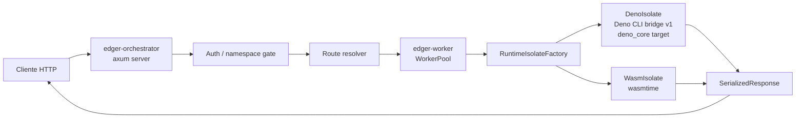
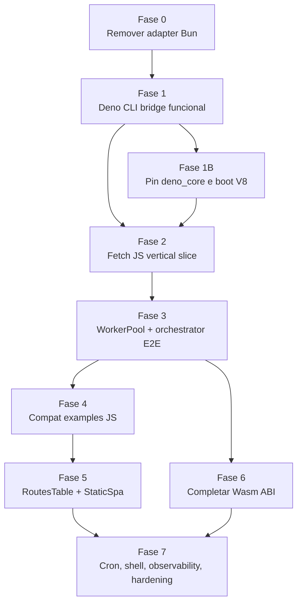

# Plano: edger funcional sem adapter Bun

**Data:** 2026-06-29 (atualizado 2026-07-02)  
**Status:** **MVP funcional entregue e validado ao vivo** (boot + curls, evidência em `status/evidence/`). Runtime JS default: **processo Deno persistente por worker** (Epic 15, UDS + módulo quente, ~25x vs v1, cap de heap por worker, streaming bounded). A Deno CLI bridge v1 (`deno run` por request) fica como **fallback legado** via `EDGER_JS_RUNTIME=bridge`.  
**Escopo:** transformar o edger em um runtime funcional pelo caminho Rust, sem fallback para adapter Bun.

## Objetivo

Ter uma versão funcional do edger em que um operador consiga iniciar o runtime Rust, apontar `RUNTIME_WORKER_DIRS` para `workers/`, e obter respostas reais de workers JS/TS e Wasm através do mesmo pipeline de produção:

```bash
ROOT_API_KEY=test-root PORT=19080 RUNTIME_WORKER_DIRS=workers cargo run -p edger-orchestrator --bin edger
```

Essa versão não precisa ser "produção completa", mas precisa provar o contrato central:

- descoberta de workers por manifest/root;
- roteamento HTTP pelo orquestrador Rust;
- auth root mínima;
- dispatch por `ExecutionKind`;
- execução real de JS/TS e Wasm;
- testes automatizados que exercem o caminho externo observável.

## Decisão de arquitetura

O adapter Bun foi removido e não é mais um caminho válido de runtime. Ele pode permanecer apenas como referência histórica em documentos antigos de status, mas não deve aparecer em README, AGENTS, gates ou plano ativo como mecanismo de execução.

O caminho único é:



## Definição de funcional

### MVP funcional

O MVP funcional está pronto quando todos estes itens forem verdadeiros:

- `cargo run -p edger-orchestrator --bin edger` sobe o servidor sem adapter externo.
- `GET /ready` retorna `200`.
- `GET /wasm-hello` executa Wasm real e retorna `wasm-hello`.
- `GET /hello-world` executa JS/TS real, não `MockIsolate`.
- `POST /read-body` entrega o body ao worker JS/TS e retorna o tamanho correto.
- `GET /empty-response` preserva status `204`.
- `GET /serve-html/foo` ou rota equivalente serve HTML por JS/TS real ou StaticSpa real, sem shim Bun.
- Todos os itens acima passam por manifest discovery em `RUNTIME_WORKER_DIRS=workers`.
- Gate Rust passa: `cargo test --workspace`, `cargo clippy --workspace -- -D warnings`, `cargo fmt -- --check`.
- Gate de planejamento passa com JS root tests ausentes ou explícitos: `planning/edger/scripts/run-gates.sh`.

### Foundation funcional

Depois do MVP, a foundation funcional exige:

- `ExecutionKind::FetchHandler`, `RoutesTable`, `StaticSpa` e `WasmModule` com backends reais.
- `Fullstack` documentado como unsupported/adapter-required com erro `501` claro, ou primeiro adapter mínimo.
- ~~`DenoIsolate` troca a bridge de processo por `deno_core` embutido~~ → **entregue de outra forma** (Epic 15): processo Deno persistente por worker (UDS + módulo quente), não embedding `deno_core`. `EDGER_JS_RUNTIME=bridge` mantém a v1 como fallback legado.
- Cron nativo dispara requisições internas autenticadas.
- Shell/SPA injeta `<base href>` quando `inject_base` estiver habilitado.
- Limites de body/header aplicados no ingress.
- Timeout por worker aplicado no isolate.
- Métricas e tracing mínimos por request, worker, pool hit/miss e erro de isolamento.
- Matriz de compatibilidade Buntime automatizada para os exemplos suportados.

## Estado atual

### Entregue

- `edger-core`: tipos, configs, manifests, wire structs e inferência de `ExecutionKind`.
- `edger-worker`: pool, lifecycle, supervisor, TTL/ephemeral e factory dinâmica por `WorkerRef`.
- `edger-orchestrator`: servidor, health/readiness, routing, auth root, registry de extensões e pipeline.
- `edger-ext-auth` e `edger-ext-gateway`: primeiras extensões estáticas.
- `RUNTIME_WORKER_DIRS`: loader de roots/dirs diretos com `manifest.yaml`, `package.json` e `index.*`.
- Wasm v1: `workers/wasm-hello/index.wat` executa via wasmtime pelo pipeline Rust.
- JS/TS v1: `DenoIsolate` executa `Deno.serve` e default fetch via Deno CLI bridge pelo pipeline Rust.
- Sandbox v1 (2026-07-02): bridge migrada de `deno eval` para `deno run --no-prompt` com `--allow-read=<worker_dir>`, `--allow-env` sobre env limpo/filtrado, `--allow-net` configurável (`EDGER_DENO_ALLOW_NET`); write/run/ffi/sys negados (`edger-isolation/tests/deno_sandbox.rs`).
- `routes` export v1 (2026-07-02): dispatch por path/método com `:param`, `*` wildcard, method map (405), fallback `fetch` e 404 sem fallback (`workers/routes-demo` + E2E).
- Resiliência de pool (2026-07-02): erro de isolate recicla o worker em vez de deixá-lo preso em `Active` (`pool_error_recovery.rs`).
- `injectBase: false` respeitado com `kind: spa` explícito (fix `infer_execution_kind`).

### Bloqueadores

| ID | Bloqueador | Impacto | Destino |
|---|---|---|---|
| B1 | `deno_core` boot real | backend embutido de produção | 07.04 follow-up (aguarda aprovação explícita) |
| B2 | Bridge request/response JS | **Concluído v1** | Deno CLI bridge |
| B3 | Convenções `Deno.serve` e default export | **Concluído v1** | Deno CLI bridge |
| B4 | StaticSpa/base injection | **Concluído v1** (2026-07-02: namespaced + `injectBase: false`) | 07.02 |
| B5 | ABI Wasm request/response | Wasm atual só cobre body estático mínimo | 07.05 follow-up |
| B6 | Gates ainda carregavam resíduo Bun | falso caminho de execução | Fase 0 deste plano (**concluído**) |

## Sequência de execução



### Fase 0 — Limpeza do caminho errado

**Objetivo:** remover o adapter Bun como opção ativa.

**Entregas:**

- Remover `edger.ts`.
- Remover `edger.test.ts`.
- Atualizar README e AGENTS para entrypoint Rust.
- Ajustar `run-gates.sh` para não exigir `bun test` quando não houver suíte JS raiz.
- Atualizar docs ativos da Fase 7 para não citar Bun como gate obrigatório.

**Critério de aceite:** `rg "edger\\.ts|bun edger|loadWorkerHandler"` não encontra referência ativa fora de histórico documentado.

### Fase 1 — Bridge funcional via Deno CLI

**Objetivo:** executar TS real com `Deno.serve`, `Request`, `Response`, streams e `Deno.readTextFile` sem voltar ao adapter Bun.

**Entregas técnicas:**

- `edger-isolation/src/deno/cli.rs`.
- JSON bridge `SerializedRequest`/`SerializedResponse`.
- Captura de `Deno.serve` e default export.
- E2E no orquestrador para exemplos reais em `workers/`.

**Critério de aceite:** `cargo test -p edger-orchestrator --test kind_dispatch_integration` passa com JS/TS real e Wasm real.

### Fase 1B — Boot real de `deno_core`

**Objetivo:** provar que o crate `edger-isolation` consegue iniciar V8 e executar módulo JS mínimo sob feature `deno`.

**Entregas técnicas:**

- Fixar versões de `deno_core` e dependências em `edger-isolation/Cargo.toml`.
- Criar `edger-isolation/src/deno/runtime.rs` com inicialização singleton da plataforma V8.
- Criar `edger-isolation/src/deno/module_loader.rs` restrito ao worker root.
- Criar teste de integração que carrega módulo inline ou temp file e retorna string simples.
- Documentar versão pinada e sharp edges em `planning/edger/epics/03-isolacao-execucao/spike.md`.

**Critério de aceite:** `cargo test -p edger-isolation --features deno deno_boot` passa e falha se o módulo JS não for executado.

### Fase 2 — Vertical slice `fetch` JS/TS

**Objetivo:** executar um worker `export default { fetch(req) {} }` com request/response real.

**Entregas técnicas:**

- Implementar `DenoIsolate` como `Isolate`.
- Converter `SerializedRequest` para `Request` no JS.
- Converter `Response` JS para `SerializedResponse`.
- Suportar default export function e default export object com `fetch`.
- Rejeitar entrypoint fora do worker root.
- Aplicar timeout básico por request.

**Fixtures mínimas:**

- `workers/hello-world`
- `workers/read-body`
- `workers/empty-response`

**Critério de aceite:** testes de integração exercem `DenoIsolate.execute_fetch` e validam status, headers e body observáveis.

### Fase 3 — E2E pelo `WorkerPool` e orquestrador

**Objetivo:** o caminho externo HTTP deve usar o backend JS real sem hint manual e sem mock.

**Entregas técnicas:**

- `RuntimeIsolateFactory` escolhe `DenoIsolate` para `FetchHandler`, `RoutesTable` e `StaticSpa`.
- `WorkerPool::fetch` preserva `WorkerConfig.kind` e `worker_dir`.
- `edger-orchestrator/tests/js_dispatch_integration.rs` sobe pipeline e chama workers por rota.
- Validação manual com `cargo run` + `curl`.

**Critério de aceite:** `GET /hello-world` retorna o body real do worker JS, não `fetch:GET /`.

### Fase 4 — Matriz de exemplos JS compatíveis

**Objetivo:** substituir a antiga cobertura Bun por uma suíte Rust de compatibilidade externa.

**Casos prioritários:**

| Worker | Contrato validado | Obrigatório no MVP |
|---|---|---|
| `hello-world` | JSON/body + method | sim |
| `serve-declarative-style` | `Deno.serve` ou forma declarativa equivalente | sim |
| `empty-response` | status sem body | sim |
| `read-body` | request body stream/text | sim |
| `chunked-text` | response stream ou fallback documentado | sim |
| `serve-html` | file read/static path ou StaticSpa | sim |
| `sse` | streaming longo | foundation |
| `commonjs*` | compat CJS/Node subset | foundation/post-MVP |

**Critério de aceite:** cada worker suportado tem teste Rust E2E que passa pelo servidor/pipeline ou pelo pool com isolate real.

### Fase 5 — `RoutesTable` e `StaticSpa`

**Objetivo:** cobrir modos de aplicação além de fetch simples.

**Entregas técnicas:**

- Definir convenção de `routes` exportada em JS.
- Implementar dispatch por método/path.
- Implementar `StaticSpa` com leitura de arquivos dentro do worker root.
- Implementar `inject_base` com path calculado pelo orquestrador.
- Bloquear path traversal e arquivos fora do root.

**Critério de aceite:** SPA fixture retorna HTML correto com `<base href>` quando configurado e rotas API continuam isoladas.

### Fase 6 — Completar Wasm v1

**Objetivo:** elevar Wasm de fixture estático para contrato request/response mínimo.

**Entregas técnicas:**

- Host WASI real com preopen apenas do worker root.
- Env allowlist explícita após filtro sensível.
- ABI request/response em linear memory.
- Teste para body/method/path chegando ao módulo Wasm.
- Erros tipados para módulo inválido, import proibido, timeout e memória.

**Critério de aceite:** worker Wasm consegue responder de forma dependente da requisição, não apenas body estático compilado.

### Fase 7 — Foundation operacional

**Objetivo:** fechar o mínimo necessário para uma foundation confiável.

**Entregas técnicas:**

- Cron nativo com requisição interna autenticada.
- Shell routing com base injection e documentação do protocolo.
- `/metrics` Prometheus e tracing estruturado.
- Limites de ingress para headers/body.
- Matriz de compatibilidade em `planning/edger/docs/compat-matrix.md`.
- Harness de performance com testes `#[ignore]` para cold start, warm hit e p95 local.

**Critério de aceite:** `planning/edger/epics/07-avancado/07-hardening-compat-matrix.md` pode ser fechado sem mocks em caminhos declarados como suportados.

## Test strategy

Os testes novos devem validar comportamento observável:

- integração de crate para isolamento real;
- integração de pool para lifecycle/cache/dispatch;
- integração de orquestrador para HTTP externo;
- fixtures reais em `workers/`;
- casos negativos de sandbox, timeout e path traversal.

Não aceitar testes que apenas verifiquem que structs existem, mocks foram chamados, ou objetos são truthy.

## Gates por fase

| Fase | Gate mínimo |
|---|---|
| 0 | `git diff --check`, `cargo check --workspace` |
| 1 | `cargo test -p edger-orchestrator --test kind_dispatch_integration` |
| 1B | `cargo test -p edger-isolation --features deno deno_core_boot` |
| 2 | `cargo test -p edger-isolation --features deno js_fetch` |
| 3 | `cargo test -p edger-orchestrator --features deno js_dispatch` + curl manual |
| 4 | suíte compat JS em Rust |
| 5 | testes SPA/routes + path traversal |
| 6 | `cargo test -p edger-isolation --features wasm` + E2E orchestrator |
| 7 | workspace gate completo + `run-gates.sh` |

O gate final de qualquer entrega que mexa em runtime é:

```bash
cargo test --workspace
cargo clippy --workspace -- -D warnings
cargo fmt -- --check
git diff --check
```

## Riscos e mitigação

| Risco | Severidade | Mitigação |
|---|---|---|
| `deno_core` aumenta muito o tempo de build | Alta | Feature flag `deno`, testes focados e documentação de toolchain |
| API de `deno_core` muda rápido | Alta | Pin explícito, wrapper fino em `edger-isolation/src/deno`, sem espalhar APIs |
| Recriar Web APIs demais manualmente | Alta | Começar por `Request`/`Response` mínimo e evoluir por exemplos reais |
| Streaming JS complica a primeira fatia | Média | MVP pode bufferizar body; streaming vira critério da Fase 4/foundation |
| Compat Node vira escopo infinito | Alta | `commonjs*` e Node subset ficam pós-MVP, com matriz de compat |
| Misturar shell/cron antes de JS real | Média | Sequência bloqueia shell/cron após vertical slice JS real |
| Wasm ABI crescer sem contrato claro | Média | Manter `planning/edger/docs/wasm-abi.md` como fonte canônica |

## Ordem recomendada imediata

1. ~~Harden da bridge Deno CLI: path/permission tightening e erros de sandbox.~~ **Entregue 2026-07-02.**
2. ~~Fechar os gaps de `execute_routes` e `StaticSpa` explícitos.~~ **Entregue 2026-07-02.**
3. Fazer spike implementation curta da Fase 1B (`deno_core` boot), sem desmontar a bridge funcional — aguarda aprovação explícita.
4. Migrar internamente de bridge CLI para `deno_core` quando o boot e a API Web mínima estiverem provados.
5. Completar Wasm foundation (host WASI real + ABI request/response em linear memory, Fase 6).
6. Streaming passthrough real para `stream`/`sse` (hoje bounded-first-chunk).

## Stop rules

- Se `deno_core` não compilar no ambiente local após pin + toolchain documentada, parar e registrar o erro real antes de escolher runtime alternativo.
- Se a bridge `Request`/`Response` exigir uma superfície maior que o planejado, manter o MVP em body bufferizado e registrar streaming como foundation, não bloquear hello-world.
- Se qualquer fase reintroduzir Bun como runtime, rejeitar a mudança; Bun pode aparecer apenas como ferramenta externa de desenvolvimento se houver suíte JS explícita no futuro.

## Artefatos que devem ser atualizados ao avançar

- `planning/edger/epics/07-avancado/04-real-js-execution.md`
- `planning/edger/docs/pendencies-epic-07.md`
- `planning/edger/docs/compat-matrix.md`
- arquivos de checkpoint em `planning/edger/status/`
- `README.md`
- `AGENTS.md`
