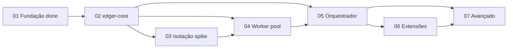

# Status: Backlog edger — maduro e pronto para desenvolvimento

**Source:** `planning/edger/roadmap.md`, decomposição `/agile-epic` + `/agile-story`  
**Mode:** Consolidation

## Context
- **Project/initiative:** edger — runtime edge em Rust (visão Buntime + estrutura Edge Runtime)
- **Period:** 2026-06-28 — 2026-06-29 (decomposição e refinamento contínuo)
- **Current objective:** Backlog Fases 1–7 decomposto em epics/stories/tasks, validado para iniciar Fase 2 (edger-core)
- **Related epic/story/issue:** Epic 01 complete; próximo `epics/02-edger-core/01-setup-core-crate.md`

---

## Consolidation (period report)

### Progress
- **Completed:**
  - Intake, design, analysis-synthesis, roadmap
  - 7 epics com overview + acceptance criteria + story backlog
  - 31 stories com Context, Files, Detail, Tasks, Verification
  - Fase 1 (Fundação): Bun loader funcional, 6 testes, examples copiados, closure documentado
  - Scripts de gate: `refinement-lint.py`, `path-preflight.sh`, `run-gates.sh`, `render-status-from-gates.sh`
  - `/agile-refinement` Mode 1: 0 RED, 0 WARN (orquestrador)
- **In progress:**
  - Nenhuma story em execução — backlog em estado ready-for-development
- **Relevant deviations:**
  - `memory_lint` excluído dos gates de planejamento (instabilidade servidor; diretiva operador)
  - Maturidade validada via `/agile-refinement` + `refinement-lint.py` oracle
  - Skeletons (`spike.md`, `docs/extensions.md`, etc.) existem como templates — conteúdo operacional preenchido nas stories indicadas

### Backlog summary

| Fase | Epic folder | Stories | Planning status | Implementation |
|---|---|---|---|---|
| 1 Fundação | `epics/01-fundacao/` | 4 | complete | **delivered** (Bun loader) |
| 2 edger-core | `epics/02-edger-core/` | 4 | ready-for-development | not started |
| 3 Isolação | `epics/03-isolacao-execucao/` | 4 | ready-for-development | not started |
| 4 Worker | `epics/04-worker-management/` | 4 | ready-for-development | not started |
| 5 Orquestrador | `epics/05-orquestrador/` | 5 | ready-for-development | not started |
| 6 Extensibilidade | `epics/06-extensibilidade/` | 3 | ready-for-development | not started |
| 7 Avançado | `epics/07-avancado/` | 7 | ready-for-development | not started |

### Blockers and risks

| Blocker / Risk | Impact | Owner | Next action |
|---|---|---|---|
| memory_lint remoto instável | Sem auditoria wiki automática neste gate | operador | Reativar quando servidor estável; apenas orquestrador chama memory tools |
| Embedding spike (Fase 3) | Pode alterar estimativas PR 10 | dev | Executar story 03.01 time-boxed; atualizar spike.md |
| Drift contratos Buntime | Migração futura | dev | Matriz compat em 07.07; referenciar design.md em cada PR |

### Decisions needed
- Nenhuma bloqueante para iniciar Fase 2 — decisões de embedding já registradas no design (deno_core + facade, wasmtime WASI).

### Next steps
- [ ] Executar `/agile-story` em `planning/edger/epics/02-edger-core/01-setup-core-crate.md`
- [ ] Após cada story: `/agile-status` checkpoint + `/agile-refinement` code review
- [ ] Reavaliar `memory_lint` quando servidor ai-memory estável

---

## Maturity gates (planning)

_Rendered at 2026-06-29T01:32:13Z after run-gates.sh. memory_lint excluded (server stability)._

- [x] 7 epics / 31 stories decomposed com secoes obrigatorias
- [x] /agile-refinement Mode 1 — 0 red flags (status/evidence/refinement-report.txt)
- [x] refinement-lint.py oracle — 0 RED (status/evidence/refinement-lint-oracle.txt)
- [x] Path-preflight — 0 missing (status/evidence/path-preflight.txt)
- [x] Fase 1 completed; Fases 2-7 ready-for-development
- [x] bun test pass (status/evidence/bun-test.txt)

## Critical path (implementação)

## Evidence (committed)

| File | Gate |
|---|---|
| refinement-report.txt | /agile-refinement Mode 1 |
| refinement-lint-oracle.txt | refinement-lint.py |
| path-preflight.txt | cross-refs |
| artifact-inspection.txt | story sections |
| gates-summary.json | run-gates.sh |
| agile-status.txt | consolidation snapshot |
| bun-test.txt | regression |
