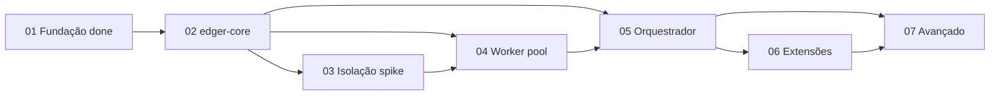

# Status Consolidation: Backlog maduro — pronto para desenvolvimento

**Date:** 2026-06-29
**Mode:** consolidation (post planning decomposition)

## Scope
Decomposição completa do roadmap Fases 1-7 em epics/stories/tasks via fluxo `/agile-*`.

## Backlog summary

| Fase | Epic folder | Stories | Planning status | Implementation |
|---|---|---|---|---|
| 1 Fundação | `epics/01-fundacao/` | 4 | complete | **delivered** (Bun loader) |
| 2 edger-core | `epics/02-edger-core/` | 4 | ready-for-development | not started |
| 3 Isolação | `epics/03-isolacao-execucao/` | 4 | ready-for-development | not started |
| 4 Worker | `epics/04-worker-management/` | 4 | ready-for-development | not started |
| 5 Orquestrador | `epics/05-orquestrador/` | 5 | ready-for-development | not started |
| 6 Extensibilidade | `epics/06-extensibilidade/` | 3 | ready-for-development | not started |
| 7 Avançado | `epics/07-avancado/` | 7 | ready-for-development | not started |

**Total:** 7 epics, 31 stories, todas com Context/Traceability/Files/Detail/Tasks/Verification.

**Artefatos de planejamento (skeletons):** `epics/03-isolacao-execucao/spike.md`, `docs/{extensions,compat-matrix,performance-baselines,shell-protocol,wasm-abi}.md` — existem como templates; conteúdo operacional preenchido nas stories indicadas.

## Maturity gates (planning)

- [x] Cada fase do roadmap tem epic correspondente (`01`–`07`)
- [x] Cada epic tem `00-overview.md` + >=1 story file
- [x] Stories contêm tasks acionáveis e comandos de verificação (`cargo test`, `bun test`, launches)
- [x] agile-refinement — script formal `planning/edger/scripts/refinement-lint.py`; gates por epic 01–07 (v2) + full-tree v2: **0 RED** (830 OK lines); path-preflight: 22 refs, 0 missing
- [ ] memory_lint scoped `djalmajr/edger` — **bloqueado** (servidor remoto 503 / MCP handshake); 5 tentativas em `scratch/memory-lint.txt`; re-executar quando `memory.djalmajr.dev` voltar
- [x] Fase 1 permanece `completed`; Fases 2-7 `ready-for-development`
- [x] Cross-refs roadmap ↔ epics alinhados

## Critical path (implementação)

## Next execution step
`/agile-story` em `planning/edger/epics/02-edger-core/01-setup-core-crate.md` — completar módulos do core e gate Rust.

## Deviations from prior consolidation
- Backlog expandido de 2 epics parciais para 7 epics completos (31 stories).
- Fase 1 ganhou stories 03-copy-examples e 04-closure-evidence (retrospectiva documentada).

## Evidence
- `planning/edger/epics/` tree: 7 folders, 38 markdown files (+ 2 scripts em `planning/edger/scripts/`)
- Refinement report: `scratch/refinement-report.txt` (2066 linhas — epic gates v2 + full-tree v2 + path-preflight)
- Path preflight: `scratch/path-preflight-v2.txt` (22 refs únicos, 0 missing)
- memory_lint: `scratch/memory-lint.txt` (5 tentativas; servidor indisponível)
- Tests: `bun test` 6 pass; `cargo check --workspace` pass (skeleton)