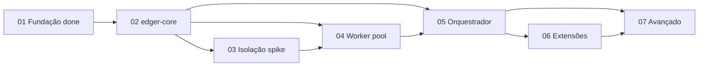

# Status Consolidation: Backlog maduro — pronto para desenvolvimento

**Date:** 2026-06-29
**Mode:** consolidation (post planning decomposition)

## Scope
Decomposição completa do roadmap Fases 1-7 em epics/stories/tasks via fluxo `/agile-*`.

## Backlog summary

| Fase | Epic folder | Stories | Planning status | Implementation |
|---|---|---|---|---|
| 1 Fundação | `epics/01-fundacao/` | 4 | complete | **delivered** (Bun loader) |
| 2 edger-core | `epics/02-edger-core/` | 4 | ready-for-development | not started |
| 3 Isolação | `epics/03-isolacao-execucao/` | 4 | ready-for-development | not started |
| 4 Worker | `epics/04-worker-management/` | 4 | ready-for-development | not started |
| 5 Orquestrador | `epics/05-orquestrador/` | 5 | ready-for-development | not started |
| 6 Extensibilidade | `epics/06-extensibilidade/` | 3 | ready-for-development | not started |
| 7 Avançado | `epics/07-avancado/` | 7 | ready-for-development | not started |

**Total:** 7 epics, 31 stories, todas com Context/Files/Detail/Tasks/Verification.

**Artefatos de planejamento (skeletons):** `epics/03-isolacao-execucao/spike.md`, `docs/{extensions,compat-matrix,performance-baselines,shell-protocol,wasm-abi}.md` — existem como templates; conteúdo operacional preenchido nas stories indicadas.

## Maturity gates (planning)

_Rendered at 2026-06-29T01:27:19Z after run-gates.sh. memory_lint excluded (server stability)._

- [x] 7 epics / 31 stories decomposed com secoes obrigatorias
- [x] /agile-refinement Mode 1 — 0 red flags (status/evidence/refinement-report.txt)
- [x] refinement-lint.py oracle — 0 RED (status/evidence/refinement-lint-oracle.txt)
- [x] Path-preflight — 0 missing (status/evidence/path-preflight.txt)
- [x] Fase 1 completed; Fases 2-7 ready-for-development
- [x] bun test pass (status/evidence/bun-test.txt)

## Critical path (implementação)

## Next execution step
`/agile-story` em `planning/edger/epics/02-edger-core/01-setup-core-crate.md` — completar módulos do core e gate Rust.

## Deviations from prior consolidation
- Backlog expandido de 2 epics parciais para 7 epics completos (31 stories).
- Fase 1 ganhou stories 03-copy-examples e 04-closure-evidence (retrospectiva documentada).
- Gate I/O decoupled: `run-gates.sh` + `render-status-from-gates.sh` (no hand-written PASS claims)
- **`memory_lint` excluído dos gates de planejamento** — operador reportou instabilidade no servidor remoto; maturidade validada via `/agile-refinement` Mode 1 apenas.

## Evidence (committed)

| File | Gate |
|---|---|
| refinement-report.txt | /agile-refinement Mode 1 |
| refinement-lint-oracle.txt | refinement-lint.py |
| path-preflight.txt | cross-refs |
| artifact-inspection.txt | story sections |
| gates-summary.json | run-gates.sh |
| agile-status.txt | consolidation snapshot |
| bun-test.txt | regression |
