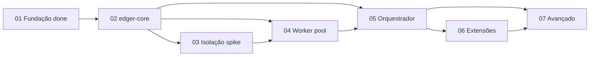

# Status Consolidation: Backlog maduro — pronto para desenvolvimento

**Date:** 2026-06-29
**Mode:** consolidation (post planning decomposition)

## Scope
Decomposição completa do roadmap Fases 1-7 em epics/stories/tasks via fluxo `/agile-*`.

## Backlog summary

| Fase | Epic folder | Stories | Planning status | Implementation |
|---|---|---|---|---|
| 1 Fundação | `epics/01-fundacao/` | 4 | complete | **delivered** (Bun loader) |
| 2 edger-core | `epics/02-edger-core/` | 4 | ready-for-development | not started |
| 3 Isolação | `epics/03-isolacao-execucao/` | 4 | ready-for-development | not started |
| 4 Worker | `epics/04-worker-management/` | 4 | ready-for-development | not started |
| 5 Orquestrador | `epics/05-orquestrador/` | 5 | ready-for-development | not started |
| 6 Extensibilidade | `epics/06-extensibilidade/` | 3 | ready-for-development | not started |
| 7 Avançado | `epics/07-avancado/` | 7 | ready-for-development | not started |

**Total:** 7 epics, 31 stories, todas com Context/Files/Detail/Tasks/Verification.

**Artefatos de planejamento (skeletons):** `epics/03-isolacao-execucao/spike.md`, `docs/{extensions,compat-matrix,performance-baselines,shell-protocol,wasm-abi}.md` — existem como templates; conteúdo operacional preenchido nas stories indicadas.

## Maturity gates (planning)

- [x] Cada fase do roadmap tem epic correspondente (`01`–`07`)
- [x] Cada epic tem `00-overview.md` + >=1 story file
- [x] Stories contêm tasks acionáveis e comandos de verificação (`cargo test`, `bun test`, launches)
- [x] `/agile-refinement` Mode 1 — full-tree + 7 epic-scoped passes: **0 RED** (ver `status/evidence/refinement-report.txt` e `refinement-epic-*.txt`)
- [x] `memory_lint` scoped `workspace=djalmajr` `project=edger` — **findings: []** (ver `status/evidence/memory-lint.txt`; remoto 503, executado via servidor local `127.0.0.1:19474` com MCP+CLI raw)
- [x] Fase 1 permanece `completed`; Fases 2-7 `ready-for-development`
- [x] Cross-refs roadmap ↔ epics alinhados (path-preflight: 22 refs, 0 missing)

## Critical path (implementação)

## Next execution step
`/agile-story` em `planning/edger/epics/02-edger-core/01-setup-core-crate.md` — completar módulos do core e gate Rust.

## Deviations from prior consolidation
- Backlog expandido de 2 epics parciais para 7 epics completos (31 stories).
- Fase 1 ganhou stories 03-copy-examples e 04-closure-evidence (retrospectiva documentada).
- `memory_lint` remoto indisponível (503); evidência capturada via fallback local com mesmo scope explícito.

## Evidence (committed in repo)
All artifacts under `planning/edger/status/evidence/`:

| File | Description |
|---|---|
| `refinement-report.txt` | `/agile-refinement` Mode 1 full-tree (916 lines, VERDICT PASS) |
| `refinement-epic-NN-*.txt` | Per-epic scoped refinement (7 files) |
| `path-preflight.txt` | Cross-ref path existence check |
| `memory-lint.txt` | Raw MCP JSON + CLI JSON (`findings: []`) |
| `agile-status.txt` | `/agile-status` consolidation snapshot |
| `bun-test.txt` | 6 pass / 0 fail |
| `cargo-check.txt` | workspace skeleton check |
| `epics-tree.txt` | Full file listing |
| `epics-inventory.txt` | Story count per epic |