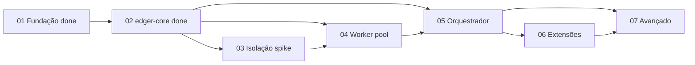

# Status: Backlog edger — Fases 1–5 entregues

**Source:** `planning/edger/roadmap.md`  
**Mode:** Consolidation (updated 2026-06-29 post Epic 05)

## Context
- **Project/initiative:** edger
- **Period:** 2026-06-28 — 2026-06-29
- **Current objective:** Fase 6 próxima (Epic 06 Extensibilidade)
- **Related epic:** Epic 06; próximo `epics/06-extensibilidade/00-overview.md`

---

## Consolidation (period report)

### Progress
- **Completed:**
  - Fase 1: Bun loader (6 tests)
  - Fase 2: `edger-core` modular — 17 Rust tests, traits, wire, models
  - Per-story checkpoints: `status/checkpoint-2026-06-29-story-02-0{1..4}.md`
  - Per-story refinement: `status/evidence/refinement-story-02-0{1..4}.txt`
  - Epic 02 closure: `status/checkpoint-2026-06-29-epic-02-closure.md`
- **Completed:** Epic 03 — stories 03.01–03.04 + epic closure (14 isolation tests)
- **Completed:** Epic 04 — stories 04.01–04.04 + epic closure (24 worker tests)
- **Completed:** Epic 05 — stories 05.01–05.05 + epic closure (48 orchestrator tests)
- **Per-story checkpoints Epic 05:** `status/checkpoint-2026-06-29-story-05-0{1..5}.md`
- **Deviations:** Epic 02 delivered in continuous cycle; per-story artifacts added retroactively per AC3

### Backlog summary

| Fase | Epic folder | Stories | Planning status | Implementation |
|---|---|---|---|---|
| 1 Fundação | `epics/01-fundacao/` | 4 | complete | **delivered** |
| 2 edger-core | `epics/02-edger-core/` | 4 | complete | **delivered** (17 tests) |
| 3 Isolação | `epics/03-isolacao-execucao/` | 4 | **completed** | 14 isolation tests |
| 4 Worker | `epics/04-worker-management/` | 4 | **completed** | 24 worker tests |
| 5 Orquestrador | `epics/05-orquestrador/` | 5 | **completed** | 48 orchestrator tests |
| 6 Extensibilidade | `epics/06-extensibilidade/` | 3 | ready-for-development | not started |
| 7 Avançado | `epics/07-avancado/` | 7 | ready-for-development | not started |

### Next steps
- [ ] `/agile-story` em `planning/edger/epics/06-extensibilidade/`
- [ ] Per-story checkpoint + refinement após cada story (Epic 06+)

---

## Maturity gates (planning)

_Rendered at 2026-06-29T02:44:05Z after run-gates.sh. memory_lint excluded (server stability)._

- [x] 7 epics / 31 stories decomposed
- [x] /agile-refinement Mode 1 — 0 red flags
- [x] refinement-lint.py oracle — 0 RED
- [x] Path-preflight — 0 missing
- [x] Fase 1 + Fase 2 completed; Fases 3–7 ready-for-development
- [x] bun test pass (6 pass)

## Critical path (implementação)

## Evidence (committed)

| File | Gate |
|---|---|
| refinement-report.txt | /agile-refinement Mode 1 |
| refinement-story-02-01..04.txt | per-story code review |
| checkpoint-2026-06-29-story-02-01..04.md | per-story /agile-status |
| checkpoint-2026-06-29-epic-02-closure.md | epic closure |
| bun-test.txt | regression |